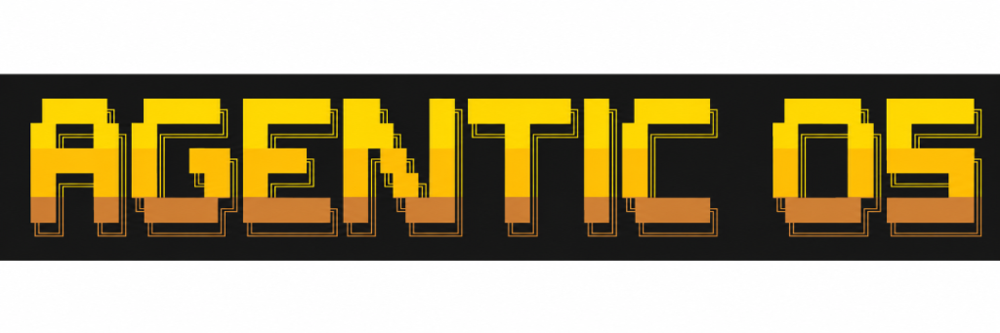

<p align="center">
  
</p>

# Agentic OS ☤

<p align="center">
  <a href="agentic-os/LICENSE"></a>
  <a href="https://github.com/nousresearch/hermes-agent"></a>
  <a href="https://nousresearch.com"></a>
  <a href="https://github.com/subhxroy"></a>
  <a href="https://python.org"></a>
  <a href="https://nodejs.org"></a>
</p>

## Overview

**Agentic OS** is an advanced, self-improving AI agent system integrated with a persistent Obsidian memory vault, native multi-modal voice processing, an interactive terminal & modern TUI, a multi-platform messaging gateway, and a desktop application interface. 

Built with a closed-loop learning architecture, Agentic OS dynamically generates reusable skills from completed complex tasks, persists structured reflections in an Obsidian knowledge graph, searches past session histories using FTS5 vector and keyword indexing, and maintains long-term user context across sessions and platforms.

---

## Origin

This repository is based on the open-source **[Hermes Agent](https://github.com/nousresearch/hermes-agent)** project by **[Nous Research](https://nousresearch.com)**. It has been customized, extended, and restructured by **Subhankar Roy** with additional features, integrations, launchers, memory architecture, custom provider support, and workflow improvements.

---

## What's New

The following key features, architectural enhancements, and integrations have been added or modified in this repository compared to the upstream project:

- **Dual Unified Launchers**:
  - **Python Unified Launcher (`launch.py`)**: Root-level CLI supporting `--voice`, `--tui`, `--gateway`, `--dashboard`, `--status`, and `--setup` flags with automatic environment setup and vault resolution.
  - **Node.js Surface Selector (`server.js`)**: Interactive CLI selection menu with cross-platform process management, handling Windows execution without `EINVAL` spawn issues, and support for Desktop app launching (`--electron`) and provider management (`--add-provider`).
- **Obsidian Brain Memory Architecture**:
  - Dedicated Obsidian Markdown Vault (`obsidian-brain/`) maintaining auto-synced memories (`memories/`), daily journals (`journal/`), project notes (`projects/`), capability definitions (`skills/`), and session logs (`conversations/`) in a bidirectional knowledge graph.
- **Custom LLM Provider & Flexible Authentication**:
  - Enhanced provider configuration engine enabling custom LLM endpoints with arbitrary HTTP authentication headers (e.g., `Bearer`, `x-api-key`, or custom header names).
  - Local LLM endpoint optimizations including Ollama model slug normalization, provider prefix stripping, and automatic API key check exemptions for local servers.
- **Native Voice Pipeline Fixes & Upgrades**:
  - Hands-free voice recognition loop with automatic restart capability for non-continuous voice input inside Electron environments.
  - Resolved audio dependency setup (`faster-whisper`, `sounddevice`, `numpy`, `edge-tts`) and eliminated infinite print loop conditions during continuous STT/TTS runs.
  - Hybrid browser-side wake-word fallback detection (e.g., "Jarvis").
- **Electron Desktop Application Integration**:
  - Full desktop application surface (`agentic-os/apps/desktop`) with SQLite local state persistence, updated brand iconography, and expanded desktop tool capabilities.
- **System Prompt & Execution Efficiency**:
  - Prompt optimizations for casual greeting interactions, reducing unnecessary tool-calling turns.
  - Cross-platform process execution fixes for native Windows environments (MinGit auto-detection, SQLite cursor transaction handling, environment variable loading).
- **Modular Repository Restructuring**:
  - Clean separation into workspace root launchers, persistent knowledge vaults, desktop app packages, and core agent reasoning engines.

---

## Architecture

The repository is structured into distinct workspace modules:

```text
agentic-os/
├── README.md               # Main project overview, quickstart & provenance documentation
├── ROADMAP.md              # 22-Pillar Strategic Architecture & Next-Gen Feature Blueprint
├── CHANGELOG_REPOSITORY.md # Repository changelog and documentation update history
├── server.js               # Node.js launcher & interactive surface selection menu
├── launch.py               # Unified Python launcher (CLI, TUI, Voice, Gateway, Dashboard)
├── obsidian-brain/         # Persistent Obsidian markdown vault & knowledge graph
│   ├── README.md           # Obsidian Brain structure overview
│   ├── memories/           # Facts, user preferences & auto-synced memory notes
│   ├── journal/            # Daily activity logs & session reflections
│   ├── skills/             # Learned skill definitions & capability specs
│   ├── projects/           # Active project context & note graphs
│   └── conversations/      # Session summaries & chat history logs
└── agentic-os/             # Core AI Agent Engine & CLI Framework
    ├── apps/desktop/       # Native Electron desktop application surface
    ├── agentic_os_cli/     # Command line interface & web server handlers
    ├── agent/              # Reasoning loop, LLM provider integration & prompt assembly
    ├── gateway/            # Multi-platform messaging gateway (Telegram, Discord, Slack, etc.)
    ├── tools/              # 40+ built-in execution tools & toolsets
    ├── providers/          # Standard & custom LLM provider adapters
    └── LICENSE             # Original MIT License (Nous Research)
```

---

## Strategic Roadmap & Next-Gen Vision

Agentic OS includes a comprehensive 22-pillar architectural roadmap elevating the agent beyond reactive execution into a proactive, federated, multimodal operating system. 

Explore the full specification in **[ROADMAP.md](ROADMAP.md)**:

1. ⚡ **Proactive Intelligence**: Event-driven webhook/RSS monitoring & automated deep research.
2. 🌐 **Agent-to-Agent Collaboration**: Federated agent networks, negotiation protocols & skill marketplaces.
3. 🕸️ **Advanced Memory & Knowledge Graph**: SQLite/Neo4j property graphs, idle memory consolidation & decay metrics.
4. 👁️ **Visual Computer Use**: Desktop GUI screen perception, OCR reasoning & desktop automation loops.
5. 🔀 **Workflow Automation Engine**: Visual ReactFlow builder, IFTTT rules & parallel DAG execution.
6. 💰 **Cost Intelligence & Routing**: Smart model router, token budgets & cache-aware cost optimization.
7. 👥 **Real-Time Collaboration**: Multi-user concurrent sessions, shared context & handoff protocols.
8. 📊 **Observability & Telemetry**: Step-by-step decision traces, tool call replay & immutable audit logs.
9. 🌐 **Advanced Browser Automation**: Multi-tab orchestration, visual regression testing & session persistence.
10. 💻 **Code Intelligence**: Full LSP integration, autonomous PR review, test generation & security scanning.
11. 📩 **Communication Intelligence**: Personalized email drafting, automated meeting prep & transcribing.
12. 🎥 **Multi-Modal Capabilities**: Video understanding, audio podcast creation, diagrams & slide decks.
13. 🛡️ **Enterprise Security**: Multi-tenant isolation, SAML/OIDC SSO, AES-256 encryption & automated backups.
14. 📈 **Agent Self-Improvement**: Skill scoring, prompt self-optimization, A/B strategy testing & benchmark suites.
15. 🔌 **Plugin Ecosystem 2.0**: Hot-reload plugins, sandboxed Wasm execution & composite plugin suites.
16. 🛠️ **Developer Experience & SDK**: Programmatic SDKs, inbound webhook triggers & GUI tool builder.
17. 🔒 **Local-First & Privacy**: 100% offline local LLM mode, on-device data processing & client-side encryption.
18. 🏠 **IoT & Smart Home**: Home Assistant integration, device presence tracking & energy optimization.
19. 🔬 **Deep Research & Competitive Intel**: Automated literature reviews, competitor tracking & citation management.
20. ⚙️ **Advanced Automation**: Cron chain reactions, conditional scheduling & dead letter queues.
21. 💡 **UX Innovations**: Persistent context sidebar, confidence metrics & step-by-step reasoning undo.
22. 📈 **Analytics & Performance**: Token/latency telemetry, learning velocity charts & exportable PDF reports.

---

## Quickstart & Launch Modes

### 1. Interactive Node.js Launcher

Run the interactive surface selector from the workspace root:

```bash
node server.js
```

Or pass direct flags:

```bash
node server.js --tui           # Terminal UI
node server.js --dashboard     # Web Dashboard
node server.js --electron      # Electron Desktop App
node server.js --voice         # Voice Mode
node server.js --gateway       # Messaging Gateway
node server.js --add-provider  # Interactive Custom LLM Provider Setup
```

### 2. Python Unified Launcher

Run the Python entry point:

```bash
python launch.py               # Interactive CLI Mode (default)
python launch.py --tui         # Modern Terminal UI (Ink/React)
python launch.py --voice       # Hands-Free Voice Mode (STT & TTS)
python launch.py --gateway     # Multi-Platform Messaging Gateway
python launch.py --dashboard   # Web Dashboard SPA & API Server
python launch.py --status      # System Status & API Configuration Check
python launch.py --setup       # Guided Environment Setup
```

---

## Features

- 🧠 **Obsidian Brain Memory Vault**: Synchronizes memories, daily journal logs, user preferences, and skills directly into an Obsidian markdown vault, establishing a bidirectional knowledge graph between the AI agent and your personal notes.
- 🎙️ **Multi-Modal Voice Pipeline**: Integrated push-to-talk and continuous speech-to-text (Faster-Whisper / Groq) with edge text-to-speech output (Edge TTS / ElevenLabs) and hybrid wake-word detection.
- 💻 **Multiple Surface Launchers**: Choose between an interactive CLI, a modern Terminal UI (React/Ink TUI), a Web Dashboard, or an Electron Desktop application via `python launch.py` or `node server.js`.
- ⚡ **Multi-Platform Messaging Gateway**: Unified gateway connecting Telegram, Discord, Slack, WhatsApp, Signal, and Email with voice memo transcription and cross-platform conversation continuity.
- 🔌 **Custom Provider & Flexible Auth**: Full support for custom LLM providers, local endpoints (Ollama, vLLM, LM Studio), and arbitrary HTTP header authentication schemes (Bearer, `x-api-key`, custom headers).
- 🛠️ **Autonomous Learning Loop**: Self-improving agent architecture that synthesizes reusable skills from completed complex tasks following the open `agentskills.io` specification.
- 🖥️ **Native Windows & Cross-Platform Support**: Works natively on Windows without requiring WSL, using bundled MinGit detection, robust process spawning, and optimized SQLite persistence.

---

## Attribution

Agentic OS is derived from **[Hermes Agent](https://github.com/nousresearch/hermes-agent)** by **[Nous Research](https://nousresearch.com)** and includes substantial customizations, extensions, launchers, memory vault integrations, and architectural enhancements developed by **[Subhankar Roy](https://github.com/subhxroy)**.

---

## License

This project is licensed under the MIT License — see the original license in [`agentic-os/LICENSE`](agentic-os/LICENSE).
