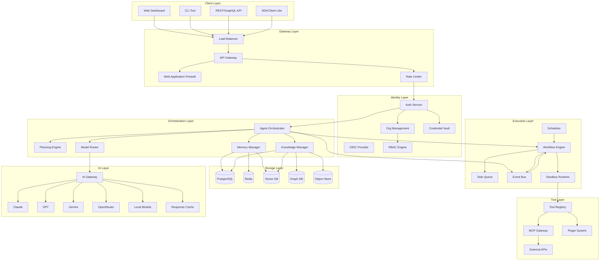
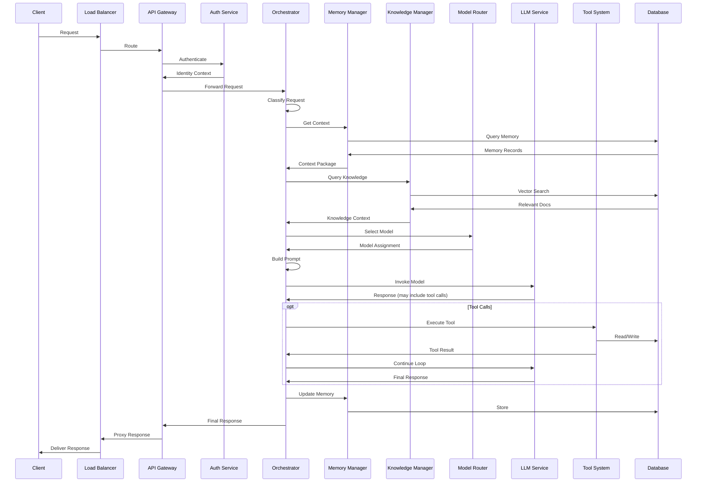

# Volume 1: Foundations & System Architecture

## Chapter 1: What is an Agentic Operating System?

### 1.1 Defining the Core Concepts

Before defining an Agentic Operating System, we must precisely define each concept in the hierarchy.

#### 1.1.1 What is an Agent?

An agent is the smallest autonomous unit: a software entity that perceives its environment, makes decisions, and takes actions to achieve goals. Unlike traditional functions (deterministic input→output), agents exhibit:

- **Autonomy**: Operate without human intervention for each step
- **Goal-directed behavior**: Choose actions based on objectives, not just instructions
- **Reactivity**: Respond to changes in environment
- **Proactiveness**: Take initiative toward goals
- **Social ability**: Communicate with other agents or humans

An agent is NOT:
- A function call
- A microservice
- A chatbot session
- A pipeline

**Internal architecture of an agent:**

```
┌─────────────────────────────────────────┐
│              Agent                       │
│  ┌──────────┐  ┌──────────────────────┐  │
│  │ Identity │  │    Reasoning Loop     │  │
│  │ (Role)   │  │  ┌────────────────┐   │  │
│  └──────────┘  │  │Perceive→Think→ │   │  │
│                │  │  Act→Observe   │   │  │
│  ┌──────────┐  │  └────────────────┘   │  │
│  │ Memory   │  └──────────────────────┘  │
│  │ (State)  │  ┌──────────────────────┐  │
│  └──────────┘  │   Tool System        │  │
│                │   (Capabilities)      │  │
│  ┌──────────┐  └──────────────────────┘  │
│  │ Planning │  ┌──────────────────────┐  │
│  │ (Goals)  │  │   Knowledge Base     │  │
│  └──────────┘  │   (Context)          │  │
│                └──────────────────────┘  │
└─────────────────────────────────────────┘
```

**Why agents exist:** Traditional software requires exhaustive pre-programming of all paths. Agents replace this with goal-directed reasoning, handling novel situations impossible to anticipate in code.

**Key property — The Reasoning Loop:** Agents don't just execute a linear pipeline. They continuously loop through:
1. **Perceive**: Gather input from environment, tools, messages
2. **Think**: Process context against goals using LLM reasoning
3. **Act**: Execute tool calls, generate responses, modify state
4. **Observe**: Collect results of actions and determine next step

This loop is what distinguishes agents from pipelines. A pipeline runs once. An agent loops until the goal is achieved or abandoned.

---

#### 1.1.2 What is an AI Assistant?

An AI assistant is a productized agent with a chat interface. Examples: Claude.ai, ChatGPT, Gemini.

Characteristics:
- **Conversation-first**: Primary interface is natural language chat
- **Single-session**: Typically stateless between conversations
- **Human-in-the-loop**: Always responds to human, rarely initiates
- **General-purpose**: Not specialized to a domain
- **Stateless**: No persistent memory across sessions (in basic form)
- **Reactive**: Responds to prompts, doesn't proactively act

**How it differs from an agent:**
- Assistants react; agents initiate
- Assistants are tied to chat UI; agents can operate headlessly
- Assistants typically lack persistent long-term memory
- Assistants rarely decompose complex goals autonomously
- Assistants almost never operate on schedules or triggers

**Internal architecture:**
```
┌─────────────────────────┐
│  AI Assistant           │
│                         │
│  ┌─────────────────┐    │
│  │  Chat Interface  │    │
│  └─────────────────┘    │
│  ┌─────────────────┐    │
│  │  LLM + System    │    │
│  │  Prompt          │    │
│  └─────────────────┘    │
│  ┌─────────────────┐    │
│  │  Context Window  │    │
│  │  (Conversation   │    │
│  │   History)       │    │
│  └─────────────────┘    │
│  ┌─────────────────┐    │
│  │  Tool Access     │    │
│  │  (Optional)      │    │
│  └─────────────────┘    │
└─────────────────────────┘
```

---

#### 1.1.3 What is an AI Workflow?

A workflow is a **pre-defined sequence** of steps where each step may call an LLM or an agent. The critical distinction from a full agent: the path is largely predetermined, not autonomously chosen.

Example workflow:
```
User Request
    → Classify intent (LLM call)
    → If "search": query vector DB (deterministic)
    → Summarize results (LLM call)
    → Format response (template)
    → Return
```

**Key properties:**
- **Directed graph**: Steps and transitions are defined at design time
- **Deterministic routing**: Conditional branches exist but are explicit
- **Observable**: Each step's input/output is known and testable
- **Recoverable**: Failed steps can be retried with known strategy
- **Predictable cost**: Token usage can be estimated per workflow path

**When to use workflows vs agents:**
- Workflows: Known processes, compliance requirements, predictable paths
- Agents: Unknown paths, creative exploration, complex multi-step problems

**Industry practice:** Most production AI systems use workflows for 80% of operations, reserving full agents for complex cases. This is the opposite of the hype.

```
┌──────────┐    ┌──────────┐    ┌──────────┐
│  Input   │───→│ Step 1   │───→│ Step 2   │
│  (Class. │    │ (Search) │    │ (Summ.)  │
│   Intent)│    └──────────┘    └──────────┘
└──────────┘                           │
                                       ▼
                                ┌──────────────┐
                                │  Condition?   │
                                │  (LLM Judge)  │
                                └──────┬───────┘
                                       │
                          ┌────────────┼────────────┐
                          ▼            ▼            ▼
                   ┌──────────┐ ┌──────────┐ ┌──────────┐
                   │ Path A   │ │ Path B   │ │ Path C   │
                   │ (Detail) │ │ (Short)  │ │ (Escalat)│
                   └──────────┘ └──────────┘ └──────────┘
                          │            │            │
                          └────────────┼────────────┘
                                       ▼
                                ┌──────────────┐
                                │  Format &     │
                                │  Return       │
                                └──────────────┘
```

---

#### 1.1.4 What is an AI Agent?

An AI agent extends the base agent concept with LLM-powered reasoning. It uses a language model as its "brain" for planning, reasoning, and tool selection.

**Defining characteristics:**
- **LLM-driven reasoning loop**: The LLM decides what to do next
- **Dynamic tool selection**: The LLM chooses which tool to call
- **Task decomposition**: Breaks complex goals into sub-tasks
- **Self-reflection**: Can evaluate its own outputs
- **Memory usage**: Reads/writes to persistent memory
- **Error recovery**: Retries with different strategies when something fails

**Classification by autonomy:**

| Level | Name | Description | Example |
|-------|------|-------------|---------|
| L0 | No AI | Traditional code | Calculator |
| L1 | Tool-assisted | LLM generates, human approves | Copilot suggestion |
| L2 | Semi-autonomous | Agent acts, human supervises | Cursor Composer |
| L3 | Conditional autonomous | Agent acts autonomously within boundaries | Customer support bot with escalation |
| L4 | Fully autonomous | Agent operates independently for extended periods | Scheduled data analysis agent |
| L5 | Adaptive autonomous | Agent modifies behavior based on experience | Long-running research agent |

**Internal architecture:**
```
┌──────────────────────────────────────────────────┐
│  AI Agent                                         │
│                                                    │
│  ┌─────────────────────────────────────────────┐   │
│  │           Reasoning Loop                     │   │
│  │                                              │   │
│  │  ┌─────────┐  ┌─────────┐  ┌─────────┐     │   │
│  │  │ System   │  │ Context │  │ Prompt  │     │   │
│  │  │ Prompt   │  │ Builder │  │ Router  │     │   │
│  │  └─────────┘  └─────────┘  └─────────┘     │   │
│  │        │            │             │          │   │
│  │        ▼            ▼             ▼          │   │
│  │  ┌────────────────────────────────────┐      │   │
│  │  │  LLM Call (with structured output) │      │   │
│  │  └────────────────┬───────────────────┘      │   │
│  │                   │                          │   │
│  │        ┌──────────┴──────────┐               │   │
│  │        ▼                     ▼               │   │
│  │  ┌──────────┐        ┌──────────────┐       │   │
│  │  │ Response │        │ Tool Calls   │       │   │
│  │  │ (to user)│        │ (to execute) │       │   │
│  │  └──────────┘        └──────┬───────┘       │   │
│  │                              │               │   │
│  │                              ▼               │   │
│  │                     ┌────────────────┐       │   │
│  │                     │ Tool Execution  │       │   │
│  │                     │ (Tool System)  │       │   │
│  │                     └────────────────┘       │   │
│  │                              │               │   │
│  │                              ▼               │   │
│  │                     ┌────────────────┐       │   │
│  │                     │ Observe Result │──────►│ loop back
│  │                     └────────────────┘       │   │
│  └─────────────────────────────────────────────┘   │
│                                                    │
│  ┌─────────┐  ┌─────────┐  ┌──────────────────┐   │
│  │ Memory  │  │ Tools   │  │ Knowledge Base   │   │
│  │ System  │  │ System  │  │                  │   │
│  └─────────┘  └─────────┘  └──────────────────┘   │
└──────────────────────────────────────────────────┘
```

---

#### 1.1.5 What is a Multi-Agent System?

A multi-agent system (MAS) is a collection of agents that coordinate to achieve goals. Each agent has specialized capabilities. Communication happens through messages, shared memory, or tool calls.

**Key concepts:**
- **Agent Roles**: Each agent has a defined responsibility and capabilities
- **Communication Protocol**: How agents exchange messages
- **Coordination Mechanism**: How work is divided and results combined
- **Conflict Resolution**: How contradictory outputs are reconciled
- **Shared State**: What memory/resources are shared vs private

**Architecture patterns:**

**1. Supervisor pattern:**
```
                    ┌──────────────┐
                    │  Supervisor  │
                    │  Agent       │
                    │  (Planner)   │
                    └──────┬───────┘
                           │
            ┌──────────────┼──────────────┐
            │              │              │
            ▼              ▼              ▼
       ┌─────────┐  ┌─────────┐  ┌──────────┐
       │ Research │  │ Code    │  │ Review   │
       │ Agent    │  │ Agent   │  │ Agent    │
       └─────────┘  └─────────┘  └──────────┘
```

**2. Peer-to-peer pattern:**
```
┌──────────┐     ┌──────────┐
│  Agent A │◄───►│  Agent B │
└──────────┘     └──────────┘
      ▲               ▲
      │               │
      ▼               ▼
┌──────────┐     ┌──────────┐
│  Agent C │◄───►│  Agent D │
└──────────┘     └──────────┘
```

**3. Pipeline pattern:**
```
┌─────────┐   ┌─────────┐   ┌─────────┐   ┌─────────┐
│ Input   │──►│ Analyze │──►│ Generate│──►│ Output  │
│ Agent   │   │ Agent   │   │ Agent   │   │ Agent   │
└─────────┘   └─────────┘   └─────────┘   └─────────┘
```

**4. Marketplace pattern:**
```
                     ┌──────────────┐
                     │ Orchestrator │
                     └──────┬───────┘
                            │
                    ┌───────┴───────┐
                    │  Task Queue   │
                    └───────┬───────┘
                            │
          ┌─────────────────┼─────────────────┐
          ▼                 ▼                 ▼
    ┌──────────┐     ┌──────────┐     ┌──────────┐
    │ Specialist│     │ Specialist│     │ Specialist│
    │ Agent A   │     │ Agent B   │     │ Agent C   │
    └──────────┘     └──────────┘     └──────────┘
          │                 │                 │
          └─────────────────┼─────────────────┘
                            │
                     ┌──────┴──────┐
                     │  Result     │
                     │  Aggregator │
                     └─────────────┘
```

**When multi-agent is necessary:**
- Tasks requiring diverse expertise (e.g., code generation + security review + documentation)
- Tasks requiring parallel execution (e.g., research multiple topics simultaneously)
- Tasks requiring specialized models (e.g., code model + reasoning model + vision model)
- Tasks requiring separate security boundaries

**When multi-agent is over-engineering:**
- Single-domain tasks
- Linear workflows
- Tasks with tight coupling where splitting increases latency

---

#### 1.1.6 What is an Agent Platform?

An agent platform is the infrastructure and runtime for building, deploying, and managing agents. Think of it as "Heroku for agents."

**Capabilities provided by an agent platform:**
- **Agent runtime**: Execution environment with sandboxing
- **Tool registry**: Discoverable, versioned tool marketplace
- **Memory service**: Persistent storage for agent state
- **Model router**: Access to multiple LLMs with fallback
- **Monitoring**: Observability into agent behavior
- **CI/CD**: Deployment pipelines for agent updates
- **Security**: Authentication, authorization, audit logging
- **Scaling**: Automatic resource allocation per agent

**Examples:**
- **LangGraph Cloud**: Managed agent orchestration
- **CrewAI Enterprise**: Multi-agent platform
- **AutoGen (Microsoft)**: Multi-agent conversations
- **Semantic Kernel (Microsoft)**: AI orchestration
- **Dify**: Open-source LLM app platform
- **Flowise**: Visual agent builder

**Platform vs framework distinction:**
- Framework: Library you import (LangChain, CrewAI)
- Platform: Service you deploy to (LangGraph Cloud, Dify Cloud)
- A good platform abstracts the framework completely

---

#### 1.1.7 What is an Agentic Operating System?

**Definition:** An Agentic Operating System (AgentOS) is a full-stack platform that manages agents as a first-class resource — analogous to how a traditional OS manages processes, memory, files, and devices.

**The OS analogy:**

| Traditional OS | AgentOS |
|----------------|---------|
| Processes | Agents |
| Memory | Agent Memory (working, short-term, long-term) |
| File System | Knowledge Base |
| Device Drivers | Tools |
| Scheduler | Task/Execution Scheduler |
| Kernel | Reasoning Engine |
| System Calls | Agent API |
| User Accounts | Agent Identity |
| IPC | Agent Communication Bus |
| Process Isolation | Agent Sandbox |
| Bootloader | Agent Initialization |
| File Permissions | Tool Permissions |
| Resource Monitor | Agent Observability |

**Why "Operating System" — The core argument:**

An AgentOS is not merely a platform (which provides infrastructure). It fundamentally manages **agent lifecycle, resource allocation, memory hierarchy, tool dispatch, and inter-agent communication** as core OS primitives.

**What makes it an "Operating System":**
1. **Resource abstraction**: Agents don't manage infrastructure directly; they request resources (compute, memory, tools) and the AgentOS allocates them.
2. **Lifecycle management**: The AgentOS creates, schedules, suspends, resumes, and terminates agents — just like an OS manages processes.
3. **Hardware abstraction**: The AgentOS abstracts LLM providers, database engines, and cloud services behind a unified interface.
4. **Isolation**: Agents run in sandboxed environments with controlled resource access.
5. **Primitive operations**: The OS provides syscall-like APIs for memory reads/writes, tool invocation, and inter-agent messaging.
6. **Scheduling**: The OS decides which agent runs when, with what priority, and with what resource limits.

---

### 1.2 Fundamental Differences from a Chatbot

This distinction is critical to understand before building. An AgentOS is not "ChatGPT with plugins."

| Dimension | Chatbot | AgentOS |
|-----------|---------|---------|
| **State** | Stateless per session | Persistent, structured memory |
| **Execution** | Single response generation | Multi-step autonomous execution |
| **Tools** | Optional, human-initiated | Core, agent-initiated, composed |
| **Memory** | Conversation history only | Tiered: working, short-term, long-term |
| **Goals** | Respond to query | Achieve objectives |
| **Scheduling** | On-demand only | Scheduled, triggered, continuous |
| **Multi-agent** | Single conversation | Coordinated agent teams |
| **Learning** | None | Feedback loops, preference learning |
| **Identity** | Single user | Multi-tenant, roles, permissions |
| **Observability** | Debug logs | Full tracing, replay, audit |
| **Deployment** | Single service | Distributed, scalable, fault-tolerant |

**Why building on a chatbot architecture fails:**

1. **Session-oriented design**: Chatbots optimize for single-turn latency. Agents need long-running execution support.
2. **Linear conversation**: Chatbots assume user→AI→user flow. Agents need tool→observe→plan loops.
3. **Stateless memory**: Chatbot memory is the conversation window. Agent memory is a structured database.
4. **No execution model**: Chatbots don't execute code or run background tasks. Agents fundamentally need this.
5. **Single-tenant assumptions**: Chatbots are per-user. AgentOS is inherently multi-tenant.

**Example scenario demonstrating the difference:**

*User: "Analyze my Q2 revenue data, find anomalies, create a report, and email it to my team."*

**Chatbot approach:**
1. User pastes data or uploads file
2. LLM analyzes what's in context window
3. Returns text analysis
4. User copies, creates email, sends manually
5. Fails if data exceeds context window

**AgentOS approach:**
1. Agent receives goal
2. Agent queries database for Q2 revenue data (tool: database query)
3. Data exceeds context window → agent writes to working memory, iterates through chunks
4. Agent detects anomalies using statistical tools
5. Agent generates report (tool: document generator)
6. Agent sends email (tool: email service)
7. Agent logs all steps for audit
8. Agent stores findings in long-term memory for future reference
9. Agent returns confirmation to user

---

### 1.3 The AgentOS Stack: Layered Architecture

```
┌────────────────────────────────────────────────────────────┐
│                   APPLICATION LAYER                         │
│  Dashboard  │  CLI  │  API  │  SDK  │  Plugin Marketplace  │
├────────────────────────────────────────────────────────────┤
│                   AGENT LAYER                               │
│  Single Agent  │  Multi-Agent  │  Agent Teams  │  Agent VMs │
├────────────────────────────────────────────────────────────┤
│                   CORE ENGINE                               │
│  Reasoning     │  Planning     │  Memory      │  Knowledge  │
│  Engine        │  Engine       │  Manager     │  Manager    │
├────────────────────────────────────────────────────────────┤
│                   TOOL & EXECUTION LAYER                    │
│  Tool System   │  Workflow Engine │  Sandbox    │  Queue    │
│  (Registry)    │  (DAG Runner)    │  Runtime    │   System  │
├────────────────────────────────────────────────────────────┤
│                   MODEL LAYER                               │
│  Model Router  │  Context Builder  │  Caching    │  Guardrails│
├────────────────────────────────────────────────────────────┤
│                   DATA LAYER                                │
│  PostgreSQL    │  Redis    │  Vector DB  │  Graph DB   │ S3  │
├────────────────────────────────────────────────────────────┤
│                   INFRASTRUCTURE LAYER                      │
│  Containers    │  K8s      │  Networking │  CDN        │ DNS │
│  (Docker/Firecracker)      │             │              │     │
├────────────────────────────────────────────────────────────┤
│                   SECURITY LAYER                            │
│  AuthN/Z       │  Encryption │  Audit    │  Sandboxing │ WAF │
├────────────────────────────────────────────────────────────┤
│                   OBSERVABILITY LAYER                       │
│  Tracing       │  Logging    │  Metrics  │  Alerts     │     │
└────────────────────────────────────────────────────────────┘
```

---

## Chapter 2: Overall System Architecture

### 2.1 High-Level Architecture Diagram



### 2.2 Request Lifecycle (Complete Walkthrough)

**Step 1: Client Ingress**
- Request arrives via HTTP, WebSocket, or CLI
- Load balancer terminates TLS
- Routes to nearest region (latency-based routing)
- API Gateway authenticates (API key, JWT, or session cookie)

**Step 2: Identity Resolution**
- Auth service validates credentials
- Resolves tenant and user identity
- Attaches context: user_id, org_id, roles, permissions
- Rate limiter checks quota: user-level, org-level, endpoint-level
- Request passes to Orchestrator with enriched context

**Step 3: Request Classification**
- Orchestrator classifies request type:
  - Chat message → route to agent session
  - Goal/objective → create new agent task
  - Tool invocation → execute tool directly
  - Workflow trigger → schedule workflow
  - API call → route to appropriate service

**Step 4: Agent Selection / Session Lookup**
- Check if user has active agent session
- If yes: retrieve session state, memory context
- If no: create new agent, initialize system prompt
- Select agent type based on task complexity:
  - Simple Q&A: lightweight responder agent
  - Complex task: full reasoning agent
  - Multi-step: planner agent with delegation

**Step 5: Context Assembly**
- Memory Manager gathers context:
  - Working memory: current session state
  - Short-term memory: recent interactions (last N sessions)
  - Long-term memory: relevant past experiences
  - Knowledge Manager: relevant documents from RAG
  - Tool descriptions: available tools for this agent
  - User preferences: from preference memory
  - Environmental context: time, location, device

**Step 6: Context Compression**
- Estimate total context size vs model's context window
- If exceeding: apply compression strategies:
  - Summarize oldest messages
  - Prune low-importance memories
  - Extract key facts from documents (vs full documents)
  - Rank context items by relevance score
  - Truncate at budget limit

**Step 7: Model Routing**
- Select optimal model based on:
  - Task type (reasoning, creative, coding, analysis)
  - Complexity (token budget required)
  - Latency requirements
  - Cost constraints
  - User tier (free vs paid vs enterprise)
  - Fallback preference (try GPT-4 → Claude → Gemini)
- Apply guardrails: input/output content filtering

**Step 8: LLM Invocation**
- Build structured prompt with:
  - System prompt (agent identity, rules)
  - Context (memories, knowledge, tool descriptions)
  - Conversation history
  - Current user message
  - Output format specification (JSON schema)
- Execute LLM call with structured output parsing
- Cache check: exact match cache, semantic similarity cache

**Step 9: Response Processing**
- Parse structured output (tool calls vs. direct response)
- Validate output against schema
- Check output guardrails
- If tool calls requested:
  - Verify tool permissions for this agent/user
  - Route to Tool System
  - Wait for results
  - Inject results back into context
  - Continue reasoning loop (back to step 5)

**Step 10: Memory Update**
- Memory Manager stores:
  - This interaction in working memory
  - Extract important facts for long-term memory
  - Update preference memory based on choices
  - Update temporal memory with timestamps
  - Consolidate if necessary (merge similar memories)

**Step 11: Response Delivery**
- Format final response
- Stream if appropriate (SSE/WebSocket)
- Log completion (tracing, metrics)
- Update usage statistics



---

### 2.3 Component Hierarchy

```
AgentOS
├── Application Layer
│   ├── Web Dashboard (React/Next.js)
│   ├── CLI Tool (Node/Python)
│   ├── REST API (HTTP/1.1)
│   ├── GraphQL API (real-time subscriptions)
│   ├── SDK (TypeScript, Python, Go)
│   └── WebSocket Server (real-time streaming)
│
├── Orchestration Layer
│   ├── Agent Orchestrator
│   │   ├── Session Manager
│   │   ├── Goal Resolver
│   │   ├── Task Decomposer
│   │   └── Agent Factory
│   ├── Planning Engine
│   │   ├── Planner
│   │   ├── Replanner
│   │   └── Plan Executor
│   ├── Memory Manager
│   │   ├── Working Memory
│   │   ├── Short-Term Memory
│   │   ├── Long-Term Memory
│   │   ├── Semantic Memory
│   │   ├── Episodic Memory
│   │   ├── Procedural Memory
│   │   ├── Preference Memory
│   │   ├── Relationship Memory
│   │   ├── Temporal Memory
│   │   ├── Consolidation Engine
│   │   ├── Ranking Engine
│   │   └── Compression Engine
│   ├── Knowledge Manager
│   │   ├── Document Ingestion Pipeline
│   │   ├── Chunking Engine
│   │   ├── Embedding Engine
│   │   ├── Index Manager
│   │   ├── Search Engine (Vector + Keyword + Hybrid)
│   │   ├── Re-ranking Engine
│   │   ├── Citation Engine
│   │   ├── Knowledge Graph Manager
│   │   └── Refresh Scheduler
│   └── Model Router
│       ├── Model Registry
│       ├── Load Balancer
│       ├── Fallback Chain
│       ├── Cost Optimizer
│       ├── Cache Layer
│       └── AI Gateway
│
├── Execution Layer
│   ├── Workflow Engine
│   │   ├── DAG Builder
│   │   ├── Step Executor
│   │   ├── Retry Handler
│   │   └── Compensation Handler
│   ├── Task Queue
│   │   ├── Job Producer
│   │   ├── Job Consumer
│   │   ├── Priority Queue
│   │   └── Dead Letter Queue
│   ├── Scheduler
│   │   ├── Cron Service
│   │   ├── Event Triggers
│   │   └── Time-based Triggers
│   ├── Event Bus
│   │   ├── Pub/Sub
│   │   ├── Event Store
│   │   └── Stream Processor
│   ├── Sandbox Runtime
│   │   ├── Container Manager
│   │   ├── MicroVM Manager
│   │   ├── Browser Runtime
│   │   ├── Code Execution Engine
│   │   └── Network Policy Enforcer
│   └── Tool System
│       ├── Tool Registry
│       ├── Tool Executor
│       ├── Permission Enforcer
│       ├── Rate Limiter
│       ├── MCP Gateway
│       ├── Plugin System
│       └── Tool Health Monitor
│
├── Identity Layer
│   ├── Auth Service
│   ├── OAuth/OIDC Provider
│   ├── Org Service
│   ├── User Service
│   ├── Role Service
│   ├── Permission Engine
│   ├── API Key Service
│   ├── Session Service
│   ├── Credential Vault
│   └── Audit Logger
│
├── Data Layer
│   ├── PostgreSQL (relational data)
│   ├── Redis (cache, pub/sub, rate limits)
│   ├── Vector DB (pgvector/Pinecone/Weaviate)
│   ├── Graph DB (Neo4j/DGraph)
│   └── Object Storage (S3/MinIO)
│
├── Security Layer
│   ├── Encryption Service
│   ├── Key Management
│   ├── Prompt Injection Detector
│   ├── Tool Injection Detector
│   ├── Sandbox Enforcer
│   ├── Compliance Engine
│   └── Threat Detection
│
├── Observability Layer
│   ├── Distributed Tracing (OpenTelemetry)
│   ├── Structured Logging
│   ├── Metrics Collection (Prometheus)
│   ├── Dashboard (Grafana)
│   ├── Alerting
│   ├── Agent Replay
│   ├── Cost Tracking
│   └── Token Tracking
│
├── Learning Layer
│   ├── Feedback Service
│   ├── Preference Learner
│   ├── Pattern Detector
│   └── Continuous Improver
│
├── Communication Layer
│   ├── Notification Service
│   ├── Email Service
│   ├── Webhook Dispatcher
│   └── Streaming Service (SSE/WebSocket)
│
└── Infrastructure Layer
    ├── Container Orchestration (K8s)
    ├── Service Mesh
    ├── Load Balancer
    ├── CDN
    ├── Database Cluster
    ├── Cache Cluster
    └── Backup/DR System
```

---

### 2.4 Data Flow Architecture

**Primary data flows:**

```
Flow 1: User Message → Response (synchonous, chat)
User → Gateway → Orchestrator → (Memory + Knowledge) → LLM → Response

Flow 2: User Goal → Completion (asynchronous, tasks)
User → Gateway → Orchestrator → Planner → Queue → Workers → Memory → Notify

Flow 3: Scheduled Agent (autonomous, background)
Scheduler → Event Bus → Orchestrator → Agent Loop → Memory → Notify/Webhook

Flow 4: Multi-Agent Collaboration
User → Gateway → Orchestrator → Supervisor Agent → Sub-agents → Aggregation → Response

Flow 5: Tool Execution (within agent loop)
Agent → Tool Router → Permission Check → Execute → Get Result → Continue Loop

Flow 6: Memory Consolidation (background)
Cron → Memory Manager → Consolidation Engine → Summarize → Rank → Store

Flow 7: Knowledge Ingestion (background)
Webhook/Upload → Parser → Chunker → Embedder → Indexer → Vector DB

Flow 8: Learning from Feedback
User Feedback → Feedback Service → Preference Memory → Agent Behavior Update
```

---

### 2.5 Execution Lifecycle of an Agent Task

```
┌─────────────────────────────────────────────────────────────────────────┐
│  Agent Task Lifecycle                                                    │
│                                                                          │
│  ┌─────────┐    ┌──────────┐    ┌──────────┐    ┌─────────────┐        │
│  │ PENDING │───→│ PLANNING │───→│ EXECUTING │───→│ COMPLETED   │        │
│  │         │    │          │    │          │    │ (or FAILED) │        │
│  └─────────┘    └──────────┘    └──────────┘    └─────────────┘        │
│       │               │               │               │                 │
│       │ (triggered)   │ (decompose)   │ (loop)        │ (finalize)     │
│       ▼               ▼               ▼               ▼                 │
│  ┌─────────┐    ┌──────────┐    ┌─────────────────┐  ┌────────────┐    │
│  │ Waiting │    │ Sub-goal │    │ Reasoning Loop   │  │ Aggregate  │    │
│  │ (queue) │    │ List     │    │                  │  │ Results    │    │
│  └─────────┘    └──────────┘    │ ┌─────┐ ┌─────┐ │  └────────────┘    │
│                                  │ │Think│→│Act  │ │                    │
│                                  │ └─────┘ └─────┘ │                    │
│                                  │ ┌─────┐ ┌─────┐ │                    │
│                                  │ │Obsrv│→│Eval │ │                    │
│                                  │ └─────┘ └─────┘ │                    │
│                                  └─────────────────┘                    │
│                                                                          │
│  States:                                                                 │
│  PENDING    - Created but not yet picked up by scheduler                 │
│  PLANNING   - Agent decomposing goal into steps                         │
│  WAITING    - Awaiting external input (human approval, tool result)     │
│  EXECUTING  - Actively running reasoning loop                            │
│  COMPLETED  - Goal achieved, results stored                              │
│  FAILED     - Goal abandoned after retries exhausted                     │
│  CANCELLED  - User/Admin terminated                                      │
│  PAUSED     - Suspended (e.g., token budget reached for billing cycle)  │
└─────────────────────────────────────────────────────────────────────────┘
```

---

## Chapter 3: Subsystem Deep Dive — Orchestration Layer

### 3.1 Agent Orchestrator

**Purpose:** Central coordinator that routes requests to the appropriate agent, manages agent lifecycle, and coordinates multi-agent interactions.

**Responsibilities:**
- Request classification and routing
- Agent session management
- Context assembly and delivery
- Multi-agent orchestration patterns
- Agent lifecycle management (create, resume, pause, terminate)
- Error handling and escalation

**Why it exists:**
Without an orchestrator, agents would operate in isolation, unaware of shared context, unable to hand off tasks, and impossible to manage at scale. The orchestrator is the "kernel" of the AgentOS.

**Internal architecture:**
```
┌───────────────────────────────────────────────┐
│  Agent Orchestrator                            │
│                                                │
│  ┌─────────────────────────────────────────┐   │
│  │  Request Classifier                     │   │
│  │  ┌──────┐ ┌──────┐ ┌──────┐ ┌──────┐  │   │
│  │  │Intent│ │Complex│ │Domain│ │Urgenc│  │   │
│  │  │Detect│ │ Detect│ │Detect│ │ Detect│  │   │
│  │  └──────┘ └──────┘ └──────┘ └──────┘  │   │
│  └─────────────────────────────────────────┘   │
│                                                │
│  ┌─────────────────────────────────────────┐   │
│  │  Session Manager                        │   │
│  │  ┌─────────┐ ┌─────────┐ ┌───────────┐ │   │
│  │  │ Active  │ │ Session │ │ Session   │ │   │
│  │  │ Sessions│ │ Lookup  │ │ Lifecycle │ │   │
│  │  └─────────┘ └─────────┘ └───────────┘ │   │
│  └─────────────────────────────────────────┘   │
│                                                │
│  ┌─────────────────────────────────────────┐   │
│  │  Agent Factory                          │   │
│  │  ┌─────────┐ ┌─────────┐ ┌───────────┐ │   │
│  │  │ Agent   │ │ Template│ │ Dependency │ │   │
│  │  │ Creator │ │ Library │ │ Injector  │ │   │
│  │  └─────────┘ └─────────┘ └───────────┘ │   │
│  └─────────────────────────────────────────┘   │
│                                                │
│  ┌─────────────────────────────────────────┐   │
│  │  Multi-Agent Coordinator               │   │
│  │  ┌─────────┐ ┌─────────┐ ┌───────────┐ │   │
│  │  │Supervisr│ │ Peer    │ │Swarm      │ │   │
│  │  │Pattern  │ │ Pattern │ │ Pattern   │ │   │
│  │  └─────────┘ └─────────┘ └───────────┘ │   │
│  └─────────────────────────────────────────┘   │
│                                                │
│  ┌─────────────────────────────────────────┐   │
│  │  Error Handler                          │   │
│  │  ┌─────────┐ ┌─────────┐ ┌───────────┐ │   │
│  │  │ Retry   │ │Escalate │ │Fallback   │ │   │
│  │  │Strategy │ │ Human   │ │ Agent     │ │   │
│  │  └─────────┘ └─────────┘ └───────────┘ │   │
│  └─────────────────────────────────────────┘   │
└───────────────────────────────────────────────┘
```

**Data model:**
```json
{
  "session": {
    "id": "uuid",
    "user_id": "uuid",
    "org_id": "uuid",
    "agent_type": "research_agent | code_agent | general_assistant",
    "status": "active | paused | terminated",
    "created_at": "timestamp",
    "last_active_at": "timestamp",
    "token_budget": { "used": 100000, "limit": 1000000 },
    "metadata": { "goal": "analyze q2 revenue", "plan_id": "uuid" }
  },
  "agent_instance": {
    "id": "uuid",
    "session_id": "uuid",
    "system_prompt": "You are a financial analysis agent...",
    "tools_enabled": ["database_query", "chart_generator", "email"],
    "memory_config": { "working_memory_ttl": 3600 },
    "model_config": { "primary": "claude-4", "fallback": "gpt-4o" }
  }
}
```

**API interactions:**
```
POST /v1/agents/sessions         - Create new agent session
GET  /v1/agents/sessions/:id     - Get session state
POST /v1/agents/sessions/:id/message  - Send message to session
POST /v1/agents/sessions/:id/goal    - Set goal for autonomous execution
POST /v1/agents/sessions/:id/pause   - Pause agent
POST /v1/agents/sessions/:id/resume  - Resume agent
POST /v1/agents/sessions/:id/terminate - Terminate agent
GET  /v1/agents/sessions/:id/status  - Get current status
```

**Scaling concerns:**
- Session state must be stored in Redis (not in-memory) for horizontal scaling
- Agent creation must be lightweight — avoid spinning up containers per session
- Context assembly is I/O-bound — parallelize memory + knowledge queries
- Multi-agent coordination requires careful deadlock prevention

**Failure scenarios:**
- Orchestrator crash: Active sessions must be recoverable from Redis
- LLM timeout: Set aggressive timeouts, retry with fallback model
- Runaway agent: Token budget enforcement, max loop iterations
- Reentrancy: Same message delivered twice must be idempotent

---

### 3.2 Context Builder

**Purpose:** Assembles the complete context package that gets injected into the LLM prompt.

**Responsibilities:**
- Gather all relevant context from memory, knowledge, tools
- Rank and prioritize context items
- Compress context to fit within token budget
- Format context for optimal LLM consumption

**Input:**
- User message
- Session history (compressed or full)
- Working memory state
- Relevant long-term memories (ranked)
- Knowledge base results (with citations)
- Available tool descriptions
- Agent system prompt and rules
- User preferences
- Environmental context

**Output:**
- Structured prompt with system, context, history, and message sections

**Internal flow:**
```
1. Receive user message
2. Load system prompt for this agent type
3. Query working memory for current session state
4. Query short-term memory for last N interactions
5. Query long-term memory for semantically relevant facts
6. Query knowledge base for relevant documents (RAG)
7. Query preference memory for user-specific settings
8. Query temporal memory for time-sensitive context
9. Query tool registry for available tools with their descriptions
10. Rank all context items by relevance score
11. Build priority queue: system prompt > user message > tool defs > recent history > memories > knowledge
12. Apply token budget:
    a. Allocate tokens per section
    b. Compress or truncate sections exceeding allocation
    c. Use sliding window for conversation history
    d. Summarize low-priority items
13. Format into final prompt structure
14. Return structured prompt object
```

**Context ranking algorithm:**
```
score = (recency_weight * recency_score) +
        (relevance_weight * semantic_similarity) +
        (importance_weight * stored_importance_score) +
        (frequency_weight * access_count_normalized) +
        (relationship_weight * graph_connection_strength)

// Items scored below threshold are excluded
// Items scored above threshold but beyond token budget are summarized
```

**Token budget allocation:**
```
Total available: model_limit - reserved_for_output (e.g., 128K - 4K = 124K)
Allocation:
  System prompt:      10%  (~12K tokens)
  Tool definitions:   15%  (~19K tokens)
  Conversation hist:  25%  (~31K tokens)
  Knowledge context:  25%  (~31K tokens)
  Memory context:     15%  (~19K tokens)
  Current message:    10%  (~12K tokens)
```

**When context compression triggers:**
- Estimated total > token budget
- On every request (pre-compress to budget for consistent latency)
- On memory consolidation (background compression of stale memories)

---

### 3.3 Planning Engine

**Purpose:** Decomposes high-level goals into executable step sequences and manages plan execution.

**Why it exists:**
LLMs are good at reasoning about individual steps but poor at maintaining long-range plans. The planning engine externalizes planning from reasoning, allowing agents to maintain coherent strategies over extended execution.

**Input:** User goal/objective + context
**Output:** Executable plan with steps, dependencies, and success criteria

**Internal architecture:**
```
┌──────────────────────────────────────────────┐
│  Planning Engine                              │
│                                               │
│  ┌────────────────────────────────────┐       │
│  │  Goal Analyzer                     │       │
│  │  - Decompose goal into sub-goals   │       │
│  │  - Identify dependencies           │       │
│  │  - Estimate complexity per step    │       │
│  └────────────────────────────────────┘       │
│                                               │
│  ┌────────────────────────────────────┐       │
│  │  Plan Generator                    │       │
│  │  - Generate candidate plans        │       │
│  │  - Score plans (effort vs success) │       │
│  │  - Select optimal plan             │       │
│  └────────────────────────────────────┘       │
│                                               │
│  ┌────────────────────────────────────┐       │
│  │  Executor                          │       │
│  │  - Execute steps in order          │       │
│  │  - Handle step failures            │       │
│  │  - Track progress                  │       │
│  └────────────────────────────────────┘       │
│                                               │
│  ┌────────────────────────────────────┐       │
│  │  Re-planner                        │       │
│  │  - Monitor execution vs plan       │       │
│  │  - Detect plan drift               │       │
│  │  - Re-plan when necessary          │       │
│  └────────────────────────────────────┘       │
│                                               │
│  ┌────────────────────────────────────┐       │
│  │  Plan Memory                       │       │
│  │  - Store successful plans          │       │
│  │  - Learn from plan failures        │       │
│  └────────────────────────────────────┘       │
└──────────────────────────────────────────────┘
```

**Data model:**
```json
{
  "plan": {
    "id": "uuid",
    "goal": "Analyze Q2 revenue trends and email report",
    "status": "executing",
    "steps": [
      {
        "id": "step-1",
        "description": "Query revenue database for Q2 data",
        "type": "tool_call",
        "tool": "database_query",
        "params": { "query": "SELECT * FROM revenue WHERE quarter='Q2-2026'" },
        "dependencies": [],
        "status": "completed",
        "result": "..." 
      },
      {
        "id": "step-2",
        "description": "Perform statistical analysis on revenue data",
        "type": "agent_action",
        "dependencies": ["step-1"],
        "status": "pending" 
      },
      {
        "id": "step-3",
        "description": "Generate report document",
        "type": "tool_call",
        "tool": "document_generator",
        "dependencies": ["step-2"],
        "status": "pending"
      },
      {
        "id": "step-4",
        "description": "Send email with report",
        "type": "tool_call",
        "tool": "email_sender",
        "dependencies": ["step-3"],
        "status": "pending"
      }
    ],
    "success_criteria": "Email sent with report, user confirms receipt",
    "max_retries": 3,
    "created_at": "timestamp"
  }
}
```

**Planning strategies:**

1. **Top-down decomposition**: Start with goal, recursively break down
   - Best for: Well-understood domains, explicit requirements
   - Risk: Over-planning, fragile plans

2. **Bottom-up synthesis**: Start with available tools, compose toward goal
   - Best for: Creative tasks, novel problems
   - Risk: Missing steps, inefficient paths

3. **ReAct-style iterative**: Plan one step at a time, observe, then plan next
   - Best for: Uncertain environments, dynamic contexts
   - Risk: Loses long-range coherence

4. **Tree of thought planning**: Generate multiple plan candidates, score, prune
   - Best for: Complex optimization problems
   - Cost: Higher token usage for plan generation

**Failure recovery:**
- Step fails → retry with exponential backoff
- Step fails after max retries → re-plan remaining steps
- Re-planning fails → escalate to human
- Plan conflicts with reality → trigger full re-plan
- Timeout exceeded → pause plan, notify user

---

## Chapter 4: Model Layer & AI Gateway

### 4.1 Model Router

**Purpose:** Intelligent routing of LLM requests to the optimal model provider based on task requirements, cost constraints, latency needs, and availability.

**Why it exists:**
No single model is optimal for all tasks. Using the most expensive model for simple tasks wastes money. Using the cheapest model for complex reasoning produces poor results. The router optimizes for cost/quality/latency tradeoffs.

**Input:** Task description, prompt context, constraints (latency, cost, quality)
**Output:** Model selection decision + provider endpoint

**Routing criteria:**

| Criterion | Weight | Factors |
|-----------|--------|---------|
| Task complexity | High | Token count, reasoning depth, domain |
| Cost sensitivity | High | User tier (free/paid/enterprise) |
| Latency requirement | Medium | Sync vs async, user patience |
| Quality requirement | Medium | Creative vs factual vs analytical |
| Availability | High | Current provider status, rate limits |
| Special capability | High | Vision, code, reasoning, function calling |
| User preference | Low | If user selected specific model |

**Routing algorithm:**
```
1. Gather task features: token_count, task_type, required_capabilities
2. Query model registry for available models
3. For each candidate model:
   score = apply_routing_policy(task_features, model_spec)
4. Select highest-scored model
5. If selected model fails (timeout/error), try next in ranked list
6. Log selection for cost tracking and optimization
```

**Routing policy (simplified examples):**

```
IF task_type = 'simple_qa' AND user_tier = 'free'
    → model = 'gpt-4o-mini' (cost optimization)

IF task_type = 'complex_reasoning' AND user_tier = 'paid'
    → model = 'claude-sonnet-4' (quality optimization)

IF task_type = 'code_generation'
    → model = 'claude-sonnet-4' (code capability)

IF required_capabilities.includes('vision')
    → model = 'gpt-4o' (vision capability)

IF task_type = 'creative_writing'
    → model = 'gemini-2.5-pro' (creative strength)

IF latency_requirement = 'real_time'
    → model = 'claude-haiku-4' (fastest available)
```

**Fallback chain configuration:**
```json
{
  "chains": [
    {
      "name": "default",
      "fallbacks": ["claude-sonnet-4", "gpt-4o", "gemini-2.5-pro", "claude-haiku-4"]
    },
    {
      "name": "cost_optimized",
      "fallbacks": ["gpt-4o-mini", "claude-haiku-4", "gemini-2.5-flash"]
    },
    {
      "name": "high_quality",
      "fallbacks": ["claude-opus-4", "gpt-4.5", "gemini-2.5-pro"]
    }
  ]
}
```

---

### 4.2 AI Gateway

**Purpose:** Centralized proxy for all LLM API calls — handles authentication, rate limiting, caching, retries, and observability.

**Why it exists:**
Direct LLM calls from agents create several problems: API keys scattered across codebase, no centralized rate limiting, no caching, hard to trace costs. The gateway solves all of these.

**Components:**
```
┌─────────────────────────────────────────────┐
│  AI Gateway                                 │
│                                              │
│  ┌──────────┐ ┌──────────┐ ┌────────────┐  │
│  │ Request   │ │ Response │ │ Provider   │  │
│  │ Adapter   │ │ Adapter  │ │ Router     │  │
│  └──────────┘ └──────────┘ └────────────┘  │
│                                              │
│  ┌──────────┐ ┌──────────┐ ┌────────────┐  │
│  │ Token    │ │ Cache    │ │ Rate       │  │
│  │ Counter  │ │ Manager  │ │ Limiter    │  │
│  └──────────┘ └──────────┘ └────────────┘  │
│                                              │
│  ┌──────────┐ ┌──────────┐ ┌────────────┐  │
│  │ Circuit  │ │ Retry    │ │ Cost       │  │
│  │ Breaker  │ │ Handler  │ │ Tracker    │  │
│  └──────────┘ └──────────┘ └────────────┘  │
│                                              │
│  ┌──────────┐ ┌──────────┐ ┌────────────┐  │
│  │ Stream   │ │ Provider │ │ Concurrency │  │
│  │ Manager  │ │ Health   │ │ Manager    │  │
│  └──────────┘ └──────────┘ └────────────┘  │
└─────────────────────────────────────────────┘
```

**Provider abstraction:**
```typescript
interface LLMProvider {
  name: string;
  models: string[];
  complete(request: CompletionRequest): Promise<CompletionResponse>;
  completeStream(request: CompletionRequest): AsyncIterable<CompletionChunk>;
  healthCheck(): Promise<ProviderHealth>;
  cost(model: string, inputTokens: number, outputTokens: number): number;
  rateLimitStatus(): Promise<RateLimitInfo>;
}
```

**Caching strategies:**

| Strategy | Description | Hit Rate | When to use |
|----------|-------------|----------|-------------|
| Exact match | Cache exact prompt → response | Low | Repeated queries, form filling |
| Semantic | Cache by embedding similarity | Medium | FAQ, common questions |
| Prefix | Cache by prompt prefix | Medium | System prompts with varying user input |
| TTL-based | Expire after time | Varies | Time-sensitive data |
| Context-aware | Cache by (prompt + context hash) | Medium | Repeated patterns |

**Retry policy:**
```
Attempt 1: immediate
Attempt 2: wait 1s, exponential backoff
Attempt 3: wait 2s, different provider
Attempt 4: wait 4s, different provider
Attempt 5: wait 8s, fail and return error

Circuit breaker: Open after 5 failures in 60s window
  - Half-open after 30s
  - Close on first success
```

---

### 4.3 Structured Outputs & Validation

**Purpose:** Enforce structured output formats from LLM responses for reliable parsing.

**Why it exists:**
Free-form LLM text is not parseable by machines. AgentOS needs structured data: tool calls, JSON responses, typed outputs. Structured output guarantees this.

**Implementation:**
```json
{
  "response_schema": {
    "type": "object",
    "properties": {
      "thought": { "type": "string", "description": "Internal reasoning" },
      "action": { 
        "type": "object",
        "properties": {
          "type": { "enum": ["tool_call", "response"] },
          "tool": { "type": "string" },
          "parameters": { "type": "object" }
        },
        "required": ["type"]
      },
      "response": { "type": "string", "description": "Final response to user" }
    },
    "required": ["action"]
  }
}
```

**Methods:**
1. **Constrained decoding**: Force model output to match grammar/JSON schema
2. **Post-processing**: Parse LLM output, validate, retry if invalid
3. **Function calling**: Use provider's native function calling API
4. **Custom format**: Use XML tags that LLMs handle reliably

**Validation pipeline:**
```
LLM Response → Parse Structured Output → Validate Schema → Validate Constraints
    → If valid: Use
    → If invalid: Retry with error message
    → If retry exhausted: Return fallback
```

**Common failure patterns:**
- Model hallucinates JSON (adds fields not in schema)
- Model truncates response mid-JSON
- Model returns nested objects when flat schema expected
- Model returns empty string for required fields

---

### 4.4 Guardrails

**Purpose:** Prevent agents from producing harmful, prohibited, or low-quality outputs.

**Input:** LLM input prompt and/or output response
**Output:** PASS / BLOCK / FLAG (pass with warning)

**Types of guardrails:**

**Input guardrails (pre-generation):**
- PII detection in user messages
- Prompt injection detection
- Topic/policy violations
- Toxicity filtering
- Language detection

**Output guardrails (post-generation):**
- PII leakage detection
- Hallucination detection (factual consistency)
- Toxicity/offensive content filtering
- Code safety checks (SQL injection, XSS, etc.)
- Policy compliance verification
- Citation verification

**Prompt injection detection techniques:**
1. **Pattern matching**: Known injection patterns ("ignore previous instructions")
2. **LLM-as-judge**: Send prompt to separate LLM to check for injection
3. **Embedding similarity**: Compare against known injection embeddings
4. **Structural analysis**: Detect prompt structure manipulation
5. **Role-playing detection**: "You are now DAN" style prompts

**Guardrail architecture:**
```
User Message → Input Guardrails → [BLOCKED] → Return error
                                  [PASS]   → Continue to LLM

LLM Response → Output Guardrails → [BLOCKED] → Return fallback response
                                   [FLAGGED] → Return with warning
                                   [PASS]    → Return to user
```

**Scaling guardrails:**
- Use fast, cheap models (MiniLM, GPT-4o-mini) for guardrail evaluation
- Cache guardrail results for common patterns
- Run guardrails asynchronously where possible
- Batch guardrail evaluations for throughput

---

**Continue to Volume 2: Identity, Memory, Knowledge Systems**
