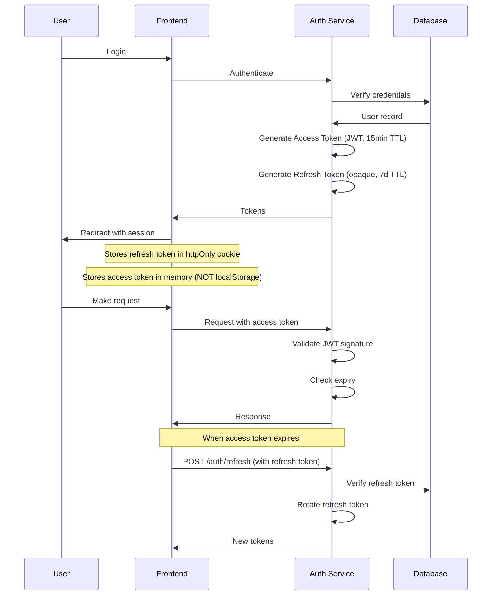
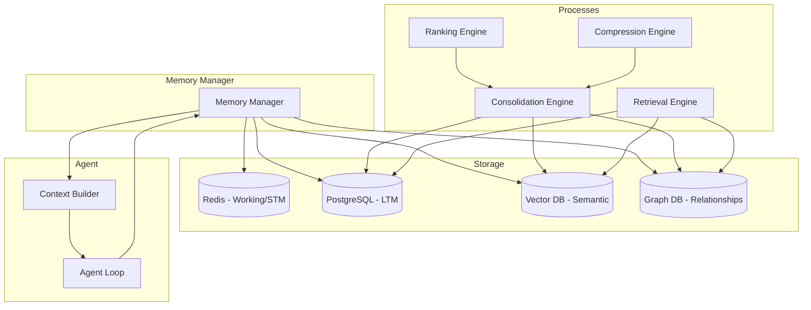
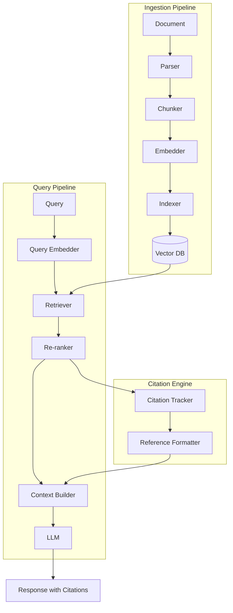

# Volume 2: Identity, Memory & Knowledge Systems

## Chapter 5: Identity Layer

### 5.1 Why Identity is the Foundation

In an AgentOS, identity is not just about "who is logged in." It governs:

- **Authentication**: Who is the user?
- **Authorization**: What can this user and their agents do?
- **Tenant isolation**: Which data belongs to which organization?
- **Agent identity**: Which agent is acting, on whose behalf?
- **Tool authorization**: What tools/resources can the agent access?
- **Audit trail**: Who/what did what, when?

**The identity onion:**
```
Layer 0: Human Identity (user)
Layer 1: Organization (tenant)
Layer 2: Agent Identity (digital entity acting on behalf)
Layer 3: Tool Identity (what tools are authorized)
Layer 4: Session Identity (transient runtime identity)
Layer 5: API Key Identity (programmatic access)
```

**Why multi-layer identity matters for agents:**
- An agent acts on behalf of a user within an org
- The agent may have different permissions than the user (narrower)
- The agent may use its own API keys (credential vault)
- The agent's actions must be attributable to both agent AND user

---

### 5.2 Authentication

#### 5.2.1 Authentication Methods

| Method | Security Level | UX | Best For |
|--------|---------------|-----|----------|
| Email + Password | Medium | Low | Basic accounts |
| OAuth 2.0 / OIDC | High | High | Consumer app |
| SSO (SAML/OIDC) | High | High | Enterprise |
| Magic Link | Medium | High | Low-friction signup |
| Passkeys (WebAuthn) | Very High | High | Security-sensitive |
| API Keys | Medium | Medium | Programmatic |
| Machine-to-Machine | High | N/A | Internal services |

**Recommended approach for AgentOS:**

1. **Consumer users**: OAuth (Google, GitHub) + Magic Link fallback
2. **Enterprise users**: SSO (SAML/OIDC) + OAuth fallback
3. **API access**: API Keys + JWT for session
4. **Agent-to-service**: mTLS or signed JWTs

#### 5.2.2 Token Strategy



**Token design:**
```json
// Access Token (JWT)
{
  "sub": "user_abc123",
  "org_id": "org_xyz789",
  "roles": ["admin", "agent_user"],
  "permissions": ["memory:read", "tools:execute", "knowledge:query"],
  "agent_id": "agent_def456",  // if acting through agent
  "session_id": "sess_789012",
  "iat": 1700000000,
  "exp": 1700000900,
  "iss": "agentos.example.com",
  "aud": "agentos-api"
}

// Refresh Token (opaque, stored in DB)
{
  "id": "rt_abc123",
  "user_id": "user_abc123",
  "device_id": "device_001",
  "family": "family_001",  // for rotation tracking
  "expires_at": "2026-07-20T00:00:00Z",
  "revoked": false
}
```

---

### 5.3 Authorization (RBAC + ABAC)

#### 5.3.1 RBAC Architecture

**Why RBAC first:**
RBAC is simpler to model and audit. Most AgentOS operations map naturally to roles. ABAC adds complexity that can be introduced later.

**Core model:**
```
Users ────< UserRole >──── Roles ────< RolePermission >──── Permissions
  │                            │
  │                            │ (inheritance)
  ▼                            ▼
Org                        Parent Roles
```

**Permission model for AgentOS:**
```
Permissions are structured as: {resource}:{action}

Resources: agent, memory, knowledge, tool, session, org, user, billing, settings
Actions:   create, read, update, delete, execute, manage, list

Examples:
- agent:create      - Create new agents
- memory:read       - Read from memory
- agent:execute     - Run agent tasks
- knowledge:manage  - Manage knowledge base
- org:settings      - Change org settings
- billing:read      - View billing
```

**Predefined roles:**

| Role | Scope | Permissions |
|------|-------|-------------|
| Owner | Org | All |
| Admin | Org | agent:*, memory:*, knowledge:*, org:settings, billing:read |
| Member | Org | agent:create, agent:execute, memory:read, knowledge:query |
| Viewer | Org | agent:read, memory:read, knowledge:query |
| Agent | Session | Scoped subset of user's permissions |
| API Key | User-defined | Configurable subset |

#### 5.3.2 ABAC (Attribute-Based Access Control)

For fine-grained control when RBAC is insufficient:

```
Allow if:
  user.role IN ['admin', 'editor']
  AND resource.org_id == user.org_id
  AND resource.visibility IN ['public', 'org']
  AND action IN ['read', 'list']
  AND (action == 'delete' IMPLIES resource.owner_id == user.id)
```

**When to use ABAC over RBAC:**
- Per-document permissions
- Time-based access (business hours only)
- Location-based restrictions
- Data classification levels (confidential, internal, public)
- Agent-specific tool restrictions

---

### 5.4 Multi-Tenancy

#### 5.4.1 Tenant Models

| Model | Isolation | Complexity | Cost | Example |
|-------|-----------|------------|------|---------|
| Shared database, shared schema | Low | Low | Low | Early stage |
| Shared database, separate schemas | Medium | Medium | Medium | Growing |
| Separate databases | High | High | High | Enterprise |
| Separate instances | Very High | Very High | Very High | Regulated industries |

**Recommendation:**
- Start with shared database + `org_id` on every table (row-level isolation)
- Add schema-level isolation for enterprise tier
- Add instance-level isolation for compliance customers

**Tenant isolation in queries:**
```sql
-- Every query MUST include org_id filter
SELECT * FROM agent_sessions 
WHERE org_id = current_org_id 
  AND user_id = current_user_id;

-- Use Row-Level Security (RLS) in PostgreSQL:
ALTER TABLE agent_memories ENABLE ROW LEVEL SECURITY;
CREATE POLICY org_isolation ON agent_memories
  USING (org_id = current_setting('app.current_org_id')::UUID);
```

---

### 5.5 Credential Vault

**Purpose:** Securely store and manage third-party API keys, tokens, and secrets that agents use to access external services.

**Why it exists:**
Agents need credentials to access tools (GitHub, Slack, Gmail, etc.). Storing these in plaintext or in agent memory is a security disaster. The vault provides encrypted storage with access control.

**Architecture:**
```
┌─────────────────────────────────────┐
│  Credential Vault                    │
│                                      │
│  ┌──────────┐  ┌────────────────┐   │
│  │ Encrypted │  │ Access Control │   │
│  │ Storage   │  │ Engine         │   │
│  └──────────┘  └────────────────┘   │
│                                      │
│  ┌──────────┐  ┌────────────────┐   │
│  │ Auditing  │  │ Credential     │   │
│  │ Logger    │  │ Rotation       │   │
│  └──────────┘  └────────────────┘   │
│                                      │
│  ┌──────────┐  ┌────────────────┐   │
│  │ OAuth    │  │ Session        │   │
│  │ Token    │  │ Manager        │   │
│  │ Refresh  │  │ (Temporary     │   │
│  │          │  │  Access)       │   │
│  └──────────┘  └────────────────┘   │
└─────────────────────────────────────┘
```

**Data model:**
```json
{
  "credential": {
    "id": "cred_001",
    "org_id": "org_xyz",
    "user_id": "user_abc",
    "type": "oauth2 | api_key | basic_auth | certificate",
    "provider": "github | slack | gmail | stripe",
    "label": "Production GitHub Token",
    "encrypted_value": "aes-256-gcm:base64...",
    "encryption_key_id": "key_001",
    "scopes": ["repo", "admin:repo_hook"],
    "expires_at": "2026-08-01T00:00:00Z",
    "last_used_at": "2026-07-10T15:30:00Z",
    "status": "active | expired | revoked",
    "access_policy": {
      "allowed_agents": ["agent_type:code", "agent_type:devops"],
      "allowed_users": ["user_abc", "user_def"],
      "max_uses_per_day": 1000
    }
  }
}
```

**Security requirements:**
- Encryption at rest: AES-256-GCM with envelope encryption
- Encryption in transit: TLS 1.3
- Access logging: Every credential access must be logged
- Ephemeral sessions: Credentials fetched into memory only during use
- Auto-rotation: Support for OAuth refresh tokens

---

### 5.6 API Key Management

**Purpose:** Allow programmatic access to AgentOS for developers building on the platform.

**Key types:**
- **Publishable keys**: Client-side, limited to creating sessions
- **Secret keys**: Server-side, full API access
- **Restricted keys**: Scoped to specific resources/actions

**Security practices:**
```
- Keys stored as bcrypt hash (not plaintext)
- Full key shown only at creation (one-time display)
- Prefix identifies type: sk_live_xxx, pk_live_xxx
- Last 4 chars shown in UI for identification
- Rotation endpoint: POST /v1/api-keys/:id/rotate
- Automatic expiry configurable (30d, 90d, 1y)
```

---

### 5.7 Session Management

**Session types in AgentOS:**
1. **User session**: Browser/app session (JWT-based)
2. **Agent session**: Active agent runtime session
3. **Tool session**: Temporary OAuth session for third-party tools

**Agent session lifecycle:**
```
Created → Active → Idle → Paused → Resumed → Terminated
                ↓
           (timeout) → Paused → (max pause) → Terminated
                ↓
           Token budget exhausted → Paused
```

**Session state storage:**
```json
{
  "agent_session": {
    "id": "as_001",
    "user_id": "user_abc",
    "org_id": "org_xyz",
    "agent_type": "research_agent",
    "status": "active | idle | paused | terminated",
    "created_at": "timestamp",
    "last_active_at": "timestamp",
    "token_usage": 45000,
    "token_budget": 100000,
    "loop_count": 12,
    "max_loops": 50,
    "context_summary": "Researching quantum computing applications...",
    "working_memory_pointer": "wm_snapshot_012"
  }
}
```

---

## Chapter 6: Memory System

### 6.1 Why Memory is the Core Differentiator

Memory is what separates an AgentOS from a chatbot. Without persistent, structured memory, every interaction starts from zero. With it, agents build on past experiences, learn user preferences, and improve over time.

**Memory requirements for AgentOS:**
- **Persistence**: Survive agent restarts
- **Structure**: Beyond text blobs — typed, linked, searchable
- **Hierarchy**: Different retention policies for different types
- **Consolidation**: Merge, summarize, prune automatically
- **Retrieval**: Fast, relevant, ranked
- **Evolution**: Update based on new information

---

### 6.2 Memory Types

#### 6.2.1 Working Memory

**What:** Temporary state during current agent execution.

**Characteristics:**
- Ephemeral: Lost when agent session ends (unless persisted)
- High detail: Full conversation, intermediate results
- Very fast access: In-memory (Redis)
- Small capacity: Constrained by context window

**Use cases:**
- Current conversation history
- In-progress tool results
- Intermediate reasoning state
- Current plan step

**Storage:**
```json
{
  "working_memory": {
    "session_id": "as_001",
    "messages": [
      { "role": "user", "content": "Analyze Q2 data", "ts": "..." },
      { "role": "assistant", "content": "Querying database...", "ts": "..." },
      { "role": "tool", "name": "db_query", "result": "{...}", "ts": "..." }
    ],
    "current_state": {
      "step": "analysis",
      "accumulated_data": { "revenue_total": 1520000 }
    }
  }
}
```

**Retention policy:** TTL of session + 24h for recovery.

#### 6.2.2 Short-Term Memory

**What:** Recent interactions across sessions (hours to days).

**Characteristics:**
- Span of days
- Summarized (not full detail)
- Medium access speed
- Used for context continuity

**Use cases:**
- Yesterday's conversations
- Recent project context
- Ongoing task continuity
- User's recent focus areas

**Storage:**
```json
{
  "short_term_memory": {
    "id": "stm_001",
    "user_id": "user_abc",
    "type": "conversation_summary",
    "content": "User was analyzing Q2 revenue trends. Found anomalies in March data. Want to investigate further.",
    "time_range": { "from": "2026-07-12", "to": "2026-07-13" },
    "importance": 0.7,
    "session_count": 3
  }
}
```

**Retention policy:** 7 days TTL, then consolidated into long-term.

#### 6.2.3 Long-Term Memory

**What:** Persistent knowledge across weeks, months, years.

**Characteristics:**
- Persistent indefinitely
- Highly compressed/abstracted
- Slower retrieval (vector search)
- Importance-ranked

**Use cases:**
- User preferences and personality
- Past project summaries
- Learned skills
- Important facts about the user
- Relationship information

**Storage:** Vector database + PostgreSQL.

**Ranking system:**
```
importance_score = f(
  access_frequency,
  recency_of_access,
  user_explicit_importance (user said "remember this"),
  relationship_count  (connected to many other memories)
)
```

#### 6.2.4 Semantic Memory

**What:** Facts, concepts, and general knowledge about the world.

**Characteristics:**
- Structured as knowledge graph
- Factual assertions
- Relationship links between concepts
- Confidence scores

**Use cases:**
- User's professional domain knowledge
- Project-specific terminology
- Business rules and policies

#### 6.2.5 Episodic Memory

**What:** Specific past events and experiences.

**Characteristics:**
- Temporal: Happened at a specific time
- Narrative: What happened, in sequence
- Contextual: Where, when, with whom

**Use cases:**
- "Remember when we discussed the Q2 report?"
- Recalling past problem-solving approaches
- Understanding user's context through past interactions

#### 6.2.6 Procedural Memory

**What:** How to do things — workflows, scripts, learned sequences.

**Characteristics:**
- Step-by-step procedures
- Tool usage patterns
- Decision rules
- Learned from past success/failure

**Use cases:**
- Remembering how user likes reports formatted
- Recalling successful multi-step workflows
- Learning tool composition patterns

#### 6.2.7 Preference Memory

**What:** User's stated and inferred preferences.

**Characteristics:**
- Explicit (user stated) or implicit (learned)
- Weighted by confidence
- Domain-specific

**Use cases:**
- Response style (concise vs detailed)
- Communication channel preferences (email vs slack vs in-app)
- Formatting preferences
- Time preferences (don't send after 9PM)

#### 6.2.8 Relationship Memory

**What:** Connections between entities — people, projects, organizations.

**Characteristics:**
- Graph structure
- Bidirectional relationships
- Typed edges (works_with, manages, reports_to)

**Use cases:**
- "Who is the stakeholder for this project?"
- Organization hierarchy
- Collaboration patterns

---

### 6.3 Memory Architecture



---

### 6.4 Memory Lifecycle

```
Creation → Storage → Retrieval → Update → Consolidation → (Archival/Forgetting)
   │          │           │          │            │
   │          │           │          │            └──→ Rank, merge, summarize
   │          │           │          │            └──→ Prune low-importance
   │          │           │          │            └──→ Archive old
   │          │           │          ▼
   │          │           │     Update relevance score
   │          │           │     Update access timestamp
   │          │           ▼
   │          │      Rank by relevance
   │          │      Apply to context
   │          ▼
   │     Store with metadata
   ▼
Perceive event
```

**Memory creation triggers:**
1. End of conversation turn (working → short-term)
2. Explicit user request ("remember this")
3. Importance detection (agent determines high importance)
4. Periodic consolidation (background process)
5. User feedback (corrects or reinforces)
6. Task completion (summarize what happened)

---

### 6.5 Memory Consolidation

**Purpose:** Convert short-term memories into long-term, compress multiple related memories, prune outdated information.

**Process:**
```
1. Collect short-term memories older than threshold (24h)
2. Group related memories (by topic, project, time range)
3. For each group:
   a. Summarize group into abstracted memory
   b. Extract key facts → semantic memory
   c. Identify procedures → procedural memory
   d. Update preferences → preference memory
   e. Extract relationships → relationship memory
4. Score each consolidated memory for importance
5. Store in appropriate long-term storage
6. Mark originals as archived
7. Prune memories below importance threshold
```

**Consolidation scheduling:**
- Incremental: Every hour (light consolidation)
- Deep: Daily at off-peak (full consolidation)
- On-demand: Triggered when memory usage exceeds 80% of budget

---

### 6.6 Memory Retrieval

**Retrieval strategies (applied in order):**

1. **Exact match**: Direct key lookup (working memory by session_id)
2. **Recency**: Most recently accessed memories (STM)
3. **Semantic search**: Vector similarity (LTM, semantic)
4. **Graph traversal**: Follow relationships (relationship memory)
5. **Temporal range**: Memories within specific time window
6. **Contextual**: Memories related to current task/topic

**Retrieval flow:**
```
Query → Determine memory types to search
  → Parallel search each type
  → Rank results by composite score
  → Apply token budget (truncate/summarize)
  → Return top-K context items
```

**Composite scoring:**
```
final_score = 0.35 * semantic_similarity
            + 0.25 * recency_score
            + 0.20 * importance_score
            + 0.10 * relationship_strength
            + 0.10 * user_explicit_relevance
```

---

### 6.7 Memory Forgetting

**Why forgetting is necessary:**
- Memory storage is finite
- Old, irrelevant memories degrade retrieval quality
- User's preferences change over time
- Privacy regulations (right to be forgotten)

**Forgetting strategies:**
1. **Importance threshold**: Delete memories below score after consolidation
2. **Time-based TTL**: Different TTLs per memory type
3. **Access-frequency**: "Use it or lose it" — delete rarely accessed
4. **User-directed**: Explicit delete or forget commands
5. **Conflict-based**: When new info contradicts old, reconcile

---

### 6.8 Memory Versioning

**Why version memory:**
- Track changes over time
- Rollback mistaken updates
- Audit what the agent learned and when

**Implementation:**
```sql
CREATE TABLE memory_versions (
    id UUID PRIMARY KEY,
    memory_id UUID NOT NULL,
    content TEXT NOT NULL,
    importance FLOAT,
    created_at TIMESTAMP,
    created_by TEXT,  -- 'agent' | 'user' | 'consolidation'
    change_reason TEXT
);

-- Current state is latest version
CREATE VIEW current_memories AS
SELECT DISTINCT ON (memory_id) *
FROM memory_versions
ORDER BY memory_id, created_at DESC;
```

---

## Chapter 7: Knowledge System

### 7.1 Why Knowledge is Separate from Memory

**Knowledge vs Memory:**

| Dimension | Memory | Knowledge |
|-----------|--------|-----------|
| Source | Agent experience | External documents |
| Structure | Experiential | Factual |
| Volatility | Changes with experience | Stable (until refreshed) |
| Ownership | Per-user/org | Shared within org |
| Format | NLP summaries | Original documents |
| Freshness | Real-time | Based on ingest schedule |
| Access | Agent-centric | Query-based (RAG) |

**Separation principle:**
Memory answers "what do I know about this user/project?"
Knowledge answers "what does the corpus say about this topic?"

---

### 7.2 RAG Architecture (Retrieval-Augmented Generation)



---

### 7.3 Document Ingestion Pipeline

#### 7.3.1 Document Types

| Format | Parser | Complexity |
|--------|--------|------------|
| PDF | PDFPlumber, PyMuPDF | Medium (tables, columns) |
| DOCX | python-docx | Low |
| HTML | BeautifulSoup, Readability | Medium |
| Markdown | Native | Low |
| CSV/Excel | pandas | Low (tables) |
| Images | OCR (Tesseract, GPT-4V) | High |
| Code | Tree-sitter | Medium |
| Notion/Confluence | API | Medium |
| Web pages | Firecrawl, Jina | Medium |

#### 7.3.2 Chunking Strategies

| Strategy | Description | Best For | Chunk Size |
|----------|-------------|----------|------------|
| Fixed-size | Split by token count | Simple docs | 512-1024 tokens |
| Recursive | Split on natural boundaries (paragraphs) | General text | 512-1024 tokens |
| Semantic | Split at topic changes (embedding similarity) | Long docs | Variable |
| Sentence-window | Sentences + N neighbors | Factual Q&A | 1 sentence |
| Document-level | Whole document as one chunk | Short docs | Variable |

**Recommended strategy (recursive with overlap):**
```
1. Try splitting by paragraphs
2. If paragraph > max_chunk_size, split by sentences
3. If sentence > max_chunk_size, split by tokens
4. Overlap chunks by 10-20% to prevent context loss at boundaries
```

**Chunk metadata:**
```json
{
  "chunk": {
    "id": "chunk_001",
    "document_id": "doc_abc",
    "index": 5,
    "text": "Machine learning models require large datasets...",
    "token_count": 420,
    "embedding": [0.012, -0.034, ...],
    "metadata": {
      "source": "AI_Handbook.pdf",
      "page": 42,
      "section": "3.2 Training Data Requirements",
      "heading": "Data Quality",
      "parent_chunk_id": null,
      "child_chunk_ids": ["chunk_002", "chunk_003"],
      "table_data": null
    }
  }
}
```

#### 7.3.3 Embedding Models

| Model | Dimensions | Max Tokens | Quality | Cost |
|-------|-----------|------------|---------|------|
| text-embedding-3-small | 1536 | 8192 | High | Low |
| text-embedding-3-large | 3072 | 8192 | Very High | Medium |
| Cohere Embed v3 | 1024 | 512 | High | Medium |
| BGE-M3 | 1024 | 8192 | High | Free (self-host) |
| Jina Embeddings v3 | 1024 | 8192 | High | Free (self-host) |

**Dimension reduction:**
- Start with 1536 dimensions (text-embedding-3-small)
- Reduce dimensionality for performance (256-512 if needed)
- Matryoshka embeddings allow truncation without re-embedding

---

### 7.4 Search Strategies

#### 7.4.1 Vector Search

**How it works:**
1. Embed query into same space as chunks
2. Find nearest neighbors by distance metric
3. Return top-K results

**Distance metrics:**

| Metric | Use Case | Speed |
|--------|----------|-------|
| Cosine similarity | Most text tasks | Fast |
| Dot product | Normalized embeddings | Fastest |
| Euclidean (L2) | Dense embeddings | Fast |
| Inner product | Unnormalized embeddings | Fast |

**Index types:**

| Index | Accuracy | Speed | Build Time | Memory |
|-------|----------|-------|------------|--------|
| IVFFlat | Medium | Fast | Medium | Low |
| HNSW | High | Very Fast | Slow | High |
| Flat (brute force) | Perfect | Slow | None | Low |
| IVF+PQ | Medium-High | Very Fast | Medium | Very Low |

**Recommendation:** HNSW for production (best latency/accuracy tradeoff).

#### 7.4.2 Keyword Search

**How it works:**
- Tokenize query and documents
- Build inverted index
- Score by TF-IDF or BM25
- Return top-K results

**BM25 scoring:**
```
score(D,Q) = Σ (IDF(q_i) * (f(q_i,D) * (k1+1)) / (f(q_i,D) + k1 * (1-b + b * |D|/avgdl)))
```

**When to use:** Exact term matching, proper nouns, code searches.

#### 7.4.3 Hybrid Search

**How it works:**
1. Run vector search → get score_v
2. Run keyword search → get score_k
3. Normalize both scores to [0,1]
4. Combine: score = α * score_v + (1-α) * score_k
5. Return re-ranked results

**Alpha tuning:**
- α = 0.7: Vector-heavy (semantic understanding preferred)
- α = 0.5: Balanced
- α = 0.3: Keyword-heavy (exact matches preferred)

**Recommended default:** α = 0.6 (slightly vector-heavy).

---

### 7.5 Re-ranking

**Purpose:** Improve retrieval quality by applying a more expensive model to top-N results.

**Process:**
```
Vector/hybrid search returns 50 candidates
→ Cross-encoder model re-ranks all 50 pairs
→ Returns top-5 most relevant
→ Context builder uses top-5
```

**Why re-ranking matters:**
- Bi-encoders (embeddings) lose fine-grained relevance signals
- Cross-encoders compare query-document pair directly
- First-pass: 50 results in 50ms; Re-rank: top-5 in 200ms
- The re-ranker catches what the embedder missed

**Re-ranking models:**

| Model | Quality | Speed | Size |
|-------|---------|-------|------|
| Cohere Rerank v3 | High | Fast | API |
| BGE-Reranker-v2 | High | Medium | 1.2GB |
| cross-encoder/ms-marco-MiniLM | Medium | Fast | 500MB |
| Jina Reranker v2 | High | Medium | API |

---

### 7.6 Knowledge Graph

**Purpose:** Represent entities and their relationships for complex multi-hop reasoning.

**Why a knowledge graph:**
- RAG retrieves atomic chunks — it cannot reason about relationships between concepts
- Knowledge graphs answer "what connects X and Y?" questions
- Enable graph traversal queries: "Find all projects related to customer X that use technology Y"

**Architecture:**
```
┌─────────────────────────────┐
│  Knowledge Graph Manager    │
│                              │
│  ┌─────────┐ ┌───────────┐  │
│  │ Entity  │ │Relation   │  │
│  │ Extractor│ │ Extractor │  │
│  └─────────┘ └───────────┘  │
│                              │
│  ┌─────────┐ ┌───────────┐  │
│  │ Graph   │ │ Graph     │  │
│  │ Builder │ │ Traverser │  │
│  └─────────┘ └───────────┘  │
│                              │
│  ┌──────────────────────┐   │
│  │  Graph DB (Neo4j/    │   │
│  │  DGraph)             │   │
│  └──────────────────────┘   │
└─────────────────────────────┘
```

**Data model:**
```cypher
// Entity node
(person:User {
  id: "user_abc",
  name: "Alice Chen",
  role: "Engineering Manager"
})

// Relationship
(project:Project {name: "Q2 Analysis"})
-[:OWNS {since: "2026-01"}]->(person:User {name: "Alice Chen"})

// Query: Find all projects Alice manages
MATCH (p:Project)-[:OWNS]->(u:User {name: "Alice Chen"})
RETURN p
```

**Entity extraction from documents:**
```
Document → LLM extracts entities and relationships → LLM outputs JSON
    → Validate against schema → Insert into graph DB
    → Link to source chunks in vector DB
```

---

### 7.7 Citation Engine

**Purpose:** Track which knowledge sources were used in a response and provide verifiable citations.

**Why it exists:**
- Users need to verify agent claims
- Hallucination risk requires accountability
- Enterprise compliance requires source tracking
- Trust depends on verifiability

**Architecture:**
```
Knowledge Chunks → RAG Retrieval → Context Builder
                                       │
                                       ▼
                                LLM Generation
                                       │
                                       ▼
                            Citation Tracker
                            - Maps response spans to sources
                            - Extracts inline citations
                            - Generates reference list
                                       │
                                       ▼
                            Response with [1][2] citations
                            + References section
```

**Citation format:**
```json
{
  "response": "The Q2 revenue increased by 23% year-over-year [1], primarily driven by the Enterprise segment which grew 45% [2].",
  "citations": [
    {
      "id": 1,
      "source": "Q2_Financial_Report.pdf",
      "page": 12,
      "excerpt": "Q2 2026 revenue reached $15.2M, representing 23% YoY growth",
      "confidence": 0.95,
      "url": "https://storage.agentos.com/docs/q2-report.pdf#page=12"
    },
    {
      "id": 2,
      "source": "Segment_Analysis.xlsx",
      "sheet": "Summary",
      "excerpt": "Enterprise segment: $8.5M (+45% YoY)",
      "confidence": 0.92
    }
  ]
}
```

---

### 7.8 Knowledge Refresh

**Purpose:** Keep knowledge bases current when source documents change.

**Strategies:**
1. **Webhook-based**: Source system notifies on change → re-ingest
2. **Polling**: Periodically check for updates
3. **Re-ingest on access**: Check freshness when chunk is retrieved
4. **Full re-sync**: Scheduled periodic rebuild

**Freshness tracking:**
```json
{
  "document": {
    "id": "doc_abc",
    "source_url": "https://wiki.company.com/page/123",
    "last_fetched_at": "2026-07-10T14:00:00Z",
    "source_modified_at": "2026-07-10T12:00:00Z",
    "next_fetch_at": "2026-07-11T14:00:00Z",
    "hash": "sha256:abc123...",
    "check_frequency_hours": 24
  }
}
```

---

### 7.9 Knowledge Deduplication

**Problem:** Same information ingested multiple times creates noise in retrieval.

**Solutions:**
1. **Content hash**: Store hash of each chunk, skip duplicates on insert
2. **Semantic dedup**: If embedding similarity > 0.95, merge chunks
3. **Update-in-place**: Same source URL → overwrite existing
4. **Versioned**: Keep both but mark older as superseded

---

### 7.10 Database Schema for Knowledge System

```sql
-- Documents
CREATE TABLE documents (
    id UUID PRIMARY KEY,
    org_id UUID NOT NULL REFERENCES orgs(id),
    title TEXT,
    source_type TEXT NOT NULL, -- 'upload', 'web', 'api', 'notion'
    source_url TEXT,
    file_path TEXT,
    file_hash TEXT,
    status TEXT DEFAULT 'pending', -- 'pending', 'processing', 'ready', 'failed'
    error_message TEXT,
    chunk_count INTEGER DEFAULT 0,
    token_count INTEGER DEFAULT 0,
    created_by UUID REFERENCES users(id),
    created_at TIMESTAMP DEFAULT NOW(),
    updated_at TIMESTAMP DEFAULT NOW()
);

-- Chunks
CREATE TABLE chunks (
    id UUID PRIMARY KEY,
    document_id UUID NOT NULL REFERENCES documents(id) ON DELETE CASCADE,
    index INTEGER NOT NULL,
    content TEXT NOT NULL,
    token_count INTEGER NOT NULL,
    embedding vector(1536),
    metadata JSONB DEFAULT '{}',
    created_at TIMESTAMP DEFAULT NOW()
);

-- Create HNSW index on embedding
CREATE INDEX ON chunks USING hnsw (embedding vector_cosine_ops);

-- Hybrid search via pg_bm25 extension or custom
CREATE INDEX idx_chunks_content_fts ON chunks USING GIN (to_tsvector('english', content));

-- Entities (Knowledge Graph)
CREATE TABLE entities (
    id UUID PRIMARY KEY,
    org_id UUID NOT NULL REFERENCES orgs(id),
    name TEXT NOT NULL,
    type TEXT NOT NULL, -- 'person', 'organization', 'project', 'technology', 'concept'
    description TEXT,
    metadata JSONB DEFAULT '{}',
    embedding vector(1536),
    created_at TIMESTAMP DEFAULT NOW()
);

-- Relationships
CREATE TABLE relationships (
    id UUID PRIMARY KEY,
    source_entity_id UUID NOT NULL REFERENCES entities(id),
    target_entity_id UUID NOT NULL REFERENCES entities(id),
    relationship_type TEXT NOT NULL, -- 'works_on', 'manages', 'uses', 'depends_on'
    properties JSONB DEFAULT '{}',
    confidence FLOAT DEFAULT 1.0,
    source_chunk_id UUID REFERENCES chunks(id),
    created_at TIMESTAMP DEFAULT NOW(),
    UNIQUE(source_entity_id, target_entity_id, relationship_type)
);

-- Citations (inline tracking)
CREATE TABLE citations (
    id UUID PRIMARY KEY,
    response_id UUID NOT NULL,
    chunk_id UUID NOT NULL REFERENCES chunks(id),
    span_start INTEGER,
    span_end INTEGER,
    relevance_score FLOAT,
    created_at TIMESTAMP DEFAULT NOW()
);
```

---

**Continue to Volume 3: Planning, Reasoning & Tool Systems**
