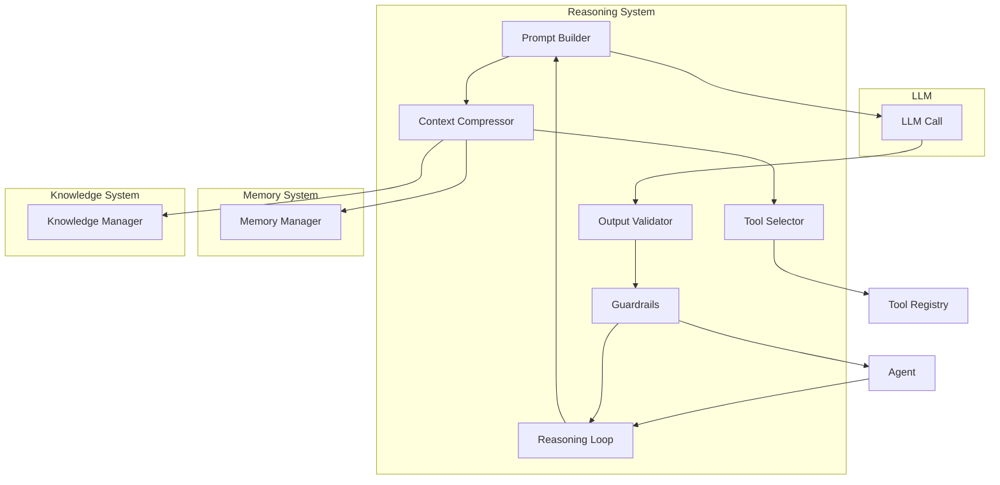
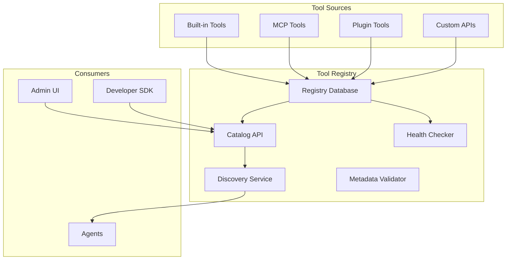

# Volume 3: Planning, Reasoning & Tool Systems

## Chapter 8: Planning System

### 8.1 Purpose and Philosophy

The planning system externalizes the agent's ability to decompose goals into executable steps. Rather than relying on the LLM to maintain long-range planning coherence within a single context window, the planner produces structured plans that persist across reasoning loops.

**Why external planning:**
- LLMs have limited context windows — plans degrade beyond ~50 steps
- Plans need to survive agent restarts and interruptions
- Plans must be inspectable, editable, and shareable
- Complex goals require hierarchical decomposition
- Failed steps require re-planning without starting over

---

### 8.2 Goal Manager

**Purpose:** Accept, validate, and decompose user goals.

**Input:** Natural language goal from user
**Output:** Structured goal object with success criteria

**Goal decomposition:**
```json
{
  "goal_id": "goal_001",
  "original": "Analyze Q2 revenue data and send report to team",
  "structured": {
    "objective": "Analyze Q2 2026 revenue data and distribute report",
    "scope": "Q2 2026 (April-June), all revenue streams",
    "constraints": {
      "must_include": ["comparison vs Q1", "YoY growth", "segment breakdown"],
      "must_not_exceed": "10 pages",
      "deadline": "2026-07-15T17:00:00Z"
    },
    "success_criteria": [
      "Revenue data queried from database",
      "Analysis completed with segment breakdowns",
      "Report generated in PDF format",
      "Email sent to engineering-team@company.com with report attached"
    ],
    "complexity_estimate": {
      "steps_estimated": 6,
      "tools_required": ["database", "chart_generator", "email"],
      "expected_loops": 8,
      "risk_level": "low"
    }
  }
}
```

---

### 8.3 Planner

**Purpose:** Generate executable step sequences from structured goals.

**Planning strategies:**

#### 8.3.1 LLM-based Planning

**How it works:**
```
Goal + Context → LLM → Structured Plan (list of steps with dependencies)
```

**Prompt template:**
```
You are a planning agent. Decompose the following goal into executable steps.

Goal: {goal}
Available tools: {tool_descriptions}
Context: {recent_memory, user_preferences, knowledge_context}

For each step, specify:
- Description of what to do
- Tool to use (if any)
- Dependencies on other steps
- Success criteria for this step
- Estimated complexity (simple/medium/complex)
- Error recovery strategy

Output as JSON array of steps.
```

**Advantages:** Flexible, handles novel goals.
**Disadvantages:** Expensive, variable quality, may hallucinate steps.

#### 8.3.2 Template-based Planning

**How it works:**
```
Goal + Context → Match to plan templates → Fill template slots
```

**Template example:**
```json
{
  "template_id": "data_analysis_report",
  "match_pattern": "analyze (quarterly|monthly|weekly) (data|revenue|metrics) and (send|email|distribute) report",
  "steps": [
    { "type": "tool_call", "tool": "database_query", "params": {"query": "{auto_generated}"} },
    { "type": "agent_action", "description": "Analyze data for trends and anomalies" },
    { "type": "tool_call", "tool": "chart_generator", "params": {"type": "bar", "metrics": ["revenue", "growth"]} },
    { "type": "tool_call", "tool": "document_generator", "params": {"format": "pdf"} },
    { "type": "tool_call", "tool": "email_sender", "params": {"to": "{extracted_recipients}", "attachment": "report.pdf"} }
  ]
}
```

**Advantages:** Fast, predictable, testable.
**Disadvantages:** Only works for known patterns.

#### 8.3.3 Hybrid Approach (Recommended)

```
1. Extract goal features (domain, verbs, nouns, constraints)
2. Try template matching first
3. If no template matches > 0.8 similarity:
   a. Use LLM to generate plan
   b. Store new plan as template for future
4. Validate plan against constraints
5. Present plan to user for approval (optional)
6. Execute
```

---

### 8.4 Plan Executor

**Purpose:** Execute plan steps in dependency order with state tracking.

**Execution model:**
```
Plan {steps: [{id, deps, type, ...}]}

1. Find steps with all dependencies satisfied (ready set)
2. Execute ready steps (parallel if dependencies allow)
3. On step completion:
   a. Store result
   b. Check if step succeeded
   c. If succeeded: update dependencies, repeat from step 1
   d. If failed: retry or re-plan
4. Continue until all steps complete or unrecoverable failure
```

**State machine per step:**
```
PENDING → READY → EXECUTING → COMPLETED
                              → FAILED → RETRYING → (COMPLETED | FAILED)
                → BLOCKED → (dependency completed → READY)
```

**Parallel execution:**
```
Steps without interdependencies execute in parallel
Example:
  Step 1 (query_db) — no deps
  Step 2 (query_analytics) — no deps
  Step 3 (analyze) — depends on [1, 2]
  → Steps 1 and 2 execute in parallel
  → Step 3 executes after both complete
```

---

### 8.5 Reflection and Self-Critique

**Purpose:** Evaluate step results and decide whether to continue, redo, or abort.

**Reflection process:**
```
Step Result → LLM Reflection → Evaluation →
  [PASS] → Continue to next step
  [RETRY] → Re-execute step with adjusted parameters
  [REPLAN] → Mark step and dependents for re-planning
  [ABORT] → Escalate to user
```

**Reflection prompt:**
```
Evaluate the result of this step:

Step: {step_description}
Expected: {success_criteria}
Actual result: {tool_output}

Questions:
1. Did the step achieve its intended goal? (yes/no/partial)
2. If partial, what's missing?
3. Should this step be retried? (yes/no)
4. If retry, what should change?
5. Should the overall plan change?

Output: PASS | RETRY | REPLAN | ABORT
Reasoning: {brief explanation}
Adjusted params: {if retry}
```

---

### 8.6 Retry Logic and Recovery

**Retry strategies:**
```
Attempt 1: Execute with original parameters
Attempt 2: Different approach (modified params)
Attempt 3: Different tool (if available)
Attempt 4: Escalate to user

Backoff: 1s → 2s → 4s → exponential
```

**Recovery strategies by failure type:**

| Failure Type | Recovery |
|-------------|----------|
| Tool timeout | Retry with longer timeout, then fallback tool |
| API error | Retry with backoff, then different provider |
| Validation error | Adjust parameters, retry |
| Hallucination detected | Re-execute with stricter constraints |
| Permission denied | Escalate with permission request |
| Data not found | Broaden search, then notify user |
| LLM error (bad output) | Re-prompt with clearer instructions |

---

### 8.7 Planning Memory

**Purpose:** Store successful and failed plans for learning.

```json
{
  "plan_memory": {
    "goal_pattern": "data_analysis_report",
    "template_id": "tpl_003",
    "success_count": 47,
    "failure_count": 3,
    "average_execution_time_ms": 45200,
    "common_failures": [
      {
        "step": "database_query",
        "failure_count": 2,
        "resolution": "Add retry with different query syntax"
      }
    ],
    "last_executed": "2026-07-13T10:30:00Z"
  }
}
```

---

## Chapter 9: Reasoning System

### 9.1 Core Architecture

The reasoning system is the "CPU" of the agent. It manages the LLM interaction loop, prompt construction, context injection, and output processing.



---

### 9.2 Prompt Builder

**Purpose:** Assemble the final prompt sent to the LLM from all context components.

**Prompt structure:**
```
<|system|>
{system_prompt}

<|context|>
{memory_context}
{knowledge_context}

<|tools|>
{available_tools_in_function_calling_format}

<|history|>
{conversation_history}

<|user|>
{current_message}

<|assistant|>
```

**System prompt components:**
```
1. Identity/role: "You are a helpful AI research assistant..."
2. Rules: "Always cite sources. Never make up data."
3. Response format: "Output tool calls as JSON..."
4. Constraints: "Keep responses under 500 words."
5. Tone: "Be concise and professional."
```

**Dynamic system prompt injection:**
```
Base system prompt (static) + 
  User preference additions (verbosity, format) +
  Tenant-specific rules (compliance, branding) +
  Agent-type additions (code_agent has code rules)
```

---

### 9.3 Context Compression

**Purpose:** Fit context into model's token window while preserving maximum useful information.

**Techniques:**

#### 9.3.1 Sliding Window

Keep recent N messages in full, summarize older ones:
```
Window 1 (0-4h ago): Full summary (50 tokens)
Window 2 (4-8h ago): Brief summary (20 tokens)  
Window 3 (8h+ ago): Single sentence
Window 4 (Current session): Full history
```

#### 9.3.2 Hierarchical Summarization

```
Conversation → Summarize every 10 messages → Summarize summaries → Final abstract
Layer 1: Raw messages (detailed)
Layer 2: Per-session summaries (500 tokens each)
Layer 3: Per-day summaries (200 tokens each)
Layer 4: Per-week summaries (100 tokens each)
```

#### 9.3.3 Importance-based Truncation

```
1. Rank all context items by importance score
2. Sort by importance (descending)
3. Take items until token budget exhausted
4. Summarize remaining items into single line each
5. Add summarized items at bottom as "Additional context"
```

**Compression ratio targets:**
```
Memory: compress 10:1 (full memory:compressed context)
History: compress 5:1 (conversation:summary)
Knowledge: compress 3:1 (documents:extracted facts)
Total context: typically 30-50% of model's max window
```

---

### 9.4 Reasoning Loop

**Purpose:** The iterative perceive-think-act-observe cycle.

**Loop implementation:**
```python
async def reasoning_loop(agent, message, max_loops=25):
    context = await build_context(agent, message)
    loop_count = 0

    while loop_count < max_loops:
        loop_count += 1

        # Step 1: Invoke LLM
        response = await invoke_llm(
            model=agent.model,
            prompt=context.build_prompt(),
            tools=agent.available_tools
        )

        # Step 2: Parse structured output
        parsed = parse_structured_output(response)

        # Step 3: Validate output
        validation = validate_output(parsed)
        if not validation.passed:
            context.add_message("system", f"Validation error: {validation.error}")
            continue

        # Step 4: Check guardrails
        guardrail_result = await check_guardrails(parsed)
        if guardrail_result.blocked:
            return ErrorResponse("Content blocked by safety filter")

        # Step 5: Execute tool calls if any
        if parsed.action == "tool_call":
            tool_result = await execute_tool(parsed.tool, parsed.parameters)
            context.add_tool_result(parsed.tool, tool_result)
            continue  # Loop back with tool result in context

        # Step 6: Return final response
        if parsed.action == "response":
            # Update memory asynchronously
            asyncio.create_task(update_memory(agent, context, parsed))
            return parsed.response

        # Step 7: Handle unexpected action
        context.add_message("system", "Unexpected action type. Please respond or use a tool.")

    # Max loops exceeded
    return ErrorResponse("Task exceeded maximum iterations. Please refine your request.")
```

**Loop termination conditions:**
1. Agent produces final response (no more tool calls needed)
2. Max loop count exceeded
3. Token budget exceeded
4. Agent explicitly requests termination
5. External cancel signal received

---

### 9.5 Tool Selection

**Purpose:** Determine which tools the LLM should call and with what parameters.

**How tool selection works in the LLM:**
```
The LLM sees tool definitions in the prompt (as function calling schema)
It outputs a structured tool_call object:
{
  "tool": "database_query",
  "parameters": {
    "query": "SELECT segment, revenue FROM q2_2026",
    "limit": 100
  }
}
```

**Tool definition format (OpenAI-compatible):**
```json
{
  "type": "function",
  "function": {
    "name": "database_query",
    "description": "Execute SQL query against company database. Read-only queries only.",
    "parameters": {
      "type": "object",
      "properties": {
        "query": {
          "type": "string",
          "description": "SQL SELECT query"
        },
        "limit": {
          "type": "integer",
          "description": "Max results to return",
          "default": 50
        }
      },
      "required": ["query"]
    }
  }
}
```

**Tool selection optimization:**
- Don't expose all tools — filter by agent type and permissions
- Reorder tools based on context relevance
- Remove tools that can't be called currently
- Add usage hints to descriptions

---

### 9.6 Output Validation

**Purpose:** Ensure LLM output conforms to expected format and constraints.

**Validation layers:**
```
1. Schema validation: Is JSON valid? Required fields present?
2. Type validation: Are values correct types? (string, number, enum)
3. Range validation: Are values within allowed ranges?
4. Constraint validation: Business rules (e.g., can't delete without confirm)
5. Consistency validation: Do parameters make sense together?
```

**On validation failure:**
```
Option A: Return error to LLM, let it fix:
  "Validation failed for tool 'email_sender': 
   parameter 'recipient' must be valid email format.
   Please provide correct email address."

Option B: Auto-correct (for minor issues):
  "recipient" was "john" → corrected to "john@company.com"
  (log the correction for audit)

Option C: Block (for severe issues):
  Tool call trying to DELETE without confirmation flag
```

---

### 9.7 Guardrails (Detail)

**Types of guardrails beyond safety:**

**Content guardrails:**
- PII detection in input and output
- Profanity filters
- Topic restrictions (per org policy)
- Competitor mention restrictions
- Legal disclaimers

**Behavioral guardrails:**
- Maximum tool calls per loop
- Maximum consecutive same-tool calls (prevent loops)
- Required human approval for destructive actions
- Rate limit awareness

**Technical guardrails:**
- Maximum token output
- Maximum parameter size
- Allowed parameter values (enums validation)
- SQL injection detection in query parameters

---

### 9.8 Response Ranking

**Purpose:** When multiple response candidates exist, select the best one.

**When multiple candidates exist:**
- LLM generates N responses (temperature sampling)
- Different models used for same query
- Different approaches explored in parallel

**Ranking criteria:**
```
score = 0.3 * factual_accuracy
      + 0.2 * helpfulness
      + 0.2 * conciseness
      + 0.1 * tone_match
      + 0.1 * citation_quality
      + 0.1 * speed
```

**Implementation:**
- Use a separate "judge" LLM call for ranking
- Or use predefined heuristics (prefer shorter, prefer cited)
- Or present options to user (for critical decisions)

---

### 9.9 Reflection (Self-Evaluation)

**Purpose:** Agent evaluates its own output before final delivery.

**Reflection prompt:**
```
Review your response before sending:

Your draft response: {draft}

Check:
1. Does it directly address the user's question?
2. Are all claims supported by cited sources?
3. Is the response clear and concise?
4. Does it respect user preferences? {preferences}
5. Any potential misunderstandings?

If improvements needed, rewrite. If satisfactory, confirm.
```

**When to reflect:**
- Before delivering final response (always)
- After complex tool call sequences
- When uncertainty is high
- When user seems frustrated (repeated similar queries)

---

### 9.10 Chain of Thought (Internal)

**How the agent reasons without exposing hidden CoT:**
- The agent's reasoning happens in the LLM call
- We structure the prompt to encourage logical thinking
- But we parse the final JSON output, not the raw text
- The "thought" field is internal to the structured output
- Users see only the final response, not intermediate reasoning

**Internal thought field:**
```json
{
  "thought": "The user wants Q2 analysis. I need to first query the database for Q2 data. Let me check what tables exist. I'll use database_query tool first, then analyze results.",
  "action": {
    "type": "tool_call",
    "tool": "database_query",
    "parameters": { "query": "SHOW TABLES" }
  }
}
```

---

## Chapter 10: Tool System

### 10.1 Why a Tool System?

Tools are how agents interact with the outside world. Without a tool system, agents can only generate text. The tool system provides:

- **Discovery**: Agents can find available tools
- **Invocation**: Execute tools with proper parameters
- **Security**: Control which agents can call which tools
- **Observability**: Track tool usage and performance
- **Reliability**: Handle failures gracefully
- **Extensibility**: Third-party tools via plugins/MCP

---

### 10.2 Tool Registry

**Purpose:** Central catalog of all available tools with metadata.



**Tool metadata schema:**
```json
{
  "tool": {
    "id": "tool_email_sender",
    "name": "Email Sender",
    "version": "2.1.0",
    "description": "Send emails via SMTP or SendGrid",
    "category": "communication",
    "auth_required": true,
    "auth_type": "credential_vault",
    "provider": "sendgrid",
    "status": "active",
    "health": {
      "last_check": "2026-07-13T10:00:00Z",
      "status": "healthy"
    },
    "metrics": {
      "total_calls": 15234,
      "success_rate": 0.987,
      "avg_latency_ms": 450,
      "p99_latency_ms": 2100
    },
    "rate_limits": {
      "per_user": 100,
      "per_org": 1000,
      "per_minute": 10
    },
    "functions": [
      {
        "name": "send_email",
        "description": "Send an email to one or more recipients",
        "parameters": {
          "type": "object",
          "properties": {
            "to": { "type": "array", "items": { "type": "string" }, "description": "Email addresses" },
            "subject": { "type": "string" },
            "body": { "type": "string" },
            "attachments": { "type": "array", "items": { "type": "string" }, "optional": true }
          },
          "required": ["to", "subject", "body"]
        }
      }
    ],
    "permissions": {
      "required_role": "member",
      "allowed_agent_types": ["assistant", "workflow"]
    }
  }
}
```

---

### 10.3 Tool Execution Pipeline

```
Agent → Built Prompt with Tool Defs → LLM Decides → Tool Call Request
  → Permission Check → Auth Check → Rate Limit Check
  → Parameter Validation → Execute
  → Monitor Execution → Handle Result/Error
  → Return to Agent Loop
```

**Execution detail:**
```typescript
async function executeTool(toolCall: ToolCall, context: ExecutionContext): Promise<ToolResult> {
    // 1. Lookup tool
    const tool = await toolRegistry.get(toolCall.toolName);

    // 2. Permission check
    if (!await permissionEngine.canExecute(context.agent, tool)) {
        return { error: "PERMISSION_DENIED", message: `Agent not authorized to use ${tool.name}` };
    }

    // 3. Authentication
    const credentials = await credentialVault.getCredentials(context, tool);
    if (!credentials) {
        return { error: "AUTH_REQUIRED", message: `Credentials needed for ${tool.name}` };
    }

    // 4. Rate limit check
    if (!await rateLimiter.check(tool.id, context)) {
        return { error: "RATE_LIMITED", message: `Rate limit exceeded for ${tool.name}` };
    }

    // 5. Validate parameters
    const validatedParams = validateParams(toolCall.parameters, tool.parameters);
    if (validatedParams.errors.length > 0) {
        return { error: "INVALID_PARAMS", message: validatedParams.errors.join(", ") };
    }

    // 6. Execute with timeout
    const timeout = tool.timeout || 30000;
    try {
        const startTime = Date.now();
        const result = await Promise.race([
            tool.handler(validatedParams, credentials, context),
            timeoutReject(timeout)
        ]);
        const latency = Date.now() - startTime;

        // 7. Log execution
        observability.logToolCall({
            tool: tool.id,
            agent: context.agent.id,
            user: context.user.id,
            params: sanitizeForLogs(toolCall.parameters),
            result: sanitizeForLogs(result),
            latency,
            success: true
        });

        return result;
    } catch (error) {
        observability.logToolCall({
            tool: tool.id,
            agent: context.agent.id,
            error: error.message,
            success: false
        });
        throw error;
    }
}
```

---

### 10.4 Tool Types

#### 10.4.1 Built-in System Tools

| Tool | Purpose | Risk Level |
|------|---------|------------|
| database_query | Read/query databases | Medium (SQL injection risk) |
| file_read | Read files from storage | Low |
| file_write | Write files to storage | Medium |
| code_execute | Run Python/JS code | High |
| browser_navigate | Browse web pages | Medium |
| email_send | Send emails | Low |
| calendar_read | Read calendar events | Low |
| calendar_create | Create calendar events | Medium |

#### 10.4.2 API Integration Tools

| Tool | Auth Required | Complexity |
|------|--------------|------------|
| github | OAuth | Medium |
| slack | OAuth | Low |
| gmail | OAuth | Medium |
| google_drive | OAuth | Medium |
| jira | OAuth/API Key | Medium |
| notion | OAuth | Medium |
| salesforce | OAuth | High |
| stripe | API Key | Medium |
| hubspot | API Key | Medium |

#### 10.4.3 Developer Tools

| Tool | Purpose |
|------|---------|
| rest_api_call | Execute arbitrary HTTP requests |
| graphql_query | Query GraphQL endpoints |
| webhook_send | Send webhook events |
| websocket_send | Send WebSocket messages |

---

### 10.5 MCP (Model Context Protocol)

**What is MCP:**
MCP is an open protocol (by Anthropic) that standardizes how LLM applications connect with external data sources and tools. It's analogous to USB-C for AI — a standard connector for tool integration.

**Why MCP matters:**
- Standardizes tool definitions across providers
- Enables tool marketplace ecosystem
- Reduces custom integration code
- Supports dynamic tool discovery

**MCP Architecture:**
```
┌──────────────────────────────────────────┐
│  MCP Gateway                             │
│                                          │
│  ┌──────────────────────────────────────┐│
│  │  MCP Client                          ││
│  │  - Discovers tools from MCP servers  ││
│  │  - Translates tool calls to MCP      ││
│  │  - Handles transport (SSE, stdio)    ││
│  └──────────────────────────────────────┘│
│                                          │
│  ┌──────────┐ ┌──────────┐ ┌──────────┐ │
│  │ MCP      │ │ MCP      │ │ MCP      │ │
│  │ Server A │ │ Server B │ │ Server C │ │
│  │ (Slack)  │ │ (GitHub) │ │ (Custom) │ │
│  └──────────┘ └──────────┘ └──────────┘ │
└──────────────────────────────────────────┘
```

**MCP tool definition format:**
```json
{
  "mcp_tool": {
    "name": "get_weather",
    "description": "Get current weather for a location",
    "inputSchema": {
      "type": "object",
      "properties": {
        "location": { "type": "string" },
        "units": { "type": "string", "enum": ["celsius", "fahrenheit"] }
      },
      "required": ["location"]
    }
  }
}
```

---

### 10.6 Plugin System

**Purpose:** Allow third-party developers to create and distribute tools.

**Plugin architecture:**
```
Plugin Package
├── manifest.json (version, permissions, description)
├── tool_definitions.json (tool schemas)
├── handler.js (or .py, .ts) (execution code)
├── assets/ (icons, images)
└── README.md
```

**Plugin validation:**
```
1. Verify manifest schema
2. Sandbox permission review (what can this plugin access?)
3. Code review (automated security scan)
4. Resource limits (CPU, memory, network)
5. Approval workflow (automated + manual for high-risk)
```

**Plugin runtime isolation:**
- Run in separate containers
- Network policies restrict outbound connections
- Resources limited by cgroups
- No access to agent memory or other plugins' data
- Ephemeral filesystem

---

### 10.7 Tool Permissions

**Multi-level permission model:**
```
Level 1: Org admin enables tool for org
Level 2: User authorizes tool (OAuth)
Level 3: Agent type permitted to use tool
Level 4: Runtime permission check per invocation
```

**Permission request flow:**
```
Agent wants to call tool X
  → Check: Is X enabled for this org? → No → Block
  → Check: Does user have OAuth for X? → No → Request auth
  → Check: Can this agent type use X? → No → Block
  → Check: Does this specific invocation pass constraints? → No → Block
  → Execute
```

**OAuth flow for tools:**
```
User: "Analyze my GitHub repos"
Agent: "I need GitHub access. Click here to authorize."
User: Clicks authorize
→ OAuth flow: Redirect → GitHub consent → Callback → Store token in vault
Agent: Now has access → proceeds with task
```

**Tool authentication best practices:**
- Never prompt: "Enter your GitHub password" — always use OAuth
- Store tokens in credential vault, not in memory
- Scope tokens to minimum permissions
- Support token refresh automatically
- Alert on unusual token usage patterns

---

### 10.8 Tool Versioning

**Why version tools:**
- Tools change APIs over time
- Agents may depend on specific behavior
- Rollback problematic tool updates

**Version strategy:**
```
- Major version: breaking changes (tool_v2, tool_v3)
- Minor version: non-breaking additions
- Patch: bug fixes

Agents pin to major version
System auto-upgrades minor/patch
```

---

### 10.9 Tool Health Monitoring

```json
{
  "tool_health": {
    "tool_id": "email_sender",
    "status": "degraded",
    "last_check": "2026-07-13T10:05:00Z",
    "checks": [
      { "name": "provider_connectivity", "status": "healthy", "latency_ms": 120 },
      { "name": "auth_token_valid", "status": "healthy", "expires_in_days": 15 },
      { "name": "rate_limit_remaining", "status": "degraded", "remaining": 12, "limit": 100 },
      { "name": "response_time", "status": "healthy", "p99_ms": 1800 }
    ]
  }
}
```

**Health check frequency:**
- Critical tools: every 60 seconds
- Standard tools: every 5 minutes
- Low-usage tools: on-demand

---

### 10.10 Tool Retry and Timeout

**Timeout configuration:**
```json
{
  "timeout_policy": {
    "default": 30000,
    "database_query": 60000,
    "browser_navigate": 120000,
    "code_execute": 120000,
    "email_send": 10000,
    "rest_api_call": 30000
  }
}
```

**Retry configuration:**
```json
{
  "retry_policy": {
    "max_retries": 3,
    "backoff_strategy": "exponential",
    "base_delay_ms": 1000,
    "max_delay_ms": 10000,
    "retryable_errors": [
      "TIMEOUT",
      "RATE_LIMITED",
      "SERVICE_UNAVAILABLE",
      "INTERNAL_ERROR"
    ],
    "non_retryable_errors": [
      "PERMISSION_DENIED",
      "INVALID_PARAMS",
      "AUTH_REQUIRED",
      "NOT_FOUND"
    ]
  }
}
```

---

### 10.11 Tool Sandboxing

**Purpose:** Prevent malicious or buggy tool code from harming the system.

**Sandbox layers:**
```
1. Network isolation:
   - Allowlist of allowed domains/IPs
   - No local network access
   - No metadata service access (cloud provider)

2. Filesystem isolation:
   - Read-only for system files
   - Temp directory only for writes
   - Quota on disk usage

3. Process isolation:
   - Run in container/MicroVM
   - CPU/memory limits via cgroups
   - No access to host processes

4. Time limits:
   - Hard timeout for execution
   - Graceful termination

5. No side effects (for read-only tools):
   - Detect and block mutations
   - Read-only database connections
```

---

### 10.12 Built-in Tool Implementations (Key Examples)

#### 10.12.1 Database Tool

```json
{
  "name": "database_query",
  "description": "Execute SQL queries on configured databases",
  "security": {
    "read_only": true,
    "query_validation": "SELECT/EXPLAIN only enforced at proxy level",
    "row_limit": 1000,
    "timeout_ms": 30000
  },
  "implementation_notes": [
    "Use read-only database connection",
    "Validate query starts with SELECT or EXPLAIN",
    "Strip dangerous keywords with regex fallback",
    "Apply row limits at query level",
    "Never expose connection strings in logs"
  ]
}
```

#### 10.12.2 Code Execution Tool

```json
{
  "name": "code_execute",
  "description": "Execute Python or JavaScript code in sandbox",
  "security": {
    "sandbox": "gvisor/Firecracker microVM",
    "network": "deny by default, allowlist only",
    "filesystem": "ephemeral, no host access",
    "timeout_ms": 120000,
    "max_memory_mb": 512,
    "allowed_imports": ["pandas", "numpy", "json", "csv", "requests"],
    "blocked_imports": ["os", "subprocess", "sys", "importlib"]
  }
}
```

#### 10.12.3 Browser Tool

```json
{
  "name": "browser_navigate",
  "description": "Navigate web pages and extract content",
  "implementation": {
    "engine": "Playwright/Puppeteer",
    "view": "headless Chromium",
    "actions": ["navigate", "click", "type", "extract", "screenshot"],
    "limitations": [
      "No JavaScript execution for untrusted sites",
      "No cookie sharing with user's browser",
      "No form auto-fill with saved passwords"
    ]
  }
}
```

---

### 10.13 Tool Composition

**Purpose:** Allow agents to combine tools in sequences and expose as higher-level capabilities.

**Example composition:**
```
"Find John's email and send him the report"

Composite workflow:
1. tool: directory_lookup (find John → email)
2. tool: database_query (get latest report)
3. tool: email_sender (send to John with attachment)
```

**Composite tool definition:**
```json
{
  "name": "send_report_to_person",
  "description": "Look up a person and email them the latest report",
  "composite": true,
  "steps": [
    { "tool": "directory_lookup", "param_mapping": { "person": "$input.name" } },
    { "tool": "report_generator", "param_mapping": { "report_type": "$input.report_type" } },
    { "tool": "email_sender", "param_mapping": { "to": "$step0.email", "attachment": "$step1.file" } }
  ]
}
```

---

### 10.14 Tool System Scaling

| Concern | Strategy |
|---------|----------|
| Many concurrent tool calls | Worker pool, async execution |
| Slow tools | Timeout + circuit breaker |
| Tool overload | Rate limiting per tool |
| Tool churn | Versioning + deprecation policy |
| Discovery at scale | Indexed registry, categorized |
| Credential management | Vault with caching + rotation |

---

**Continue to Volume 4: Execution, Learning & Communication Layers**
