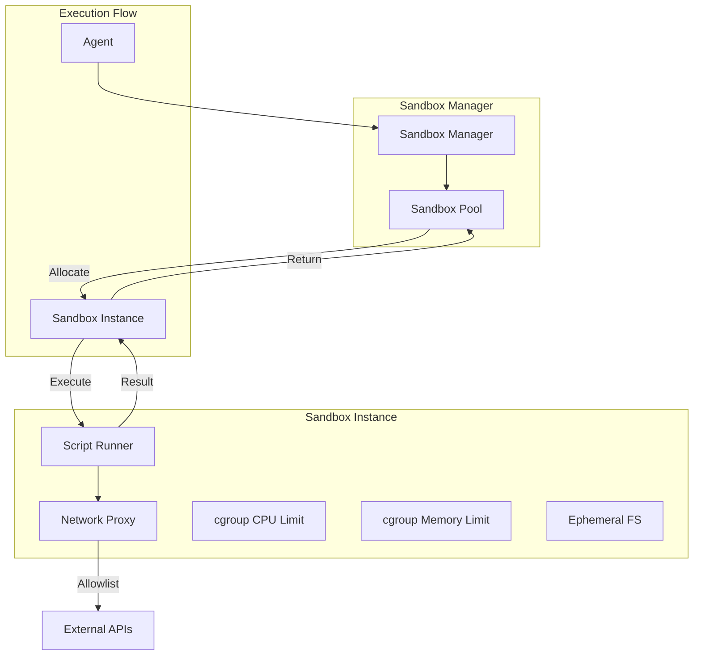
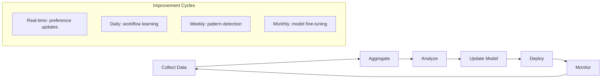

# Volume 4: Execution, Learning & Communication Layers

## Chapter 11: Execution Layer

### 11.1 Why a Dedicated Execution Layer

The execution layer is responsible for running agent tasks reliably, at scale, with appropriate resource isolation. It sits between the orchestration layer (which decides WHAT to do) and the infrastructure layer (which provides compute resources).

**Key responsibilities:**
- Task scheduling and queue management
- Workflow execution (DAG-based step sequences)
- Sandbox creation for code/tool execution
- Background job processing
- Event-driven execution triggers
- Cron/scheduled execution

**Why not run everything inline:**
- **Blocking**: Long-running tasks block the orchestrator
- **Unreliable**: Process crash loses in-progress work
- **Unscalable**: No queuing means no backpressure
- **Unobservable**: No tracking of execution state
- **Unisolated**: Memory leaks and crashes affect other agents

---

### 11.2 Task Queue

**Purpose:** Decouple task submission from execution, enabling reliable async processing.

**Architecture:**
```
┌──────────────┐    ┌──────────────┐    ┌──────────────┐
│  Producer    │───→│  Task Queue   │───→│  Consumer    │
│  (Orchestr.) │    │  (Redis/Bull) │    │  (Worker)    │
└──────────────┘    └──────────────┘    └──────────────┘
                          │
                          ▼
                    ┌──────────────┐
                    │  Dead Letter  │
                    │  Queue        │
                    │  (Failed jobs)│
                    └──────────────┘
```

**Task types:**

| Task Type | Priority | Max Retries | Typical Duration |
|-----------|----------|-------------|-----------------|
| agent_response | High | 3 | 5-30s |
| tool_execution | High | 3 | 1-120s |
| memory_update | Medium | 2 | 0.1-1s |
| knowledge_ingest | Low | 3 | 10-300s |
| consolidation | Low | 2 | 10-60s |
| email_notification | Medium | 5 | 1-5s |
| webhook_delivery | Medium | 5 | 1-10s |
| scheduled_task | Medium | 2 | Varies |

**Task schema:**
```json
{
  "task": {
    "id": "task_abc123",
    "type": "tool_execution",
    "subtype": "database_query",
    "payload": {
      "query": "SELECT * FROM revenue WHERE quarter = 'Q2-2026'",
      "connection_id": "db_prod_01"
    },
    "context": {
      "session_id": "sess_001",
      "user_id": "user_abc",
      "org_id": "org_xyz",
      "agent_id": "agent_code_01",
      "trace_id": "trace_001"
    },
    "priority": "high",
    "status": "pending",
    "retries": 0,
    "max_retries": 3,
    "created_at": "2026-07-13T10:00:00Z",
    "scheduled_at": null,  // for delayed tasks
    "timeout_ms": 30000,
    "result_ttl": 3600
  }
}
```

**Queue implementation options:**

| Technology | Pros | Cons | Best For |
|-----------|------|------|----------|
| Redis + BullMQ | Fast, simple, good DX | Memory-bound, no persistence guarantees | Most AgentOS apps |
| RabbitMQ | Durable, flexible routing | Heavier ops | Complex routing |
| Amazon SQS | Fully managed, infinite scale | Vendor lock, ~100ms latency | AWS-native |
| Kafka | Infinite retention, replay | Overkill for task queues | Event streaming + queue |
| Temporal | Workflow persistence, long-running | Heavy, steep learning curve | Complex workflows |

**Recommended:** Redis + BullMQ for most use cases. Temporal for long-running workflows.

---

### 11.3 Workflow Engine

**Purpose:** Execute pre-defined DAG-based workflows with state persistence, retry, and observability.

**Why separate from general execution:**
- Workflows have known structure (vs open-ended agent loops)
- Workflows need visual representation in dashboard
- Workflows require step-level debugging
- Workflows need compensation/rollback

**Workflow definition:**
```json
{
  "workflow": {
    "id": "wf_data_analysis",
    "name": "Data Analysis & Report",
    "version": 3,
    "description": "Analyze data and generate email report",
    "trigger": {
      "type": "api",
      "webhook_url": null,
      "schedule": null
    },
    "steps": [
      {
        "id": "validate_input",
        "type": "validation",
        "params": { "schema_ref": "analysis_request" },
        "next": { "default": "query_data", "failure": "return_error" }
      },
      {
        "id": "query_data",
        "type": "tool_call",
        "tool": "database_query",
        "params": { "query_from_input": true },
        "retry": { "max": 3, "backoff": "exponential" },
        "timeout": 60000,
        "next": { "default": "analyze", "failure": "query_fallback" }
      },
      {
        "id": "query_fallback",
        "type": "tool_call",
        "tool": "cache_lookup",
        "params": { "cache_key_from_query": true },
        "next": { "default": "analyze", "failure": "return_error" }
      },
      {
        "id": "analyze",
        "type": "agent_action",
        "params": { "prompt_template": "analysis_template" },
        "next": { "default": "generate_chart", "failure": "notify_failure" }
      },
      {
        "id": "generate_chart",
        "type": "tool_call",
        "tool": "chart_generator",
        "params": { "data_from_step": "analyze" },
        "next": { "default": "generate_report" }
      },
      {
        "id": "generate_report",
        "type": "tool_call",
        "tool": "document_generator",
        "params": { "include": ["analysis", "chart"] },
        "next": { "default": "send_email" }
      },
      {
        "id": "send_email",
        "type": "tool_call",
        "tool": "email_sender",
        "params": { "from_input": true },
        "next": { "default": "success" }
      },
      {
        "id": "return_error",
        "type": "response",
        "params": { "template": "error_message" }
      }
    ]
  }
}
```

**Workflow execution state machine:**
```
          ┌─────────┐
          │ PENDING │
          └────┬────┘
               │ trigger
               ▼
          ┌─────────┐
          │ RUNNING │
          └────┬────┘
               │
     ┌─────────┼─────────┐
     ▼         ▼         ▼
┌─────────┐ ┌──────┐ ┌──────┐
│ STEP    │ │STEP  │ │STEP  │
│ RUNNING │ │DONE  │ │FAILED│
└────┬────┘ └──────┘ └──┬───┘
    │                    │
    ▼                    │
┌─────────┐             │
│ ALL     │             │
│ DONE ───┼─── SUCCESS ─┘
└─────────┘             │
                        ▼
                   ┌────────┐
                   │ FAILED │
                   └────────┘
```

**Compensation (rollback) support:**
```json
{
  "step": {
    "id": "send_email",
    "type": "tool_call",
    "tool": "email_sender",
    "compensation": {
      "tool": "email_recall",
      "params": { "message_id_from_step": true }
    }
  }
}
```

**Workflow engine vs agent orchestrator:**
- Workflow engine: Pre-defined DAG, deterministic paths, compensatable
- Agent orchestrator: Open-ended loops, LLM-driven decisions, dynamic paths
- Both can coexist: Workflow engine handles known processes; agent handles unknown

---

### 11.4 Scheduler

**Purpose:** Trigger agents and workflows on schedules or events.

**Schedule types:**

```
1. Cron-based: Every day at 9AM, every hour, etc.
2. Interval-based: Every 30 minutes, every 2 hours
3. Event-based: On webhook, on database change
4. Chained: On completion of another task
```

**Cron schedule:**
```json
{
  "schedule": {
    "id": "sched_daily_report",
    "type": "cron",
    "expression": "0 9 * * 1-5",  // Weekdays at 9AM
    "timezone": "America/New_York",
    "action": {
      "type": "agent_goal",
      "agent_type": "analysis_agent",
      "goal": "Generate daily revenue report and post to #revenue Slack channel"
    },
    "enabled": true,
    "last_run_at": "2026-07-13T09:00:00Z",
    "next_run_at": "2026-07-14T09:00:00Z"
  }
}
```

**Scheduler implementation:**
```
- Use Redis-backed distributed lock (prevent double-triggering)
- Store schedules in PostgreSQL (durable)
- Worker polls for due schedules every 10s
- On schedule trigger: create task in task queue
- Handle missed schedules (server was down): catch-up on restart
```

---

### 11.5 Event Bus

**Purpose:** Decouple system components via publish/subscribe messaging.

**Events in AgentOS:**
```
agent.session.created        → Memory manager prepares session storage
agent.session.terminated     → Consolidation engine finalizes memories
agent.message.received       → Notification service sends push
agent.message.sent           → Audit logger records interaction
agent.tool.called            → Cost tracker records usage
agent.tool.failed            → Alert system evaluates severity
agent.memory.consolidated    → Search index refreshes
knowledge.document.ingested  → Vector index updates
user.feedback.received       → Learning layer processes feedback
org.billing.threshold_reached → Usage alert sent
```

**Event schema:**
```json
{
  "event": {
    "id": "evt_001",
    "type": "agent.tool.called",
    "version": 1,
    "source": "orchestrator",
    "timestamp": "2026-07-13T10:00:00.123Z",
    "correlation_id": "trace_001",
    "data": {
      "agent_id": "agent_001",
      "user_id": "user_abc",
      "tool": "database_query",
      "duration_ms": 450,
      "success": true
    }
  }
}
```

**Pub/Sub implementation options:**

| Tech | Pros | Cons |
|------|------|------|
| Redis Pub/Sub | Fast, simple | No persistence, no replay |
| RabbitMQ | Durable, flexible routing | More ops overhead |
| Kafka | Persistent, replayable, partitioned | Overkill for most events |
| Postgres LISTEN/NOTIFY | Zero additional infra | Limited throughput |

**Recommended:** Redis Pub/Sub for real-time events, PostgreSQL for event sourcing/audit log. Kafka when scaling to millions of events/day.

---

### 11.6 Sandbox Runtime

**Purpose:** Execute untrusted code (agent-generated scripts, plugin code) in isolated environments.

#### 11.6.1 Sandbox Technologies

| Technology | Isolation Level | Startup Time | Overhead | Best For |
|-----------|----------------|-------------|----------|----------|
| Docker container | Process-level | 1-5s | Low | Most tools |
| Firecracker microVM | VM-level | 125ms | Medium | Code execution |
| gVisor | Application-level kernel | 100ms | Medium | High-security |
| WebAssembly | Sandboxed runtime | <10ms | Very low | Plugin code |
| Subprocess + seccomp | Process-level | <10ms | Very low | Quick scripts |

#### 11.6.2 Code Execution Sandbox Design



**Sandbox capabilities:**
```
Code execution: Python 3.12, Node.js 20, Go 1.22
Constraints:
  - CPU: 1 core (burst to 2)
  - Memory: 512 MB
  - Disk: 1 GB ephemeral
  - Network: Allowlist only
  - Execution time: 120s max
  - No GPU access
```

**Network allowlist approach:**
```
Default: deny all outbound
Allowlist: 
  - api.agentos.internal (internal APIs)
  - api.openai.com (LLM providers)
  - api.anthropic.com
  - *.data.company.com (user's data sources)
Block:
  - 169.254.169.254 (metadata service)
  - 10.0.0.0/8, 172.16.0.0/12, 192.168.0.0/16 (internal networks)
```

#### 11.6.3 Browser Automation Sandbox

```json
{
  "browser_sandbox": {
    "engine": "Playwright",
    "browser": "Chromium headless",
    "isolation": "per-session container",
    "limitations": {
      "screenshots": true,
      "file_downloads": false,
      "extensions": false,
      "local_storage": false,
      "cookies": "per-session, no persistence"
    },
    "security": {
      "javascript": "enabled (required for SPAs)",
      "popups": false,
      "notifications": false,
      "geolocation": "blocked",
      "clipboard": "blocked"
    }
  }
}
```

---

### 11.7 Resource Limits and Concurrency

**Per-org resource limits:**
```
Concurrent agent sessions: 50 (basic), 200 (pro), 1000 (enterprise)
Concurrent tool executions: 100 (basic), 500 (pro), 2000 (enterprise)
Concurrent sandboxes: 10 (basic), 50 (pro), 200 (enterprise)
Total worker threads: auto-scaled based on load
Memory per agent session: 256 MB (RAM for context)
Storage per org: 10 GB (basic), 100 GB (pro), unlimited (enterprise)
```

**Backpressure strategy:**
```
Load → Queue depth increases → Monitor triggers scale-up
Queue depth > threshold → New requests get 429 (Too Many Requests)
Queue depth > critical → Reject lowest priority tasks
All workers saturated → Queue, don't drop (within limits)
```

---

## Chapter 12: Learning Layer

### 12.1 Why Learning is Essential

Without learning, an AgentOS is static. Every agent starts from zero knowledge about each user. With learning, agents:
- Adapt to user preferences over time
- Improve response quality from feedback
- Learn successful workflows and reuse them
- Detect patterns in user behavior
- Optimize token usage and cost

**Learning loop:**
```
User Interaction → Collect Signals → Analyze → Update Agent Behavior → Improved Interaction
```

---

### 12.2 Feedback System

**Feedback types:**

| Type | Source | Granularity | Reliability |
|------|--------|-------------|-------------|
| Explicit thumbs up/down | User | Per response | High |
| Explicit rating (1-5) | User | Per response | Medium |
| Edits/corrections | User | Per response | Very High |
| Follow-up questions | Implicit | Per session | Medium |
| Response abandonment | Implicit | Per response | Low |
| Response copy/paste | Implicit | Per response | Medium |
| Time to read response | Implicit | Per response | Low |
| Tool usage patterns | Implicit | Cross-session | Medium |

**Explicit feedback schema:**
```json
{
  "feedback": {
    "id": "fb_001",
    "user_id": "user_abc",
    "session_id": "sess_001",
    "message_id": "msg_005",
    "type": "thumb",
    "value": "up | down",
    "category": null,  // "incorrect", "unhelpful", "offensive", etc.
    "comment": "Great analysis but could you also include the YoY comparison?",
    "created_at": "2026-07-13T10:05:00Z"
  }
}
```

**Feedback collection points:**
```
- After each response: thumbs up/down button
- After task completion: rating prompt
- Continuous: "Was this helpful?" at bottom of long responses
- Correction: Edit response function
- Report: "Report issue" button for serious problems
```

---

### 12.3 Preference Learning

**Purpose:** Infer user preferences from behavior and feedback without explicit configuration.

**Learned preferences:**
```
Communication:
- Verbosity: concise (4.2/5) vs detailed (1.8/5)
- Formality: casual vs professional
- Format: bullet points preferred over paragraphs

Content:
- Domain interests: engineering, data analysis, product management
- Depth preference: overview vs deep dive
- Examples: preffered inline instead of linked

Behavioral:
- Response time tolerance: fast vs can wait for quality
- Tool authorization: always ask vs auto-approve trusted
- Correction style: direct edit vs suggest change

Scheduling:
- Best time to contact: 9AM-11AM
- Response expectation: within 5 minutes
- Break preference: no notifications 12PM-1PM
```

**Preference inference algorithm:**
```
For each interaction:
1. Extract features from user behavior
2. Score each feature against preference dimensions
3. Update weighted average for each preference
4. Downweight old observations (exponential decay)
5. Confidence: more observations = higher confidence
6. Only apply preferences with confidence > 0.7
```

**Preference storage:**
```json
{
  "preference": {
    "dimension": "verbosity",
    "score": 0.75,  // 0=very concise, 1=very detailed
    "confidence": 0.85,  // 0-1
    "observations": 34,
    "last_updated": "2026-07-13T10:00:00Z",
    "source": "implicit | explicit"
  }
}
```

---

### 12.4 Workflow Learning

**Purpose:** Learn and template successful multi-step workflows from agent executions.

**Process:**
```
1. Agent completes complex task successfully
2. Log all steps: tools called, order, parameters
3. Extract workflow pattern: generalize specifics → template
4. Score template by: success rate, efficiency, user satisfaction
5. Store in workflow library
6. On similar future request → suggest workflow template
```

**Example learned workflow:**
```json
{
  "learned_workflow": {
    "id": "lwf_customer_analysis",
    "trigger_pattern": "analyze customer (\\w+) data and (report|email|present)",
    "extracted_entities": ["customer_name", "action", "timeframe"],
    "steps": [
      { "tool": "database_query", "description": "Query customer data for timeframe" },
      { "tool": "chart_generator", "description": "Generate trend charts" },
      { "tool": "document_generator", "description": "Create report" },
      { "tool": "email_sender", "description": "Send to stakeholders" }
    ],
    "success_rate": 0.94,
    "average_completion_time": 45.3,
    "times_used": 23,
    "derived_from_session_ids": ["sess_012", "sess_045", "sess_078"]
  }
}
```

---

### 12.5 Pattern Detection

**Purpose:** Identify recurring patterns in user behavior and agent responses.

**Detected patterns:**
```
Usage patterns:
- User always asks about revenue on Monday mornings
- User frequently corrects agent's formatting of financial data
- User copies analysis into Notion after receiving it

Error patterns:
- Agent consistently fails on timezone-related queries
- SQL queries fail when filtering by date ranges
- Email tool times out for large attachments

Optimization patterns:
- User frequently asks "can you make this shorter"
- User always rejects first chart format, prefers bar over pie
- User checks data source before trusting analysis
```

**Pattern detection implementation:**
```
1. Collect interaction logs: user actions, agent actions, outcomes
2. Time-series analysis: detect periodic patterns
3. Sequence analysis: detect common sequences (apriori, prefixspan)
4. Embedding clustering: group similar interactions
5. Anomaly detection: flag unusual patterns
```

---

### 12.6 Continuous Improvement Pipeline



**Improvement cycles:**
```
Real-time (each interaction):
  - Update preference weights
  - Adjust response style
  - Update importance scores

Daily (batch):
  - Consolidate learned workflows
  - Re-rank template library
  - Update pattern database

Weekly (batch):
  - Fine-tune embedding models
  - Update reranker model
  - Audit feedback trends

Monthly (major):
  - Full model evaluation
  - Retrain reward models
  - Update routing policies
```

---

### 12.7 Human Feedback Integration

**Feedback loops for reinforcement learning:**

```python
# Simplified preference learning from feedback
async def learn_from_feedback(feedback: Feedback):
    if feedback.type == "thumb" and feedback.value == "up":
        # Reinforce behavior
        await reinforce_response_style(feedback.message_id)
        await update_preference("response_quality", +0.05)
        
    elif feedback.type == "thumb" and feedback.value == "down":
        # Penalize and analyze
        await analyze_failure(feedback.message_id, feedback.comment)
        await update_preference("response_quality", -0.1)
        
        # If correction provided
        if feedback.correction:
            await learn_from_correction(feedback.message_id, feedback.correction)
    
    elif feedback.type == "edit":
        # Extract corrected response
        original = await get_original_response(feedback.message_id)
        correction = feedback.corrected_response
        
        # Learn the difference
        await learn_correction_pattern(original, correction)
```

---

## Chapter 13: Communication Layer

### 13.1 Purpose and Scope

The communication layer handles all outgoing notifications and messages from the AgentOS to users and external systems. It is separate from the agent's own message generation — this layer handles delivery, formatting, scheduling, and channel management.

**What it covers:**
- Notifications (in-app, push, email, SMS)
- Webhook delivery to external systems
- Real-time streaming (SSE/WebSocket)
- Message formatting per channel
- Delivery guarantees and retries
- Rate limiting per channel

---

### 13.2 Notification Service

**Architecture:**
```
┌──────────────┐    ┌────────────────┐    ┌──────────────┐
│  Event Bus   │───→│ Notification   │───→│ Channel       │
│  (triggers)  │    │  Service       │    │  Router       │
└──────────────┘    └────────────────┘    └──────┬───────┘
                                                  │
                          ┌───────────────────────┼───────────────┐
                          ▼                       ▼               ▼
                   ┌──────────┐           ┌──────────┐    ┌──────────┐
                   │ Email    │           │ Push     │    │ In-App   │
                   │ Provider │           │ Provider │    │ (WebSock)│
                   └──────────┘           └──────────┘    └──────────┘
```

**Notification types:**
```
agent.task.completed     → "Your Q2 analysis is ready"
agent.task.failed        → "Revenue analysis failed: database timeout"
agent.needs_approval     → "Agent needs approval to send email"
schedule.triggered       → "Daily report generated"
billing.threshold        → "You've used 80% of your token budget"
system.alert             → "Service maintenance Sunday 2AM"
```

**Channel selection logic:**
```
IF urgency = high AND user_dnd = false → push + in-app + email
IF urgency = medium AND user_online   → in-app only
IF urgency = medium AND user_offline  → email digest
IF urgency = low                      → in-app + daily digest
```

---

### 13.3 Email Service

**Architecture:**
```
Agent (generates email content) → Notification Service 
  → Email Queue → Email Worker → SendGrid/SES → Recipient
```

**Email templates:**
```html
<!-- Transactional (agent results) -->
<h1>Your Analysis is Ready</h1>
<p>{{agent_name}} has completed "{{task_name}}"</p>
<div class="results">
  {{results_summary}}
</div>
<a href="{{dashboard_url}}">View Full Report</a>
```

**Delivery concerns:**
```
- DKIM/SPF/DMARC setup for deliverability
- Rate limiting: max 10 emails/second from one IP
- Bounce handling: unsubscribes and invalid addresses
- Template rendering: Mustache/Handlebars
- Attachments: via S3 signed URLs (not inline)
```

---

### 13.4 Webhook Service

**Purpose:** Deliver agent results and events to external systems in real-time.

**Webhook event schema:**
```json
{
  "webhook_payload": {
    "event": "agent.task.completed",
    "timestamp": "2026-07-13T10:00:00Z",
    "org_id": "org_xyz",
    "data": {
      "agent_id": "agent_001",
      "task_id": "task_123",
      "goal": "Analyze Q2 revenue",
      "result_summary": "Revenue increased 23% YoY...",
      "artifacts": [
        { "type": "report", "url": "https://storage.agentos.com/reports/q2.pdf" }
      ],
      "tokens_used": 15000,
      "execution_time_ms": 45000
    }
  }
}
```

**Webhook delivery guarantees:**
```
- At-least-once delivery
- Retries: 5 attempts with exponential backoff
- Signature: HMAC-SHA256 with shared secret
- Timeout: 10 seconds per attempt
- Dead letter: After 5 failures, store for manual retry
```

---

### 13.5 Real-Time Streaming

**Purpose:** Stream agent responses token-by-token to client.

**Technologies:**

| Technology | Direction | Use Case |
|-----------|-----------|----------|
| SSE (Server-Sent Events) | Server → Client | Token streaming |
| WebSocket | Bidirectional | Full-duplex chat |
| WebRTC | Peer-to-peer | Voice/video agents |

**SSE implementation:**
```
Client connects: GET /v1/agents/sessions/:id/stream
Server sends:
  event: token
  data: {"token": "The", "index": 0}

  event: token  
  data: {"token": "analysis", "index": 1}

  event: tool_call
  data: {"tool": "database_query", "params": {...}}

  event: tool_result
  data: {"tool": "database_query", "result": {...}}

  event: done
  data: {"final": true, "tokens_used": 4500}
```

---

### 13.6 Event Sourcing

**Purpose:** Persistent log of all events for audit, replay, and analytics.

**Event store schema:**
```sql
CREATE TABLE event_store (
    id UUID PRIMARY KEY DEFAULT gen_random_uuid(),
    event_type TEXT NOT NULL,
    version INTEGER NOT NULL DEFAULT 1,
    source TEXT NOT NULL,
    correlation_id UUID NOT NULL,
    causation_id UUID,  -- which event caused this one
    data JSONB NOT NULL,
    metadata JSONB DEFAULT '{}',
    created_at TIMESTAMP DEFAULT NOW()
);

-- Index for replay
CREATE INDEX idx_event_store_correlation ON event_store(correlation_id);
CREATE INDEX idx_event_store_type ON event_store(event_type);
CREATE INDEX idx_event_store_created ON event_store(created_at);
```

**Event sourcing for agents:**
```
Full agent session as event stream:
  session.created
  message.received (user message)
  memory.retrieved (memories loaded)
  knowledge.queried (RAG results)
  llm.called (prompt + response)
  tool.called (tool name + params + result)
  message.sent (final response)
  session.terminated

Replay capability:
  Given session_id, replay all events to reconstruct state
  Debug by stepping through event timeline
  Audit by reviewing tool calls and LLM interactions
```

---

**Continue to Volume 5: Infrastructure, Security & AI Models**
