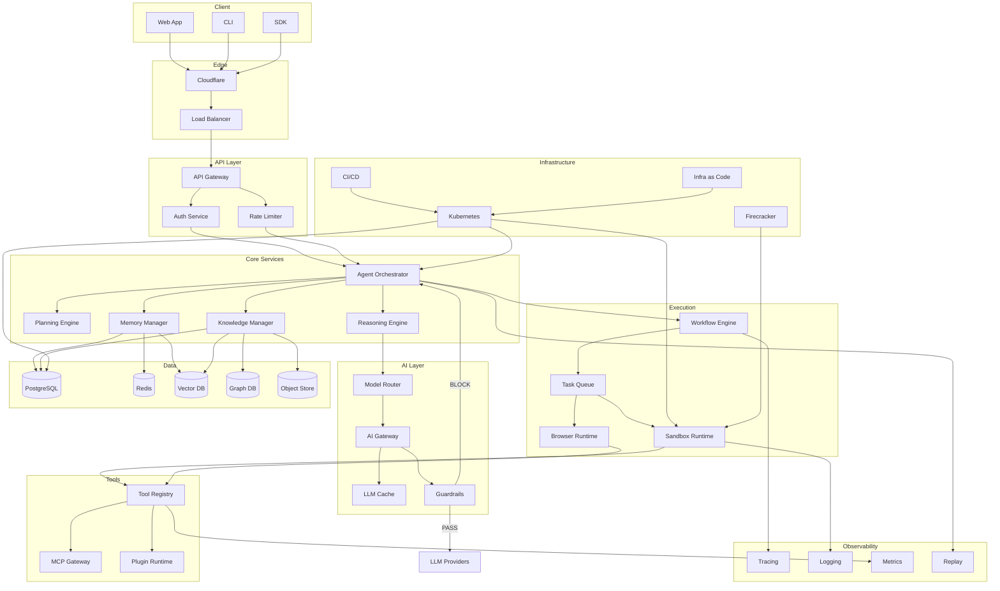

# Volume 7: Observability, Deployment & Implementation Roadmap

## Chapter 19: Observability

### 19.1 Why Observability is Critical for AgentOS

AgentOS presents unique observability challenges beyond traditional systems:

- **Non-deterministic**: LLM outputs vary, making debugging harder
- **Long-running**: Sessions span hours/days with complex state
- **Multi-step**: One user action triggers many internal steps
- **Cost-intensive**: Each LLM call costs money, invisible to devs
- **Hard to reproduce**: Prompt-dependent behavior is hard to reproduce
- **Security-sensitive**: Need full audit trails of agent actions

**Observability pillars:**
```
1. Tracing: What happened, in what order, how long did it take?
2. Logging: What was the state at each step?
3. Metrics: What are the aggregates and trends?
4. Replay: Can we replay what the agent saw and did?
5. Alerting: When should humans be notified?
```

---

### 19.2 Distributed Tracing

**Architecture:**
```
Instrumentation → OpenTelemetry Collector → Jaeger (storage) → Grafana (visualization)
                    ↓
                Tempo (long-term storage)
```

**What to trace:**
```
Per request/session:
  - span: auth (authn + authz)
  - span: context_assembly (parallel memory + knowledge)
  - span: llm_call (per model call)
  - span: tool_execution (per tool call)
  - span: memory_update
  - span: response_delivery

Per tool call:
  - span: permission_check
  - span: credential_fetch
  - span: external_api_call
  - span: result_processing
```

**Trace context propagation:**
```
Headers:
  traceparent: 00-0af7651916cd43dd8448eb211c80319c-b7ad6b7169203331-01
  tracestate: agentos=session_id_001
  
Propagate through:
  - HTTP headers (API calls)
  - Message headers (queue)
  - Redis (session context)
  - Database queries (comment field)
```

**Span attributes:**
```json
{
  "span": {
    "name": "llm_call.claude-sonnet-4",
    "trace_id": "0af7651916cd43dd8448eb211c80319c",
    "span_id": "b7ad6b7169203331",
    "parent_span_id": "a1b2c3d4e5f6g7h8",
    "start_time": 1700000000,
    "end_time": 1700000003,
    "attributes": {
      "model": "claude-sonnet-4",
      "input_tokens": 45000,
      "output_tokens": 1200,
      "cost": 0.019,
      "session_id": "sess_001",
      "user_id": "user_abc",
      "org_id": "org_xyz",
      "agent_type": "research_agent",
      "tool_calls_requested": 1,
      "cached_tokens": 12000,
      "error": null
    },
    "events": [
      {
        "name": "rate_limit_approaching",
        "timestamp": 1700000001,
        "attributes": { "remaining": 12, "limit": 100 }
      }
    ],
    "status": "ok"
  }
}
```

---

### 19.3 Structured Logging

**Log levels:**
```
ERROR:  Something is broken (action required)
WARN:   Something unusual (investigate if persistent)  
INFO:   Normal operation (state transitions)
DEBUG:  Detailed debugging info (on-demand only)
TRACE:  Every function entry/exit (development only)
```

**Log format (JSON, always):**
```json
{
  "timestamp": "2026-07-13T10:00:00.123Z",
  "level": "INFO",
  "logger": "orchestrator",
  "message": "Session created",
  "service": "agent-orchestrator",
  "trace_id": "trace_001",
  "session_id": "sess_001",
  "user_id": "user_abc",
  "org_id": "org_xyz",
  "agent_type": "research_agent",
  "duration_ms": 450,
  "metadata": {
    "key": "value"
  }
}
```

**What NOT to log:**
- API keys, tokens, passwords (redact)
- Full prompts (truncate to first 200 chars)
- Internal IP addresses
- PII (names, emails — unless required for audit, then hash)

---

### 19.4 Metrics

**Key metrics to collect:**

```
Application Metrics:
  agent.sessions.active        Gauge
  agent.sessions.created       Counter
  agent.sessions.terminated    Counter
  agent.messages.total         Counter
  agent.messages.latency       Histogram (P50, P95, P99)
  agent.tool.calls.total       Counter
  agent.tool.calls.errors      Counter
  agent.tool.calls.latency     Histogram

LLM Metrics:
  llm.calls.total              Counter (by model, by provider)
  llm.calls.errors             Counter (by error type)
  llm.calls.latency            Histogram (TTFT, total)
  llm.tokens.input             Counter
  llm.tokens.output            Counter
  llm.cost.total               Counter
  llm.cache.hits               Counter
  llm.cache.misses             Counter

Infrastructure Metrics:
  http.requests.total          Counter (by path, status)
  http.requests.latency        Histogram
  db.queries.total             Counter
  db.queries.latency           Histogram
  db.connections.active        Gauge
  redis.hit_rate               Gauge
  redis.memory_usage           Gauge
  queue.depth                  Gauge (by queue name)
  queue.processed              Counter
  queue.failed                 Counter

Business Metrics:
  billing.tokens_used          Counter (by org)
  billing.active_orgs          Gauge
  user.registrations           Counter
  user.churn                   Counter
  feedback.positive            Counter
  feedback.negative            Counter
  feedback.rate                 Gauge (positive/total)
```

**Metric collection:**
```
Tool: Prometheus
Rate: 15s scrape interval
Retention: 30 days (Prometheus), 1 year (Thanos/Cortex)
```

**Dashboards (Grafana):**
```
1. Executive Dashboard:
   - Active users, sessions, token usage, cost, satisfaction rate

2. Agent Performance Dashboard:
   - Latency by agent type, success rate, tool error rates

3. LLM Cost Dashboard:
   - Cost by model, cost by org, cost trends, cache effectiveness

4. Infrastructure Dashboard:
   - Service health, DB performance, queue depth, error rates

5. Org-specific Dashboard:
   - Per-org usage, per-org cost, per-org trends
```

---

### 19.5 Alerting

**Alert rules:**
```
P0 (Immediate, page):
  - All models in fallback chain failing
  - Database cluster down
  - Token budget exhaustion preventing all agents
  - Security breach detected
  - Payment processing failure

P1 (5 min, page):
  - LLM latency > 30s P99 for 5 min
  - Error rate > 5% for 5 min
  - Queue depth > 10K for 5 min
  - Cache hit rate < 50%
  - API success rate < 95%

P2 (30 min, ticket):
  - Model quality degradation (>10% negative feedback)
  - Tool failure rate > 10%
  - Database replication lag > 10s
  - Redis memory > 80%

P3 (Business hours, ticket):
  - Cost per session trending up
  - User churn rate increasing
  - Low feedback submission rate
```

---

### 19.6 Agent Replay

**Purpose:** Reconstruct exactly what an agent saw, thought, and did during a session.

**Replay data:**
```
For each interaction:
  1. User message (exact input)
  2. Context retrieved (which memories, which documents)
  3. Prompt sent to LLM (system prompt + context + history + message)
  4. LLM raw response
  5. Parsed structured output
  6. Tool calls (which tool, what params)
  7. Tool results (raw output)
  8. Final response to user
```

**Replay UI:**
```
Timeline view:
  [09:00:00] User: "Analyze Q2 revenue"
  [09:00:01] System: Context assembled (5 memories, 3 documents)
  [09:00:02] LLM: Claude Sonnet 4 called (45K tokens)
  [09:00:05] LLM: Response → Tool call: database_query
  [09:00:06] Tool: database_query → 125ms, 42 rows returned
  [09:00:07] LLM: Claude Sonnet 4 called (52K tokens)
  [09:00:10] LLM: Response → Tool call: chart_generator
  [09:00:11] Tool: chart_generator → 2.3s, chart.png
  [09:00:12] LLM: Claude Sonnet 4 called (48K tokens)
  [09:00:15] LLM: Final response
  [09:00:15] System: Memory updated

Click on any step to expand details:
  - Show full prompt sent to LLM
  - Show raw tool input and output
  - Show token counts and costs
```

**Replay storage:**
```json
{
  "session_replay": {
    "session_id": "sess_001",
    "steps": [
      {
        "type": "user_message",
        "timestamp": "...",
        "content": "Analyze Q2 revenue"
      },
      {
        "type": "context_assembly",
        "timestamp": "...",
        "memories_retrieved": 5,
        "documents_retrieved": 3,
        "tools_available": 8,
        "total_tokens_used": 25000,
        "memory_ids": ["mem_001", "mem_002"],
        "document_ids": ["doc_001"]
      },
      {
        "type": "llm_call",
        "timestamp": "...",
        "model": "claude-sonnet-4",
        "prompt_preview": "<system>You are a research agent...</system>\n...", // truncated
        "prompt_full_path": "s3://agentos-replays/sess_001/prompt_001.txt",
        "response_full_path": "s3://agentos-replays/sess_001/response_001.json",
        "input_tokens": 45000,
        "output_tokens": 1200,
        "cost": 0.019,
        "latency_ms": 3200
      },
      {
        "type": "tool_call",
        "timestamp": "...",
        "tool": "database_query",
        "params": { "query": "SELECT * FROM revenue WHERE quarter='Q2-2026'" },
        "result_preview": "[42 rows returned]",
        "result_path": "s3://agentos-replays/sess_001/tool_001.json",
        "latency_ms": 125,
        "success": true
      }
    ],
    "total_cost": 0.045,
    "total_tokens": 145000,
    "total_duration_ms": 45000
  }
}
```

---

### 19.7 Cost Tracking

**Per-org cost breakdown:**
```
Org: Acme Corp (July 2026)
Total: $4,523.45

By model:
  Claude Sonnet 4:   $2,345.00 (52%)
  GPT-4o-mini:       $678.00   (15%)
  Claude Haiku 4:    $456.00   (10%)
  Gemini 2.5 Flash:  $234.00   (5%)
  GPT-4o:            $810.45   (18%)

By agent type:
  Research Agent:    $2,100.00 (46%)
  Code Agent:        $1,200.00 (27%)
  General Assistant: $800.00   (18%)
  Workflow:          $423.45   (9%)

By user:
  alice@acme.com:    $1,800.00 (40%)
  bob@acme.com:      $1,500.00 (33%)
  charlie@acme.com:  $1,223.45 (27%)
```

---

## Chapter 20: Deployment Architecture

### 20.1 Environment Strategy

```
Development (dev.agentos.com):
  - Single instance, minimal replicas
  - Debug logging
  - Mock LLM responses (not calling real APIs)
  - Ephemeral database (reset daily)

Staging (staging.agentos.com):
  - Same infra as production (smaller scale)
  - Real LLM calls (budget $100/day)
  - Connected to staging 3rd-party accounts
  - Feature flags enabled

Production (app.agentos.com):
  - Multi-region, HA
  - Real LLM calls
  - Real customer data
  - Strict access controls

Enterprise (customer.agentos.com):
  - Isolated instance per enterprise customer
  - Customer-managed VPC
  - Customer's own LLM API keys
  - Dedicated database
```

---

### 20.2 CI/CD Pipeline

```mermaid
graph LR
    CODE[Push Code] --> BUILD[Build & Test]
    BUILD --> LINT[Lint + TypeCheck]
    LINT --> UNIT[Unit Tests]
    UNIT --> INT[Integration Tests]
    INT --> DOCKER[Build Docker Images]
    DOCKER --> STAGING[Deploy to Staging]
    STAGING --> E2E[E2E Tests]
    E2E --> SMOKE[Smoke Tests]
    SMOKE --> APPROVAL[Manual Approval]
    APPROVAL --> CANARY[Canary 10%]
    CANARY --> MONITOR[Monitor 30min]
    MONITOR --> PROD[Full Production]
```



**Deployment strategies:**
```
Microservices: Rolling update (no downtime)
  - Update 20% of pods at a time
  - Health check between batches
  - Rollback if health check fails

Agent engine: Blue-green deployment
  - Full new stack deployed alongside old
  - Route 10% traffic to new
  - Monitor for 30 min
  - Switch 100% traffic
  - Keep old for 1 hour for rollback

Database: Zero-downtime migrations
  - Expand (add columns, nullable)
  - Migrate (backfill data)
  - Contract (remove old columns)
  - Never: rename columns (create new, drop old)
```

**Feature flags:**
```
Tool: LaunchDarkly or custom (PostgreSQL-based)
Use cases:
  - Gradual model rollout
  - Per-org feature enablement
  - A/B testing model routing
  - Kill switch for problematic features
```

---

### 20.3 Infrastructure as Code

```
Tool: Terraform or Pulumi
Provider: AWS (primary), GCP (secondary)

State: Terraform Cloud (remote state, locking)

Modules:
  /terraform
    /modules
      /vpc
      /eks
      /rds
      /elasticache
      /ecr
      /iam
      /monitoring
    /environments
      /dev
      /staging
      /production
      /enterprise
```

---

### 20.4 Kubernetes Architecture

**Cluster topology:**
```
Control Plane:
  - 3x t3a.medium (multi-AZ)
  - Managed by EKS/GKE

Node Pools:
  services: c7a.xlarge (4 vCPU, 8GB)
    - API gateway, auth, orchestrator, memory, etc.
    - Min: 3, Max: 20
    - Spot instances (70% cheaper)

  sandbox: c7a.2xlarge (8 vCPU, 16GB)
    - Code execution, browser automation
    - Min: 1, Max: 50
    - On-demand (sandboxes are latency-sensitive)

  batch: c7a.xlarge
    - Knowledge ingestion, consolidation
    - Min: 0, Max: 10
    - Spot instances
```

**Resource requests/limits:**
```yaml
# Orchestrator service
resources:
  requests:
    cpu: "500m"
    memory: "512Mi"
  limits:
    cpu: "2"
    memory: "2Gi"

# Memory manager (memory-intensive)
resources:
  requests:
    cpu: "1"
    memory: "2Gi"
  limits:
    cpu: "4"
    memory: "8Gi"

# Sandbox pool (isolated, heavy)
resources:
  requests:
    cpu: "1"
    memory: "512Mi"
  limits:
    cpu: "1"
    memory: "512Mi"
```

---

### 20.5 Multi-Region Deployment

**Region topology:**
```
Primary: us-east-1 (active)
  - Full stack
  - Read/write database

Secondary: eu-west-1 (active-read)
  - Read-only services
  - Read replica database
  - Writes forwarded to primary

DR: us-west-2 (standby)
  - Minimal footprint (can scale up)
  - Database backup restored
  - Failover: < 15 min RTO, < 1 min RPO
```

**Global routing:**
```
Users routed to nearest region via Cloudflare/Latency-based DNS
  - US East: us-east-1
  - US West: us-west-2
  - Europe: eu-west-1
  - Asia: ap-southeast-1 (future)
```

**Cross-region data:**
```
Replicated: User profiles, org settings, API keys (global data)
Not replicated: Session state, memories (per-region, use case dependent)
Approach: Active-Passive with read replicas
Future: Active-Active with CRDT for session state
```

---

### 20.6 Disaster Recovery

**DR scenarios:**
```
1. Single service crash:
   - Kubernetes auto-restarts pod
   - Health check + readiness probe
   - RTO: < 30s

2. Single zone failure:
   - Multi-AZ deployment
   - Pods spread across 3 AZs
   - RTO: < 1 min (load balancer reroutes)

3. Entire region failure:
   - DNS switch to secondary region
   - Scale up secondary region
   - RTO: < 15 min
   - RPO: < 5 min (database replication lag)

4. Data corruption:
   - Point-in-time recovery (7 day window)
   - RTO: < 1 hour
   - RPO: depends on corruption detection time
```

**DR playbook:**
```
1. Detection (automated):
   - Health check fails for 5 min
   - Region unhealthy
   - Alert triggered

2. Assessment (2 min):
   - Engineer confirms region failure
   - Decision to failover

3. Failover (5-15 min):
   - Update DNS to secondary region
   - Promote read replica to primary
   - Scale up services
   - Verify functionality

4. Recovery (1-4 hours):
   - Restore primary region operations
   - Sync data back
   - Switch back to primary (if applicable)
```

---

### 20.7 Backup Strategy

```yaml
databases:
  postgresql:
    method: pg_dump + WAL streaming
    frequency: Continuous WAL, daily full dump
    retention: 
      daily: 30 days
      weekly: 12 weeks
      monthly: 12 months
    target: S3 with cross-region replication
    encryption: AES-256 with KMS

  redis:
    method: RDB snapshots
    frequency: Every 5 minutes
    retention: 24 hours
    target: S3

file_storage:
  method: S3 versioning
  retention: 30 versions per object
  lifecycle: Transition to Glacier after 90 days
```

---

## Chapter 21: Implementation Roadmap

### 21.0 Roadmap Overview

This roadmap takes you from zero to enterprise AgentOS in 7 phases. Each phase has clear exit criteria. Do NOT skip phases — premature optimization and over-engineering are the fastest ways to fail.

```
Phase 0: Personal Prototype   (2-4 weeks)
Phase 1: Local Assistant      (4-8 weeks)
Phase 2: Production Assistant (8-12 weeks)
Phase 3: Team Collaboration   (8-12 weeks)
Phase 4: Enterprise SaaS      (12-16 weeks)
Phase 5: Developer Ecosystem  (12-16 weeks)
Phase 6: Marketplace          (16-20 weeks)
Phase 7: Large-Scale AgentOS  (Ongoing)

Total to MVP (Phase 2): ~14-24 weeks
Total to market (Phase 3): ~22-36 weeks
```

---

### 21.1 Phase 0: Personal Prototype

**Goal:** Working prototype that demonstrates the core agent loop with basic memory.

**Architecture:**
```
Single process (Node.js/Python)
SQLite (file-based database)
Simple file-based memory (JSON files)
Direct LLM calls (one API key)
Single user
No auth
No scaling
```

**Components:**
```
1. Basic agent loop (reason → act → observe)
2. Single LLM provider (Claude API)
3. Simple tool system (2-3 tools: file_search, web_search, calculator)
4. Basic conversation history (in-memory)
5. Simple prompt builder
6. Structured output parsing
7. CLI interface (stdin/stdout)
```

**Tech stack:**
```
Runtime: Python 3.12 or Node.js 22
LLM: Anthropic Claude API (single API key)
Storage: SQLite + file system
Deployment: Local machine
Interface: Terminal
```

**Exit criteria:**
- Agent can accept goal, break it down, execute tools, and return result
- Basic memory persists between sessions (file-based)
- At least 2 tools work end-to-end
- Agent handles simple errors gracefully

**Common pitfalls:**
- Trying to build too much infrastructure upfront
- Using microservices before understanding the domain
- Premature optimization (Kubernetes, multi-tenancy, etc.)
- Building for "scalability" before product-market fit

---

### 21.2 Phase 1: Local Assistant

**Goal:** Single-user assistant that runs locally but has persistent memory and knowledge.

**Architecture:**
```
Single process with async workers
SQLite → PostgreSQL (local)
Redis (local)
Memory manager with working/short-term/long-term
RAG system (local embedding model)
3-5 tools
Simple Web UI (React + Vite)
```

**Components to build:**
```
1. PostgreSQL with pgvector (local)
2. Memory Manager:
   - Working memory (Redis)
   - Short-term memory (PostgreSQL, TTL-based)
   - Long-term memory (PostgreSQL + vector)
3. Knowledge System:
   - Document upload (basic)
   - Chunking (recursive)
   - Embedding (local model or API)
   - Vector search (pgvector)
4. Tool System:
   5-10 tools (file, web, database, email, calendar)
5. Planning Engine:
   - Basic plan generation (LLM-based)
   - Step-by-step execution
6. Reasoning Engine:
   - Context builder
   - Prompt builder
   - Structured outputs
7. Simple Web UI:
   - Chat interface
   - Memory viewer
   - Knowledge upload
8. Auth: Basic email/password (bcrypt)
```

**Tech stack additions:**
```
Database: PostgreSQL (local install or Supabase)
Cache: Redis (local install or Upstash)
Search: pgvector (PostgreSQL extension)
Frontend: React + Vite + Tailwind
LLM: Claude API (primary) + GPT-4o-mini (cost optimization)
Container: Docker Compose
```

**Exit criteria:**
- Agent remembers past conversations (LTM retrieves relevant context)
- Agent can upload and query documents
- Agent uses 5+ tools reliably
- Agent handles multi-step goals with planning
- Web UI functional for chat, memory browsing, knowledge upload
- Runs on a single machine with Docker Compose

**Common pitfalls:**
- Not using pgvector from start (migrating from non-vector DB later is painful)
- Over-engineering the memory system (start with simple TTL-based)
- Building too many tools (focus on 5 high-value tools)
- LLM costs surprising you (set token budgets from day 1)

---

### 21.3 Phase 2: Production-Ready Assistant

**Goal:** Multi-user assistant with proper auth, reasonable scaling, and monitoring.

**Architecture:**
```
Distributed services (but monolith is fine for now)
PostgreSQL + Redis (managed cloud)
Proper multi-tenancy (org_id on every table)
Auth service (JWT, OAuth)
Load-balanced web servers
Background workers
```

**Components to build:**
```
1. Identity Layer:
   - OAuth (Google, GitHub)
   - JWT session management
   - API keys
   - Multi-tenancy (orgs, users)
   - Role-based access (owner, admin, member)

2. Production Database:
   - Proper schema with migrations
   - Row-level security (RLS)
   - Connection pooling (PgBouncer)
   - Read replicas

3. Auth Service:
   - Login/signup flows
   - Password reset
   - OAuth integration (Google, GitHub)

4. Improved Memory:
   - Memory ranking (importance scoring)
   - Memory consolidation (daily batch)
   - Memory forgetting (TTL + importance pruning)

5. Improved Knowledge:
   - Hybrid search (vector + keyword)
   - Re-ranking
   - Citation engine

6. Model Router:
   - Multi-model support (Claude + GPT + Gemini)
   - Cost-based routing
   - Fallback chains
   - Token budgeting

7. API:
   - REST API (RESTful)
   - Rate limiting
   - Request validation

8. Monitoring:
   - Structured logging
   - Basic metrics (Prometheus)
   - Dashboard (Grafana)
   - Error tracking (Sentry)

9. Deployment:
   - Docker Compose (single server)
   - CI/CD (GitHub Actions)
```

**Tech stack additions:**
```
Auth: Clerk/Auth0 (managed) or custom
Monitoring: Prometheus + Grafana + Sentry
Deployment: Docker Compose → Docker Swarm or Nomad
CI/CD: GitHub Actions
Managed DB: Supabase or AWS RDS
Managed Cache: Upstash or AWS ElastiCache
```

**Exit criteria:**
- Multiple users can sign up and use the system
- Data is properly isolated per org (RLS verified)
- Agent uses 10+ tools reliably
- Model routing works (cost optimization active)
- Memory persists correctly across sessions
- System runs for 7 days without manual intervention
- Basic monitoring operational

**Common pitfalls:**
- Building auth from scratch (use Clerk/Auth0)
- Not validating RLS properly (test with multiple orgs)
- Underestimating token costs at scale
- No rate limiting (a single user can bankrupt you)
- No proper error handling (LLM calls fail, tools fail — handle gracefully)

---

### 21.4 Phase 3: Team Collaboration

**Goal:** Teams can share agents, knowledge, and collaborate within orgs.

**Architecture:**
```
Same as Phase 2, plus:
- Shared workspaces
- Team agent library
- Shared knowledge bases
- Collaboration features (shared sessions, comments)
```

**Components to build:**
```
1. Organization Management:
   - Team creation
   - Role management
   - Invitation flows
   - Activity audit logs

2. Shared Knowledge:
   - Team knowledge bases
   - Permissioned access per KB
   - Knowledge versioning

3. Agent Sharing:
   - Agent templates (save and share)
   - Agent forking (copy agent with customizations)
   - Shared agent sessions (view teammate's session)

4. Billing:
   - Stripe integration
   - Subscription plans
   - Usage tracking
   - Invoice generation

5. Collaboration:
   - Real-time session sharing (WebSocket)
   - Comments on agent responses
   - Feedback per agent

6. Admin Dashboard:
   - User management
   - Usage analytics
   - Audit log viewer
   - Billing management
```

**Exit criteria:**
- Multiple users in same org can use shared agents
- Knowledge bases accessible by team members
- Billing works end-to-end (signup → usage → invoice)
- Admin dashboard functional
- Org audit logs complete

---

### 21.5 Phase 4: Enterprise SaaS

**Goal:** Enterprise features: SSO, compliance, audit, high availability.

**Architecture:**
```
Multi-region deployment
High availability (multi-AZ)
Disaster recovery
Enterprise compliance (SOC 2)
```

**Components to build:**
```
1. Enterprise Auth:
   - SSO (SAML/OIDC)
   - SCIM provisioning
   - Directory sync
   - Just-in-time provisioning

2. Compliance:
   - SOC 2 Type II preparation
   - GDPR compliance tools
   - Data retention policies
   - Data export/deletion APIs
   - Audit log export (S3 → SIEM)

3. Security Enhancements:
   - Encryption at rest (TDE)
   - VPC peering
   - IP allowlisting
   - Session policies (MFA required, session duration)

4. High Availability:
   - Multi-region active-passive
   - Automated failover
   - RTO < 5 min, RPO < 1 min

5. Enterprise Admin:
   - User provisioning/deprovisioning
   - Policy management
   - Compliance dashboard
   - SLA monitoring

6. Enterprise Support:
   - Priority support queue
   - Dedicated SLAs
   - Status page
```

**Exit criteria:**
- SSO works with major IdPs (Okta, Azure AD, Google Workspace)
- SOC 2 audit evidence collected
- Multi-region failover tested (under 15 min RTO)
- Enterprise customer successfully onboarded

---

### 21.6 Phase 5: Developer Ecosystem

**Goal:** Third-party developers can build on the platform.

**Components to build:**
```
1. Developer Portal:
   - Documentation site
   - Quickstart guides
   - API reference
   - SDK documentation
   - Changelog
   - Status page

2. SDK:
   - TypeScript SDK (first-class)
   - Python SDK
   - REST API documentation (OpenAPI)
   - GraphQL schema

3. Agent SDK:
   - Custom agent definitions
   - Agent deployment CLI
   - Agent testing framework

4. Tool/Plugin SDK:
   - Plugin manifest format
   - Plugin development guide
   - Sandbox testing

5. Developer Dashboard:
   - API key management
   - App management
   - Usage analytics
   - Rate limit monitoring
```

**Exit criteria:**
- External developer can build and deploy a custom agent
- External developer can build and publish a custom tool
- SDK published to npm/PyPI
- Documentation covers all major API endpoints

---

### 21.7 Phase 6: Marketplace

**Goal:** Third-party agent and tool marketplace.

**Components to build:**
```
1. Marketplace Frontend:
   - Browse agents and tools
   - Search and filter
   - Ratings and reviews
   - Screenshots and demos

2. Publishing Pipeline:
   - Package submission
   - Automated security scan
   - Automated sandbox test
   - Manual review queue
   - Version management

3. Revenue Sharing:
   - Developer payouts
   - Revenue split (70/30)
   - Usage-based pricing
   - Subscription tiers per plugin

4. Marketplace Backend:
   - Package storage
   - Version registry
   - Download analytics
   - Abuse detection

5. Plugin Runtime:
   - Plugin sandbox
   - Plugin resource limits
   - Plugin isolation
   - Permission system
```

**Exit criteria:**
- 10+ third-party agents published
- 20+ third-party tools published
- Developer payout system operational
- Marketplace search and discovery functional

---

### 21.8 Phase 7: Large-Scale AgentOS

**Goal:** Operate at scale with millions of users and thousands of concurrent agents.

**Architecture:**
```
Fully distributed, multi-region active-active
Event-sourced architecture
Custom agent runtime (Firecracker microVMs)
Real-time agent collaboration
Advanced ML (fine-tuned models, RLHF)
```

**Components:**
```
1. Advanced Scaling:
   - Active-active multi-region
   - Global load balancing
   - CRDT-based conflict resolution for session state
   - Custom agent scheduler (not BullMQ, custom)

2. Advanced AI:
   - Fine-tuned embedding models
   - Fine-tuned reranker models
   - RLHF from user feedback
   - Custom small models for common tasks (distillation)

3. Advanced Execution:
   - Firecracker microVMs for sandbox
   - Custom agent runtime (sub-millisecond cold start)
   - GPU-backed sandboxes for ML workloads

4. Advanced Memory:
   - Memory graph (full knowledge graph)
   - Cross-org memory (anonymized, opt-in)
   - Collaborative memory (team knowledge)

5. Advanced Observability:
   - Real-time agent debugging
   - Agent behavior prediction
   - Automated anomaly detection
   - Cost auto-optimization

6. Advanced Security:
   - Real-time threat detection
   - Automated incident response
   - Zero-trust architecture (mTLS everywhere)
   - Hardware security module (HSM) for keys
```

---

### 21.9 Technology Comparison Tables

#### PostgreSQL vs MySQL

| Criterion | PostgreSQL | MySQL |
|-----------|------------|-------|
| ACID compliance | Full | Partial (depends on engine) |
| JSON support | Excellent (JSONB) | Good (JSON) |
| Extensions | Rich (pgvector, pg_cron, etc.) | Limited |
| Full-text search | Built-in (tsvector) | Built-in (InnoDB) |
| Replication | Streaming, logical | Async group replication |
| RLS | Yes (row-level security) | No (views workaround) |
| Indexing | B-tree, Hash, GiST, GIN, BRIN, HNSW | B-tree, Hash, Full-text |
| Performance (reads) | Excellent | Excellent |
| Performance (writes) | Very Good | Excellent (InnoDB) |
| Learning curve | Moderate | Low |
| **For AgentOS** | **Recommended** | Avoid (no pgvector, no RLS) |

#### Redis vs Memcached

| Criterion | Redis | Memcached |
|-----------|-------|-----------|
| Data structures | Rich (strings, hashes, lists, sets, sorted sets, streams) | Simple (strings only) |
| Persistence | RDB, AOF | None |
| Pub/Sub | Yes | No |
| Lua scripting | Yes | No |
| Clustering | Yes | Yes (limited) |
| Memory efficiency | Moderate | Excellent |
| Use cases | Session, cache, queue, pub/sub | Pure cache |
| **For AgentOS** | **Recommended** | Insufficient |

#### Neo4j vs PostgreSQL for Graphs

| Criterion | Neo4j | PostgreSQL (adjacency lists) |
|-----------|-------|------------------------------|
| Query language | Cypher | SQL (recursive CTEs) |
| Multi-hop queries | Fast (pointer chasing) | Slower (recursive joins) |
| Path finding | Built-in (shortestPath, etc.) | Manual implementation |
| Index-free adjacency | Yes (native graph) | No (index lookups) |
| ACID | Yes | Yes |
| Ops complexity | High (separate DB) | None (same DB) |
| Best for | Deep graph traversal | Simple relationships |
| **For AgentOS** | Phase 4+ | Phase 0-3 |

#### Kafka vs RabbitMQ

| Criterion | Kafka | RabbitMQ |
|-----------|-------|----------|
| Architecture | Distributed log | Broker with queues |
| Message model | Pull-based | Push-based |
| Throughput | Millions/sec | Thousands/sec |
| Persistence | Durable by default | Optional |
| Message routing | Topics + partitions | Exchanges + bindings |
| Ordering | Per partition | Per queue |
| Retention | Configurable (time/size) | Acknowledged = deleted |
| Consumer groups | Yes | Work queues |
| Ops complexity | High | Medium |
| **For AgentOS** | Event sourcing, analytics | Task queues, notifications |

#### Temporal vs BullMQ

| Criterion | Temporal | BullMQ |
|-----------|----------|--------|
| Workflow persistence | Full (event-sourced) | Task-level only |
| Workflow duration | Unlimited (years) | Limited (retry-based) |
| State recovery | Exact replay | Redrive from queue |
| SDK | TS, Go, Java, Python | Node.js only |
| Ops complexity | High (needs Temporal Server) | Low (Redis only) |
| Learning curve | Steep | Low |
| Long-running workflows | Excellent | Poor |
| **For AgentOS** | Phase 4+ workflows | Phase 0-3 |

#### LangGraph vs CrewAI

| Criterion | LangGraph | CrewAI |
|-----------|-----------|--------|
| Architecture | Graph-based state machine | Agent team orchestration |
| Flexibility | Very high (custom graphs) | Medium (defined patterns) |
| Agent definition | Low-level (nodes + edges) | High-level (roles, goals) |
| Built-in tools | Minimal | Many built-in |
| Memory | External (your implementation) | Built-in memory types |
| Multi-agent patterns | Custom DAGs | Supervisor, pipeline, hierarchical |
| Learning curve | Steep | Moderate |
| Production readiness | Early (LangGraph Cloud) | Early |
| **For AgentOS** | Use as reference | Use for rapid prototyping |

#### Supabase vs Firebase

| Criterion | Supabase | Firebase |
|-----------|----------|----------|
| Database | PostgreSQL | Firestore (NoSQL) |
| Auth | Built-in (GoTrue) | Firebase Auth |
| Vector search | pgvector | Firebase ML |
| Open source | Yes | No |
| Self-hostable | Yes | No |
| Real-time | Yes (WebSocket + Postgres) | Yes (Firestore sync) |
| SQL | Yes (full SQL) | No |
| Cost model | Compute-based | Usage-based (can spike) |
| Vendor lock-in | Low | High |
| **For AgentOS** | **Recommended** | Avoid (NoSQL, lock-in) |

#### OpenTelemetry vs Langfuse

| Criterion | OpenTelemetry | Langfuse |
|-----------|---------------|----------|
| Scope | Full system observability | LLM-specific observability |
| Tracing | Distributed (any service) | LLM call chains only |
| Metrics | Yes (Prometheus integration) | Limited |
| Logging | Yes (structured) | Limited |
| Cost tracking | Manual instrumentation | Built-in (token counting) |
| Prompt management | No | Yes (versioning, playground) |
| Replay | Manual | Yes (session replay) |
| Open source | Yes | Yes |
| Integration | Standard | LLM-specific |
| **For AgentOS** | Use both: OTel for infra, Langfuse for LLM |

---

### 21.10 Recommended Tech Stack Summary

**Phase 0-1 (MVP):**
```
Frontend: React + Vite + Tailwind
Backend: Python (FastAPI) or Node.js (Hono)
Database: SQLite (P0) → PostgreSQL + pgvector (P1)
Cache: Redis (local)
LLM: Claude API
Auth: None (P0) → Clerk (P1)
Deploy: Local → Docker Compose on VPS ($20/month)
Monitoring: Console logs → Sentry
```

**Phase 2-3 (Production):**
```
Frontend: Next.js + Tailwind + shadcn/ui
Backend: Hono or Fastify (Node.js) / FastAPI (Python)
Database: PostgreSQL (Supabase / RDS) + pgvector
Cache: Redis (Upstash / ElastiCache)
Queue: BullMQ (Redis)
LLM: Claude + GPT + Gemini (via OpenRouter)
Auth: Clerk
File Storage: S3 / MinIO
Deploy: Docker Compose → Railway / Render
Monitoring: Prometheus + Grafana + Sentry + Langfuse
```

**Phase 4+ (Scale):**
```
Backend: Go for performance-critical services, Node/Python for business logic
Database: PostgreSQL (RDS Multi-AZ) + dedicated vector DB (Pinecone/Qdrant)
Cache: Redis Cluster (ElastiCache)
Queue: Kafka (event sourcing) + BullMQ (task queues)
LLM: OpenRouter + direct API + self-hosted fallback
Auth: Clerk (consumer) + WorkOS/Auth0 (enterprise SSO)
Deploy: Kubernetes (EKS) + Firecracker (sandbox)
Monitoring: OpenTelemetry + Datadog/Grafana Cloud
```

---

### 21.11 Final Architecture Diagram (Target State)



---

### 21.12 Closing Principles

**Build order priorities:**
1. **Core loop first**: Get the agent reasoning loop working with one LLM
2. **Memory second**: Without memory, every conversation starts from zero
3. **Tools third**: Three high-quality tools beat twenty mediocre ones
4. **Auth fourth**: Need multi-user before scaling
5. **Everything else**: Build when the user count demands it

**Never compromise on:**
- Data isolation (test RLS thoroughly)
- Token budgeting (one runaway session can cost $100+)
- Input validation (prompt injection is real)
- Error handling (LLMs fail, APIs fail, tools fail — handle all)
- Audit logging (you will need it for debugging and compliance)

**When to outsource:**
- Auth (Clerk/Auth0) — building auth correctly takes months
- LLM APIs — self-hosting LLMs is a full-time job
- Managed databases — don't run your own PostgreSQL in production
- Observability — use managed services, not self-hosted

**When to build custom:**
- Memory system — this is your core differentiator
- Agent orchestrator — no off-the-shelf solution fits
- Tool execution pipeline — your security model is unique
- Context builder — this is what makes your agents good or bad
- Model routing — this determines your cost structure

**Final advice:**
Build for today's users. Not for the millions you hope to have next year. You can always scale later. You cannot un-over-engineer.

---

*End of Engineering Handbook*
