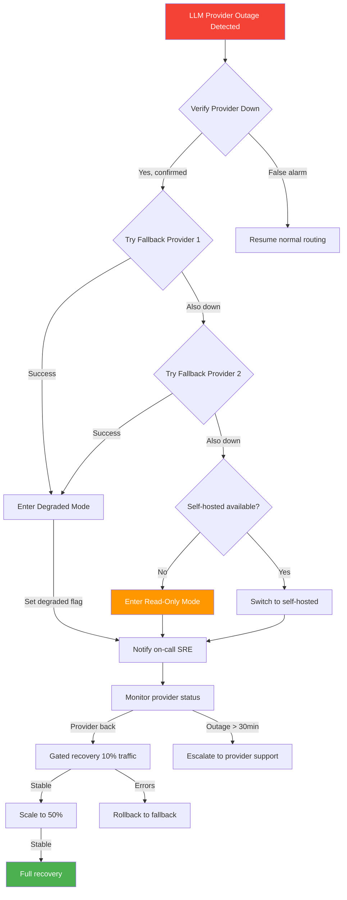
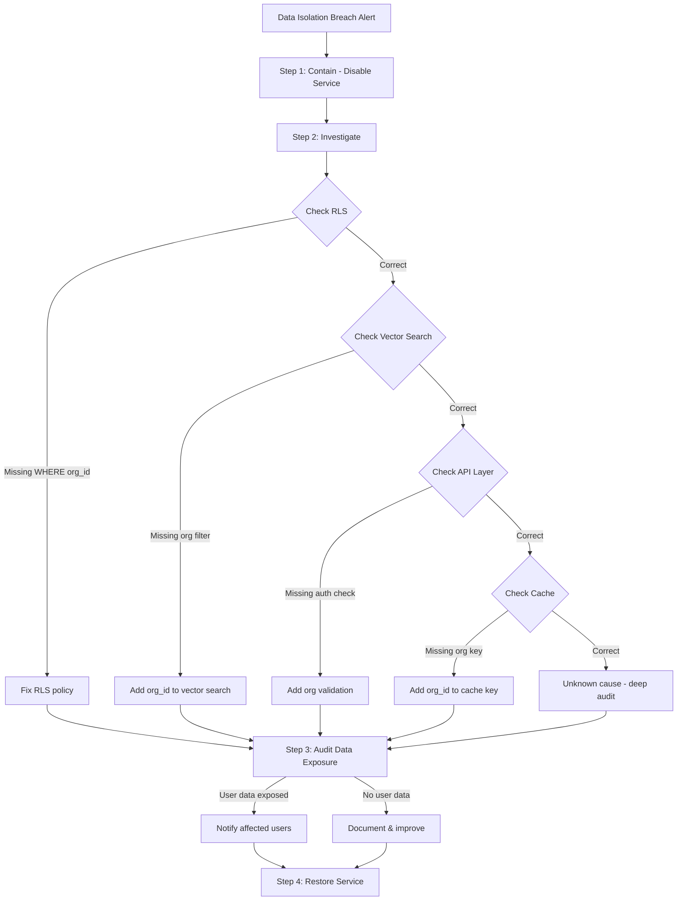
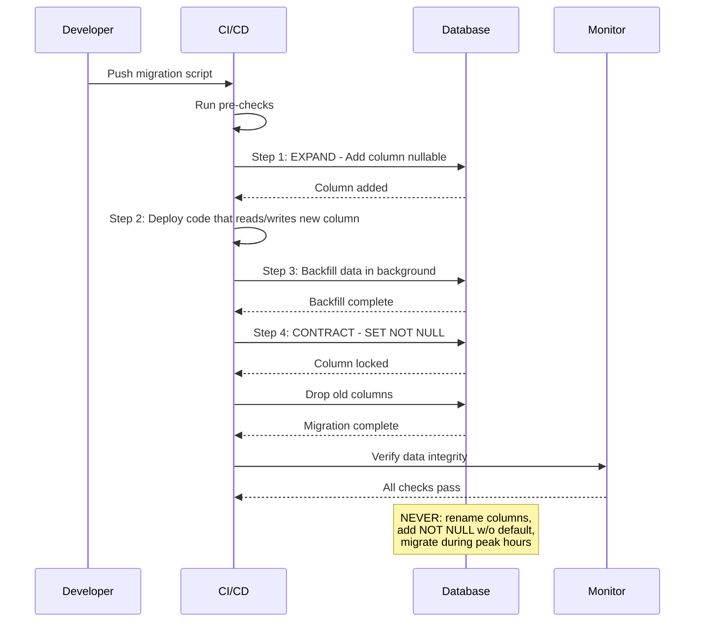

# Volume 8: Operational Runbooks & Incident Response

## Chapter 22: Production Runbooks

### 22.1 Incident Classification & Response

**Severity levels specific to AgentOS:**

```
SEV-0: Critical (page entire team)
  - All LLM providers unreachable for 5+ min
  - Database cluster completely down
  - Active data breach or unauthorized access
  - Payment processing complete failure
  - Multi-tenant data leakage confirmed

SEV-1: High (page on-call engineer)
  - Single LLM provider down, fallbacks failing
  - Database read replica lag > 60s
  - Agent response time > 60s P95 for 10+ min
  - Token budget system failing (runaway costs)
  - Knowledge search returning empty for all queries

SEV-2: Medium (respond within 1 hour)
  - Single model degraded (high latency)
  - Tool errors > 10% for one tool
  - Memory consolidation failing
  - Knowledge ingestion pipeline stalled
  - Dashboard latency > 5s

SEV-3: Low (respond within 8 hours)
  - Single user reporting issues
  - Minor UI bugs
  - Non-critical tool degradation
  - Documentation errors
```

---

### 22.2 Incident Response Playbooks

#### Playbook 1: LLM Provider Outage

```
Trigger: All requests to a provider return 5xx or timeouts

Step 1: Verify outage
  - Check provider status page (status.openai.com, status.anthropic.com)
  - Confirm via provider's API health endpoint
  - Check if other teams/services also affected
  - Duration: 30 seconds

Step 2: Execute fallback (automated by Model Router)
  - Model Router should already handle this
  - Verify fallback chain is working
  - Check: Are fallback models within budget?
  - Duration: automated (30s to verify)

Step 3: If fallback chain also failing:
  - Enable emergency fallback: self-hosted Llama 4 70B
  - This will degrade quality but keep system operational
  - Alert users: "Response quality may be reduced due to provider outage"
  - Duration: 2 minutes

Step 4: If self-hosted also failing:
  - Enable "degraded mode": Return cached responses + apologetic message
  - Disable agent sessions requiring complex reasoning
  - Only allow simple Q&A from cached knowledge
  - Duration: 5 minutes

Step 5: Recovery
  - Provider comes back online
  - Disable fallbacks gradually (10% → 50% → 100%)
  - Monitor error rates for 15 minutes
  - Close incident

Post-mortem checks:
  - Why did fallback chain fail? Update if needed.
  - Was caching effective? Improve cache hit rates.
  - Add new provider to diversify?
```



#### Playbook 2: Runaway Agent (Unlimited Token Spiral)

```
Trigger: Agent exceeds 3x expected token budget for a single task

Detection:
  - Automated: Token budget monitor alerts when session exceeds threshold
  - Automated: Loop counter exceeds 50 iterations
  - Manual: User reports agent "thinking forever"

Step 1: Immediate containment (automated)
  - Hard cap: Terminate agent session when token budget exhausted
  - Send "Session terminated: exceeded resource limits" to user
  - Prevent new agent creation for this user until reset
  - Duration: automated (< 1s)

Step 2: Investigate root cause
  - Inspect agent replay:
    - What was the original goal?
    - Where did the loop start?
    - Is it repeating same tool call pattern?
    - Is LLM stuck in reasoning without progress?
  - Duration: 5 minutes

Step 3: Common causes and fixes:
  a) Tool returning errors → agent retries forever
     Fix: Add retry limits in tool execution layer
  b) LLM stuck in analysis paralysis
     Fix: Add max consecutive "think" actions without tool calls
  c) Infinite tool chain (A→B→C→A→B...)
     Fix: Add visited-tool-set detection, prevent cycles
  d) Knowledge search returning irrelevant results
     Fix: Lower knowledge retrieval count, add relevance threshold

Step 4: Apply fix
  - Implement loop detection or tighten existing limits
  - Deploy configuration change (no code deploy if possible)
  - Duration: 30 minutes

Step 5: Restore user access
  - Reset token counters
  - Notify user with explanation
  - Offer to refund overage cost
```

#### Playbook 3: Data Isolation Breach

```
Trigger: Org A user sees Org B data in search results or agent responses

Step 1: Containment
  - IMMEDIATELY disable the affected service (memory, knowledge, or both)
  - Prevent any further data access
  - Alert security team (even if just the founder)
  - Duration: < 1 minute

Step 2: Investigation
  - Check RLS policies on PostgreSQL:
    SELECT * FROM pg_policies WHERE tablename = 'memories';
    -- Verify org_id filter is present
  - Check vector search code: does it filter by org_id?
  - Check API endpoint: does it validate org_id ownership?
  - Check authentication: was JWT valid? Was org_id spoofable?
  - Duration: 30 minutes

Step 3: Root cause resolution
  Common causes:
  a) Missing RLS policy on table
     Fix: ALTER TABLE ... ENABLE ROW LEVEL SECURITY; CREATE POLICY...
  b) Vector search bypassing RLS (pgvector raw query)
     Fix: Always include WHERE org_id = $1 in vector queries
  c) API endpoint not validating org_id from JWT
     Fix: Validate org_id matches authenticated user's org
  d) Cache returning cross-org data
     Fix: Include org_id in cache key

Step 4: Data audit
  - Query audit logs to determine scope of breach
  - Identify which users/orgs saw which data
  - Duration: 1-4 hours

Step 5: Notification
  - If user data was exposed: notify affected users
  - If no user data: document and improve
  - File incident report
```



#### Playbook 4: Runaway Cost Spike

```
Trigger: Hourly LLM cost exceeds 3x normal (e.g., $50/hr → $150/hr)

Step 1: Identify source
  - Query cost tracking: org_id, user_id, agent_type, model
  - Find top cost driver
  - Duration: 2 minutes

Step 2: Immediate action
  Options:
  a) Disable expensive model for specific user/org
  b) Force all traffic to economy models (GPT-4o-mini, Haiku)
  c) Rate limit the offending user/org
  d) Terminate runaway sessions
  Duration: 1 minute

Step 3: Root cause
  Common causes:
  a) User ran analysis on 500K tokens of data (context swamping)
     Fix: Enforce max context size per user tier
  b) Agent stuck in loop making expensive LLM calls
     Fix: Loop detection, max 15 calls per minute
  c) Model router degraded — routing everything to Opus
     Fix: Fix router, add circuit breaker for fallback
  d) Batch script running automated agent calls
     Fix: API rate limiting per API key

Step 4: Restore
  - After fix: gradually restore normal model routing
  - Monitor costs for next hour
  - Set up automated cost cap: kill switch at $X/hour
```

#### Playbook 5: Memory Corruption

```
Trigger: Agent returns clearly incorrect information based on past conversations
   OR: Memory search returns irrelevant, jumbled, or corrupted content

Step 1: Detect scope
  - Is it per-user memory or system-wide?
  - Is it one memory type (LTM vs STM vs working)?
  - Check memory version history
  - Duration: 5 minutes

Step 2: Rollback
  Memory rollback options:
  a) Rollback single memory entry to previous version
  b) Rollback all memories for a session to snapshot
  c) Rollback all memories for a user to previous day
  d) Full memory restore from backup (worst case)

  Implementation:
  - Use memory_versions table to find last good state
  - INSERT INTO memories SELECT * FROM memory_versions WHERE version_id = $1
  - Duration: 10-30 minutes

Step 3: Root cause
  Common corruption causes:
  a) Consolidation engine merged unrelated memories
     Fix: Improve similarity threshold in consolidation
  b) Embedding model drift (results changed over time)
     Fix: Re-embed all documents after model update
  c) Prompt injection modified memory via agent
     Fix: Add "memory write" guardrail validation
  d) Bug in memory update code
     Fix: Fix code, add integration tests for memory operations

Step 4: Prevent recurrence
  - Add memory write validation (LLM-as-judge for memory updates)
  - Add memory integrity checks (daily cron: verify embeddings match)
  - Implement dual-write: write to primary + verify with secondary read
```

---

### 22.3 Database Operational Procedures

#### Connection Pool Management

```
Symptom: Connection pool exhaustion → "too many clients" errors

Diagnosis:
  SELECT count(*) FROM pg_stat_activity;  -- Current connections
  SELECT state, count(*) FROM pg_stat_activity GROUP BY state;
  -- Look for "idle in transaction" connections (common leak)

Fixes:
  1. Immediate: Increase pool size (PgBouncer config)
  2. Short-term: Kill idle connections
     SELECT pg_terminate_backend(pid) WHERE state = 'idle in transaction'
     AND state_change < NOW() - INTERVAL '5 minutes'
  3. Long-term: Fix connection leak in application code
     - Ensure all query clients are released after use
     - Use connection pooler (PgBouncer) with transaction pooling
     - Set statement_timeout = '30s' to kill slow queries
```

#### Query Performance Degradation

```
Symptom: Vector search slowing down, general query latency increasing

Check:
  - Missing indexes: 
    SELECT * FROM pg_stat_all_indexes WHERE idx_scan = 0;
  - Slow queries:
    SELECT query, mean_time FROM pg_stat_statements 
    ORDER BY mean_time DESC LIMIT 10;
  - Table bloat:
    SELECT schemaname, tablename, n_dead_tup 
    FROM pg_stat_all_tables ORDER BY n_dead_tup DESC;

Fixes:
  1. VACUUM ANALYZE (for bloat)
  2. CREATE INDEX CONCURRENTLY (for missing indexes)
  3. REINDEX CONCURRENTLY (for corrupted indexes)
  4. Tune work_mem, shared_buffers for workload
  5. Consider partitioning large tables (events, logs, memories)
```

---

### 22.4 Redis Operational Procedures

#### Memory Pressure

```
Symptom: Redis eviction rate increasing, cache miss rate rising

Check:
  INFO memory  → used_memory, maxmemory, evicted_keys
  INFO stats   → keyspace_hits, keyspace_misses

Fixes:
  1. Short-term: Increase maxmemory (if RAM available)
  2. Short-term: Change eviction policy
     CONFIG SET maxmemory-policy allkeys-lru
  3. Long-term: Review TTLs on cached data
     - Are sessions cleaning up properly?
     - Are LLM cache TTLs appropriate?
     - Are queue jobs being acknowledged?
```

#### Queue Backlog

```
Symptom: Task queue depth growing, jobs taking longer

Check:
  BullMQ: Queue.getJobCounts() → waiting, active, delayed, failed
  Redis: LLEN bull:queue:id:waiting

Fixes:
  1. Immediate: Scale up workers (increase container replicas)
  2. Immediate: Prioritize high-priority queue
  3. Short-term: Check for stuck jobs (no progress for 5+ min)
  4. Short-term: Move failed jobs back to queue
  5. Long-term: Optimize slow job handlers, add timeouts
```

---

### 22.5 LLM Provider Operational Checks

#### Rate Limit Management

```
Symptom: 429 errors from LLM provider

Per-provider rate limit config:

  OpenAI:
    - Tier 1: 500 RPM, 100K TPM
    - Tier 2: 5000 RPM, 5M TPM  
    - Tier 3: 10000 RPM, 50M TPM
    Action: Request tier upgrade, implement local rate limiting

  Anthropic:
    - API key: 50 requests per minute (default)
    - Can request higher (up to 1000+ RPM for paid)
    Action: Use organization API key (higher limits than user key)

  Gemini:
    - Per model per minute limits
    - Gemini 2.5 Pro: 50 RPM
    - Gemini 2.5 Flash: 500 RPM
    Action: Distribute load across models

Mitigation:
  1. Implement token bucket algorithm in AI Gateway
  2. Queue requests when approaching limits
  3. Distribute across providers when one is saturated
  4. Cache aggressively during rate limit events
```

#### Provider Degradation Detection

```typescript
// Health check for each provider
interface ProviderHealth {
    status: 'healthy' | 'degraded' | 'down';
    latency_p50_ms: number;
    latency_p99_ms: number;
    error_rate_5min: number;  // 0-1
    rate_limit_remaining: number;
    last_success_at: string;
    last_failure_at: string;
}

const DEGRADATION_THRESHOLDS = {
    latency_p99_ms: 15000,     // 15s P99 = degraded
    error_rate_5min: 0.05,     // 5% errors = degraded
    rate_limit_remaining: 10,   // under 10 remaining = degraded
};

async function checkProviderHealth(provider: string): Promise<HealthStatus> {
    const metrics = await getRecentMetrics(provider);
    
    if (metrics.error_rate_5min > 0.20) return 'down';
    if (metrics.error_rate_5min > DEGRADATION_THRESHOLDS.error_rate_5min) return 'degraded';
    if (metrics.latency_p99_ms > DEGRADATION_THRESHOLDS.latency_p99_ms) return 'degraded';
    if (metrics.rate_limit_remaining < DEGRADATION_THRESHOLDS.rate_limit_remaining) return 'degraded';
    
    return 'healthy';
}
```

---

### 22.6 On-Call Engineer Responsibilities

**Primary responsibilities:**
```
1. Monitor dashboards (Grafana)
   - Active sessions, error rates, latency, cost
   - Database health, cache health, queue depth
   - LLM provider status

2. Acknowledge alerts within SLAs:
   - SEV-0: 2 minutes
   - SEV-1: 5 minutes
   - SEV-2: 30 minutes
   - SEV-3: 4 hours

3. Triage incoming incidents:
   - Is this real or a false alarm?
   - What's the severity?
   - Do I need to page others?
   - Can I fix it now, or workaround?

4. Communication:
   - Update status page for user-facing issues
   - Post in internal #incidents channel
   - Notify affected users if data-related
```

**On-call handoff checklist:**
```
- Are there ongoing incidents? Status?
- Any known issues (deployments, provider issues)?
- Any maintenance scheduled?
- Any recent changes (deployments, config changes)?
- Any customer complaints trickling in?
```

---

### 22.7 Maintenance Procedures

#### Database Migration

```
Safe migration pattern:
  1. Expand: Add new columns as NULLABLE
     ALTER TABLE memories ADD COLUMN importance_score FLOAT;
     
  2. Deploy: Release code that reads/writes new column
     (Old code ignores new column, new code uses it)
     
  3. Migrate: Backfill data in background
     UPDATE memories SET importance_score = calculate_importance(id)
     WHERE importance_score IS NULL;
     
  4. Contract: Make column NOT NULL, drop old columns
     ALTER TABLE memories ALTER COLUMN importance_score SET NOT NULL;
     ALTER TABLE memories DROP COLUMN old_importance;

Never:
  - Rename columns (create new, drop old)
  - Add NOT NULL without default
  - Run on large tables without batching
  - Migrate during peak hours
```



#### Certificate Rotation

```
Procedure:
  1. Generate new certificate (30 days before expiry)
  2. Deploy to load balancer / service mesh
  3. Verify TLS handshake
  4. Keep old cert until all clients have rotated
  5. Revoke old cert 7 days after rotation

Automated:
  - Use cert-manager for Kubernetes (auto-renewal)
  - Use AWS ACM (managed renewal)
```

---

### 22.8 Backup Restoration Test

**Quarterly backup restoration drill:**

```
1. Spin up temporary PostgreSQL instance
2. Restore from latest backup
3. Run validation queries:
   - SELECT count(*) FROM users;  -- Verify data exists
   - SELECT count(*) FROM memories;  -- Verify data complete
   - SELECT count(*) FROM event_store;  -- Verify event log
4. Run application against restored DB (read-only)
5. Verify specific known data points exist
6. Measure time to restore
   - Target: < 2 hours for full DB restore

Document:
  - Actual restore time
  - Any errors encountered
  - Data gaps found
  - Improvements for next time
```

---

### 22.9 Scaling Triggers

**When to scale each component:**

```
PostgreSQL:
  - CPU > 80% for 5 min → Increase instance size
  - Connections > 80% of max → Add PgBouncer, increase pool
  - Storage > 70% → Add disk, delete old data
  - Query latency > 100ms P95 → Add read replica

Redis:
  - Memory > 80% → Increase maxmemory, review TTLs
  - Eviction rate > 100/sec → Resize cluster
  - Queue depth > 10000 → Add workers

Workers:
  - Queue wait time > 30s → Add 50% more workers
  - CPU per worker > 80% → Increase worker resources

Sandbox pool:
  - Sandbox wait time > 5s → Add 2 more nodes
  - Node CPU > 80% → Add node

API:
  - Request latency > 1s P95 → Add API pods
  - Error rate > 2% → Investigate, scale if overload
```
