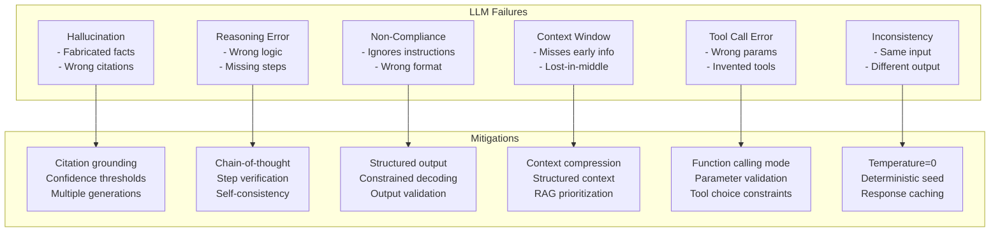
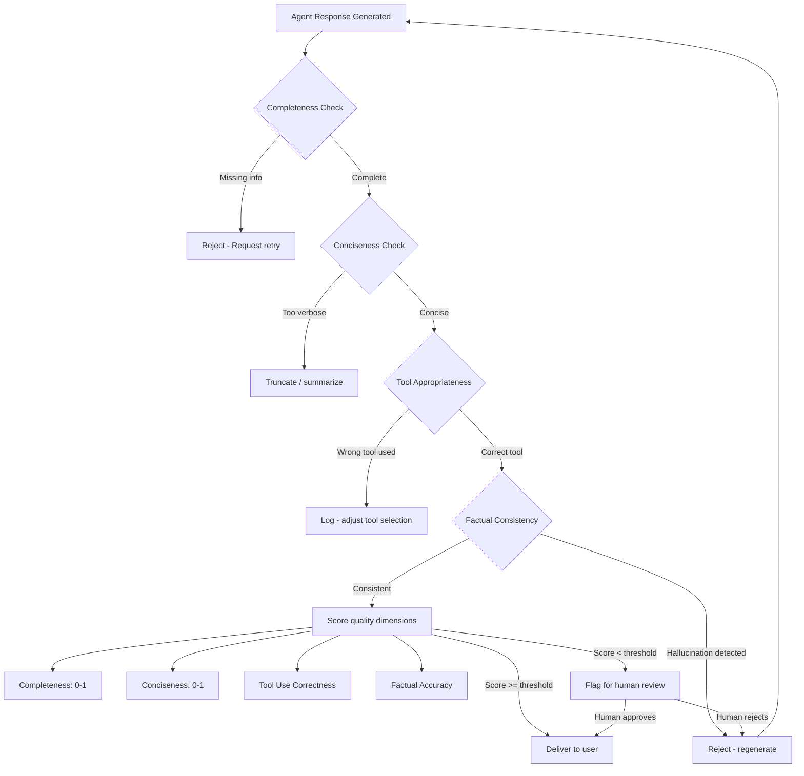
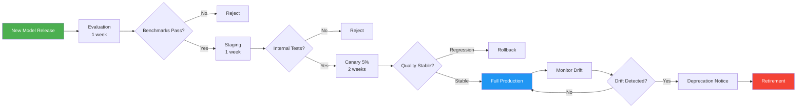

# Volume 9: LLM Reliability & Quality Engineering

## Chapter 23: Managing LLM Unreliability

### 23.1 The Core Problem

LLMs are fundamentally unreliable in ways traditional software is not:

| Traditional Software | LLM |
|---------------------|-----|
| Deterministic output | Probabilistic output |
| Predictable latency | Variable latency (1-30s) |
| Known failure modes | Novel failure modes (hallucination) |
| Testable exhaustively | Testable statistically |
| Same input → same output | Same input → different output |
| Zero cost per operation | Non-zero cost per operation |

The AgentOS must treat LLMs as unreliable components and build reliability layers around them.

---

### 23.2 LLM Failure Taxonomy

```
1. Hallucination (factual errors)
   - Making up plausible-sounding but false information
   - Inventing citations, quotes, data points
   - Frequency: 3-10% of responses depending on model and task

2. Reasoning errors
   - Incorrect logical deductions
   - Missing key constraints
   - False causal relationships
   - Frequency: 5-20% on complex reasoning tasks

3. Instruction non-compliance
   - Ignoring format requirements
   - Skipping required steps
   - Outputting wrong structure
   - Frequency: 1-5% with clear instructions, higher with complex

4. Context window issues
   - Forgetting information in middle of context (lost in the middle)
   - Attending too much to recency bias
   - Context length errors (truncation)
   - Frequency: 10-30% on long documents

5. Tool call errors
   - Calling wrong tool
   - Passing invalid parameters
   - Not calling tool when needed
   - Frequency: 5-15% of tool-use tasks

6. Consistency failures
   - Contradicting itself within same response
   - Changing answer when re-asked same question
   - Frequency: 10-20% on repeated queries
```

---

### 23.3 Mitigation Strategies by Failure Type

#### Hallucination Mitigation

**Strategy 1: Citation Requirement**
```
System prompt rule:
  "Every factual claim MUST be accompanied by a citation to the source document.
   If you cannot cite a source, state 'I don't have a source for this claim.'
   Claims without citations will be rejected."
```

**Strategy 2: Factual Consistency Check**
```python
async def check_factual_consistency(response: str, sources: List[Document]) -> ConsistencyScore:
    """Use a second LLM call to verify facts against sources."""
    prompt = f"""
    Response: {response}
    
    Sources: {[s.content[:500] for s in sources]}
    
    For each factual claim in the response, verify it against the sources.
    List any claims that are NOT supported by the provided sources.
    Rate confidence: HIGH | MEDIUM | LOW | UNSUPPORTED
    """
    
    result = await judge_llm.evaluate(prompt)
    return result.confidence
```

**Strategy 3: Confidence Thresholds**
```
- HIGH confidence claims: Accept as-is
- MEDIUM confidence: Add qualification ("According to the data...")
- LOW confidence: Request verification from user
- UNSUPPORTED: Strip from response, flag for improvement
```

**Strategy 4: Multiple Generations + Consensus**
```
- Generate 3 responses with temperature=0.3
- Compare responses for agreement
- If 3/3 agree on key facts → high confidence
- If 2/3 agree → medium confidence
- If 0/3 agree → regenerate with different prompt
```



#### Instruction Non-Compliance Mitigation

**Technique 1: Structured Output Enforcement**
```python
from pydantic import BaseModel

class AgentResponse(BaseModel):
    thought: str
    action: Literal["tool_call", "response", "request_clarification"]
    tool: Optional[str] = None
    parameters: Optional[Dict[str, Any]] = None
    response_text: Optional[str] = None

# Use constrained decoding or output parsing
response = await llm.call(prompt, response_model=AgentResponse)
# If parse fails, retry with error message appended to prompt
```

**Technique 2: Step-by-Step Decomposition**
```
Instead of:
  "Analyze this data and email the report"

Use:
  Step 1: Query the database for Q2 data
  Step 2: Analyze the data for trends
  Step 3: Generate a PDF report
  Step 4: Send email via tool
  Complete each step before proceeding to next.
```

**Technique 3: Explicit Negative Examples**
```
GOOD tool call:
  {"tool": "search", "params": {"query": "Q2 revenue 2026"}}

BAD tool call (DO NOT DO THIS):
  {"tool": "search", "params": {"query": "everything"}}
  {"tool": "delete", "params": {"table": "users"}}
```

#### Context Window Issues Mitigation

**Technique 1: Structured Context Placement**
```
Research shows LLMs attend best to:
  - Start of context (primacy effect)
  - End of context (recency effect)
  - Middle of context (lost-in-the-middle effect)

Optimal ordering:
  [System prompt]           ← Best retention (primacy)
  [User message]            ← Most relevant
  [Recent history]          ← Good retention (recency)
  [Tool definitions]        ← Medium retention
  [Long-term memories]      ← Medium retention
  [Knowledge documents]     ← Worst retention (middle)
```

**Technique 2: Chunking + Iterative Processing**
```
For documents exceeding context window:
  1. Split document into chunks (2000 tokens each)
  2. Process each chunk: summarize key points
  3. Combine summaries
  4. Process combined summary for final answer
```

**Technique 3: Dynamic Truncation with Importance**
```
1. Score each context item by importance
2. Sort by importance (descending)
3. Take items until 80% of token budget
4. Summarize remaining 20% items
5. Place summarized items at bottom
```

---

### 23.4 Quality Evaluation Framework

#### Automated Quality Checks

**Check 1: Response Completeness**
```python
def check_completeness(response: str, user_request: str) -> float:
    """Score 0-1 how completely the response addresses the request."""
    # Extract key requirements from request
    requirements = extract_requirements(user_request)
    # Check if each requirement is addressed
    addressed = sum(1 for r in requirements if r in response)
    return addressed / len(requirements) if requirements else 1.0
```

**Check 2: Response Conciseness**
```python
def check_conciseness(response: str, max_ratio: float = 2.0) -> float:
    """Score 0-1 for conciseness. Ratio of response to expected length."""
    expected_tokens = estimate_expected_tokens(response)
    actual_tokens = count_tokens(response)
    ratio = actual_tokens / max(expected_tokens, 1)
    if ratio <= max_ratio:
        return 1.0  # Good
    return max(0, 1.0 - (ratio - max_ratio) / max_ratio)  # Penalize verbosity
```

**Check 3: Tool Call Appropriateness**
```python
def check_tool_appropriateness(tool_calls: List[ToolCall], available_tools: List[Tool]) -> float:
    """Score 0-1 for correct tool usage."""
    if not tool_calls:
        return 0.5  # No tool calls = neutral
    
    correct = 0
    for call in tool_calls:
        if call.tool_name in [t.name for t in available_tools]:
            if validate_params(call.parameters, call.tool_name):
                correct += 1
    return correct / len(tool_calls)
```

#### Human Quality Reviews

**Sampling strategy:**
```
Daily random sample: 100 conversations
  - 50 from high-volume users
  - 30 from medium-volume users  
  - 20 from low-volume users

Review each for:
  1. Factual accuracy: Correct? (yes/no/partial)
  2. Helpfulness: Resolved user need? (1-5)
  3. Safety: Any harmful content? (yes/no)
  4. Style: Appropriate tone? (1-5)
  5. Efficiency: Optimal tool use? (1-5)
```

**Quality scoring:**
```json
{
  "quality_score": {
    "daily": {
      "date": "2026-07-13",
      "responses_reviewed": 100,
      "factual_accuracy": 0.94,
      "helpfulness": 4.2,
      "safety": 0.99,
      "style": 4.0,
      "efficiency": 3.8,
      "overall": 4.0
    },
    "trends": {
      "7_day_accuracy": 0.93,
      "30_day_accuracy": 0.91  // improving!
    }
  }
}
```



### 23.5 A/B Testing for Model Selection

**Testing framework:**
```
Test: Model selection policy
Control: Current model routing (e.g., Sonnet for code, Haiku for simple Q&A)
Treatment: Alternative routing (e.g., GPT-4o for code, Gemini for simple Q&A)

Metrics:
  Primary: User satisfaction (thumbs up/down rate)
  Secondary: Task completion rate, cost per task, latency

Duration: Minimum 3 days, minimum 1000 sessions per variant

Randomization: Per session (not per request)
```

**Candidate tests to run:**

| Test | Control | Treatment | Expected Impact |
|------|---------|-----------|-----------------|
| Code generation | Claude Sonnet 4 | GPT-4o | Quality vs cost tradeoff |
| Simple Q&A | Claude Haiku 4 | GPT-4o-mini | Cost reduction 60% |
| Reasoning | Claude Opus 4 | Gemini 2.5 Pro | Cost reduction 90% |
| Context assembly | Full memory | Compressed memory | Latency reduction 30% |

---

### 23.6 Model Comparison Benchmarking

**Internal benchmark suite:**
```json
{
  "benchmark": {
    "name": "agentos_quality_v1",
    "tasks": [
      {
        "name": "data_analysis",
        "prompt": "Analyze this revenue data from Q2: {data}. Identify top 3 trends.",
        "eval_criteria": ["correct_trends", "supports_claims_with_data", "concise"],
        "ground_truth": {
          "trends": ["Enterprise growth 45%", "SMB flat", "Churn decreased 12%"],
          "data_sources": ["provided data table"],
          "max_tokens": 500
        }
      },
      {
        "name": "code_generation",
        "prompt": "Write a Python function to calculate moving average...",
        "eval_criteria": ["correctness", "efficiency", "edge_cases"],
        "test_cases": [
          {"input": [1,2,3,4,5], "window": 3, "expected": [2,3,4]},
          {"input": [], "window": 3, "expected": []}
        ]
      },
      {
        "name": "tool_selection",
        "prompt": "Send the Q2 report to john@company.com",
        "eval_criteria": ["correct_tool", "correct_parameters"],
        "expected_tool": "email_sender",
        "expected_params": {"to": "john@company.com", "attachment": "Q2_report.pdf"}
      }
    ],
    "scoring": {
      "pass_threshold": 0.80,
      "pass_criteria": "all_metrics_above_threshold"
    }
  }
}
```

**Model evaluation matrix:**

| Task | Claude Opus 4 | Claude Sonnet 4 | GPT-4.5 | GPT-4o | Gemini 2.5 Pro | Gemini 2.5 Flash |
|------|--------------|----------------|---------|--------|----------------|------------------|
| Reasoning | 0.95 | 0.89 | 0.93 | 0.85 | 0.92 | 0.82 |
| Coding | 0.93 | 0.92 | 0.91 | 0.88 | 0.90 | 0.85 |
| Data analysis | 0.94 | 0.90 | 0.92 | 0.87 | 0.93 | 0.84 |
| Creative | 0.91 | 0.88 | 0.93 | 0.90 | 0.88 | 0.86 |
| Tool use | 0.92 | 0.91 | 0.90 | 0.89 | 0.85 | 0.88 |
| Instruction following | 0.93 | 0.92 | 0.91 | 0.89 | 0.88 | 0.87 |
| Speed (TTFT) | 1.5s | 0.6s | 1.2s | 0.8s | 0.5s | 0.3s |
| Cost (per 1M tok) | $15/$75 | $3/$15 | $15/$60 | $2.50/$10 | $1.25/$5 | $0.15/$0.60 |

---

### 23.7 Prompt Versioning & Management

**Prompt as code:**
```
/prompts
  /agents
    /research_agent
      system_v1.txt
      system_v2.txt
      context_template.hbs   (Handlebars template)
    /code_agent
      system_v3.txt
  /tools
    /database_query
      description_v2.txt
      instruction_v1.txt
  /guardrails
    /input_filter.txt
    /output_filter.txt
```

**Prompt registry:**
```json
{
  "prompt": {
    "id": "research_agent_system_v2",
    "name": "Research Agent System Prompt",
    "version": 2,
    "content": "You are a research agent...",
    "variables": ["user_name", "org_name", "tools"],
    "model_compatibility": ["claude-*", "gpt-4*"],
    "metrics": {
      "avg_satisfaction": 0.88,
      "avg_cost_per_call": 0.015,
      "avg_latency_ms": 4200
    },
    "parent_version": 1,
    "change_log": "Added citation requirement. Reduced verbosity. v1 had 15% hallucination rate.",
    "author": "engineer@agentos.com",
    "created_at": "2026-07-10T14:00:00Z",
    "status": "active"
  }
}
```

**Prompt A/B testing:**
```
Control: v2 ("Be concise, cite sources")
Treatment: v3 ("Be concise, cite sources, use bullet points for lists")

Rollout: 10% → 50% → 100%
Monitor: satisfaction rate, token usage, completion rate
```

---

### 23.8 Token Efficiency Optimization

**Token wastage sources:**
```
1. Overly verbose system prompts:
   - Target: < 500 tokens per agent type
   - Measure: tokens per system prompt
   - Fix: Remove redundant instructions, consolidate

2. Tool description bloat:
   - Target: < 200 tokens per tool
   - Measure: total tokens for all tool descriptions
   - Fix: Shorten descriptions, remove examples from production

3. Conversation history bloat:
   - Target: max 20% of context window
   - Measure: tokens per historical message
   - Fix: Summarize older messages aggressively

4. Knowledge context padding:
   - Target: only top-3 chunks per query
   - Measure: tokens per knowledge retrieval
   - Fix: Tighten relevance threshold, reduce chunk count
```

**Cost-per-task optimization loop:**
```
For each agent type:
  1. Measure: average tokens per task completion
  2. Identify: which part consumes most tokens?
  3. Optimize: reduce tokens in that component
  4. Measure: does quality degrade?
  5. If no degradation: deploy optimization
  6. Repeat monthly

Target: 20% cost reduction per quarter without quality loss
```

---

### 23.9 Model Lifecycle Management

```
Model release → Evaluation → Staging → Canary → Production → Deprecation
                                                              ↓
                                                         Monitor drift
                                                              ↓
                                                         Retirement

Timeline:
  - Evaluation: 1 week (benchmark suite)
  - Staging: 1 week (internal testers)
  - Canary: 2 weeks (5% of users)
  - Production: until deprecation notice
  - Deprecation: 2 months notice
  - Retirement: after deprecation period
```



**Model deprecation checklist:**
```
□ Identify all code paths using deprecated model
□ Update model routing to exclude deprecated model
□ Notify users who manually selected this model
□ Update documentation
□ Remove model from tooling (CLI, dashboard)
□ Archive benchmark results
□ Shut down API access (if self-hosted)
```
