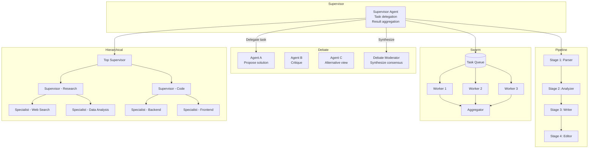
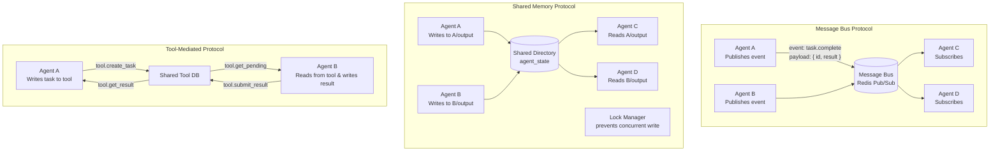
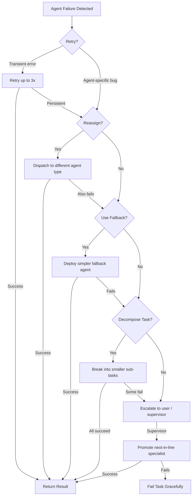

# Volume 10: Multi-Agent Orchestration Patterns

## Chapter 24: Multi-Agent Architecture

### 24.1 When to Use Multiple Agents

**Multi-agent is appropriate when:**
- Task requires **diverse expertise** (code + security review + documentation)
- Task benefits from **parallel independent work** (research multiple topics)
- Task needs **specialized models** (vision model + code model + reasoning model)
- Task requires **separate security contexts** (different credentials, different tools)
- Task has **naturally separable sub-tasks** with clear handoffs

**Multi-agent is NOT appropriate when:**
- Single agent fits in context window
- Task is linear with no parallelism
- Coordination overhead exceeds parallel gains
- Adding agents adds latency without quality improvement
- Debugging complexity isn't justified

---

### 24.2 Multi-Agent Communication Patterns

#### Pattern 1: Supervisor/Orchestrator

```
Orchestrator receives goal
  → Decomposes into sub-tasks
  → Assigns to specialized agents
  → Monitors progress
  → Handles errors
  → Aggregates results
  → Returns final response

Flow:
User → Supervisor Agent
  Supervisor → Research Agent: "Find Q2 revenue data"
  Supervisor → Analysis Agent: "Analyze trends"
  Supervisor → Report Agent: "Generate report"
  Supervisor → Return: Final response to user
```

**Implementation:**
```python
class SupervisorAgent:
    async def orchestrate(self, goal: str):
        plan = await self.planner.decompose(goal)
        
        # Parallel execution where possible
        parallel_groups = self.find_parallel_steps(plan)
        
        for group in parallel_groups:
            results = await asyncio.gather(*[
                self.execute_agent_step(step) for step in group
            ])
            self.update_context(results)
        
        # Sequential execution for dependent steps
        for step in plan.sequential:
            result = await self.execute_agent_step(step)
            self.update_context(result)
            
            if not result.success:
                result = await self.replan(step)
        
        return await self.synthesize_results()
```

**Pros:** Clear hierarchy, easy to monitor, natural error handling
**Cons:** Supervisor can be bottleneck, supervisor context may exceed limits

#### Pattern 2: Debate/Discussion

```
Multiple agents discuss a problem, critique each other, converge on answer.

Flow:
User: "Is this code secure?"
  Security Agent: "Found SQL injection in line 42"
  Code Quality Agent: "Also missing input validation"
  Security Agent: "Plus no rate limiting on auth endpoint"
  → Converged: "3 vulnerabilities found, prioritized by severity"
```

**Implementation:**
```python
class DebateTeam:
    async def debate(self, question: str, num_rounds: int = 3):
        agents = [self.create_agent_with_role(role) for role in self.roles]
        
        context = question
        for round in range(num_rounds):
            responses = await asyncio.gather(*[
                agent.respond(context) for agent in agents
            ])
            
            # Share all responses for next round
            context = self.combine_responses(responses)
            
            # Check for convergence
            if self.check_convergence(responses):
                break
        
        return self.synthesize_final(context)
```

**Pros:** Higher quality through critique, reduces individual bias, explores alternatives
**Cons:** Expensive (multiple LLM calls per round), slow, can degenerate to argument

#### Pattern 3: Pipeline/Chain

```
Agent A output → Agent B input → Agent C input → Final output

Flow:
Raw Data → Parser Agent → Structured Data → Analyzer Agent → Insights
  → Writer Agent → Draft Report → Editor Agent → Final Report → User
```

**Implementation:**
```python
class Pipeline:
    stages: List[AgentStage] = [
        AgentStage("parser", input="raw_data", output="structured_data"),
        AgentStage("analyzer", input="structured_data", output="insights"),
        AgentStage("writer", input="insights", output="draft"),
        AgentStage("editor", input="draft", output="final"),
    ]
    
    async def execute(self, initial_input: Any) -> Any:
        current = initial_input
        for stage in self.stages:
            agent = self.get_agent(stage.name)
            current = await agent.process(current)
            
            # Validation gate between stages
            if not self.validate_output(stage, current):
                current = await self.handle_failure(stage, current)
                
        return current
```

**Pros:** Simple, predictable, testable per stage, easy to monitor
**Cons:** Sequential (no parallelism), latent (long tail of slowest stage), error propagates

#### Pattern 4: Swarm/HEX

```
Many simple agents, minimal coordination, emergent behavior.

Flow:
Task arrives → Published to task queue
  → Agent A picks up task
  → Agent A realizes it needs data → publishes subtask
  → Agent B picks up subtask
  → Agent B returns data
  → Agent A completes task → publishes result

No central coordinator. Agents discover and claim tasks.
```

**Implementation (simplified):**
```python
class SwarmAgent:
    async def run(self):
        while True:
            task = await self.task_queue.dequeue()
            
            if task.requires_decomposition:
                subtasks = await self.decompose(task)
                for st in subtasks:
                    await self.task_queue.enqueue(st)
                continue
            
            result = await self.execute(task)
            
            if task.parent_task_id:
                await self.result_store.store(task.parent_task_id, result)
                
            await self.task_queue.enqueue(
                Task(type="check_completion", task_id=task.parent_task_id)
            )
```

**Pros:** Highly scalable, fault-tolerant, no single point of failure
**Cons:** Hard to debug, unpredictable behavior, no guarantees



#### Pattern 5: Hierarchical

```
Top-level supervisor → Mid-level supervisors → Specialist agents

Flow:
CEO Agent → "Launch product"
  → Engineering Supervisor → "Build features"
    → Frontend Agent → "Build UI"
    → Backend Agent → "Build API"
  → Marketing Supervisor → "Plan launch"
    → Content Agent → "Write blog post"
    → Social Agent → "Plan campaign"
  → Aggregation → "Product launched"
```

**Pros:** Handles complex hierarchies, natural org structure, good for large teams
**Cons:** Deep hierarchy = slow, complex coordination, expensive

---

### 24.3 Agent Communication Protocols

#### Protocol 1: Message Bus

```json
// Message format for inter-agent communication
{
  "message_id": "msg_001",
  "from_agent": "research_agent_v2",
  "to_agent": "analysis_agent",  // or "broadcast" for all
  "message_type": "task_assignment | result | request | notification",
  "conversation_id": "conv_001",
  "correlation_id": "task_001",
  "payload": {
    "type": "result",
    "task_id": "task_001",
    "status": "completed",
    "data": {
      "revenue_q2": 15200000,
      "growth_yoy": 0.23,
      "segments": {
        "enterprise": { "revenue": 8500000, "growth": 0.45 },
        "smb": { "revenue": 4500000, "growth": 0.02 },
        "midmarket": { "revenue": 2200000, "growth": 0.15 }
      }
    },
    "error": null,
    "metadata": {
      "tokens_used": 45000,
      "execution_time_ms": 32000,
      "tools_called": ["database_query"]
    }
  },
  "timestamp": "2026-07-13T10:00:00Z",
  "ttl": 3600,
  "priority": "high"
}
```

#### Protocol 2: Shared Memory

```
Agents communicate through shared memory regions:
  /memory/shared/task_001/
    ├── context.json          (shared context for the task)
    ├── research_agent/
    │   └── output.json       (research agent's contribution)
    ├── analysis_agent/
    │   └── output.json       (analysis agent's contribution)
    └── status.json           (task status, lock information)

No direct messaging. Agents write to memory, others poll for changes.
```

**Locking mechanism:**
```
Agent reads status → sees step_1 available → acquires lock
Agent writes to step_1 output → updates status → releases lock
Next agent sees step_1 completed → reads output → picks up step_2
```

#### Protocol 3: Tool-mediated

```
Agent A calls a tool that produces output for Agent B
No direct agent-to-agent communication

Example:
  Agent A calls "database_query" → stores result in shared storage
  Agent B calls "read_result" → picks up where Agent A left off
```

**Pros for AgentOS:**
- Tools already have auth, logging, versioning
- Easier to monitor (tool calls are already tracked)
- Agents don't need special communication capabilities



### 24.4 Multi-Agent Resource Management

**Shared resource challenges:**
```
- Token budget: Shared across agents or per-agent?
- Model access: All agents access same pool or dedicated?
- Memory: Shared agent memory or isolated?
- Tools: All tools available to all agents?
```

**Recommended partitioning:**
```
Resources        Supervisor     Specialist Agents
─────────────────────────────────────────────────
Token budget     Shared pool    Per-agent sub-budget
Model access     Premium model  Assigned by task
Memory           Full context   Relevant subset
Tools            All tools      Scoped to role
Credentials      Full vault     Scoped by role
```

---

### 24.5 Multi-Agent Error Handling

**Error types specific to multi-agent:**

```
1. Deadlock: Agent A waits for Agent B, Agent B waits for Agent A
   Detection: Timeout on all waiting agents
   Fix: Deadlock detection timeout, kill youngest agent

2. Starvation: High-priority agents always get resources, low-priority never runs
   Detection: Low-priority agent wait time > 10x high-priority
   Fix: Priority aging (priority increases with wait time)

3. Incoherent state: Two agents modify shared state inconsistently
   Detection: Version conflict in shared memory
   Fix: Last-write-wins with conflict logging, manual resolution for critical

4. Cascading failure: One agent failure → dependent agents fail
   Detection: Chain of failures with dependency links
   Fix: Circuit breaker per agent, graceful degradation
```

**Supervisor error recovery:**
```
Specialist Agent fails:
  1. Retry (if transient)
  2. Reassign (if agent-specific bug)
  3. Fallback (use simpler agent)
  4. Decompose further (task too hard for one agent)
  5. Escalate (ask user)

Supervisor fails:
  1. Promote next-in-line specialist to temp supervisor
  2. Or checkpoint and restart from last snapshot
  3. Or fail entire task gracefully
```



### 24.6 Multi-Agent Observability

**Per-agent metrics:**
```
agent.specialist.output_quality     Gauge (score from supervisor)
agent.specialist.task_completion    Counter
agent.specialist.task_failure       Counter  
agent.specialist.avg_execution_time Histogram
agent.specialist.tokens_per_task    Histogram
agent.specialist.tools_used         Counter (by tool)
```

**Cross-agent metrics:**
```
team.task.completion_rate           Gauge
team.task.avg_handoffs              Histogram (how many agents touched)
team.task.avg_time_to_completion    Histogram
team.communication.messages_sent    Counter
team.communication.rounds_per_task  Histogram
```

**Multi-agent trace visualization:**
```
Timeline:
Agent A: ──────[task 1]───[task 2]──────────────[task 4]───
Agent B:        └────[task 1a]──[task 1b]──┐
Agent C:                                      [task 2a]───
Agent D: ──────[task 3]────────────────────────────[task 4a]

Each bar = execution time
Brackets = waiting on input from another agent
Arrows = message passing between agents
```

---

### 24.7 Multi-Agent Scaling

**When to scale agents:**
```
1 task → 1 agent (single)
2-5 independent sub-tasks → 2-5 agents (supervisor)
5-20 sub-tasks with dependencies → 5-10 agents (hierarchical)
20+ sub-tasks → swarm/HEX pattern
```

**Scaling limits:**
```
- Communication overhead grows O(n²) with n agents
- Context sharing: each agent's context grows with team size
- Debugging complexity: exponentially harder with more agents
- Cost: each agent consumes LLM calls

Practical max: 5-10 agents for most tasks
Beyond that: hierarchical or swarm patterns needed
```
