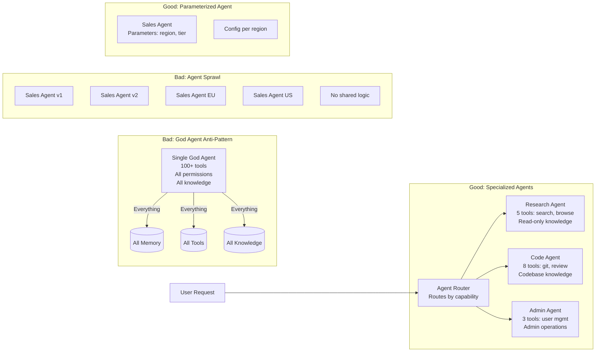
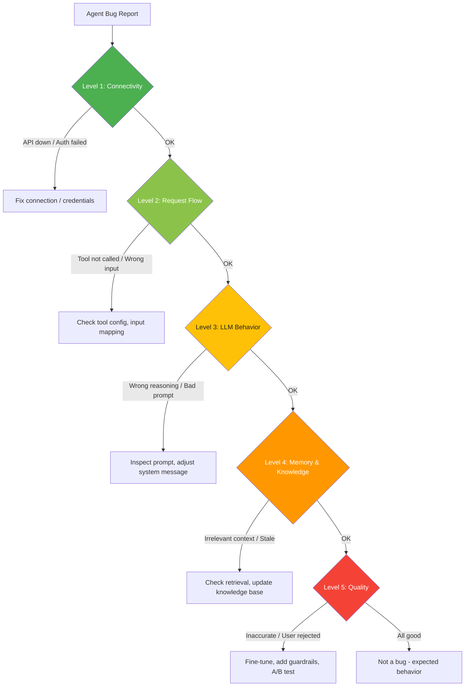
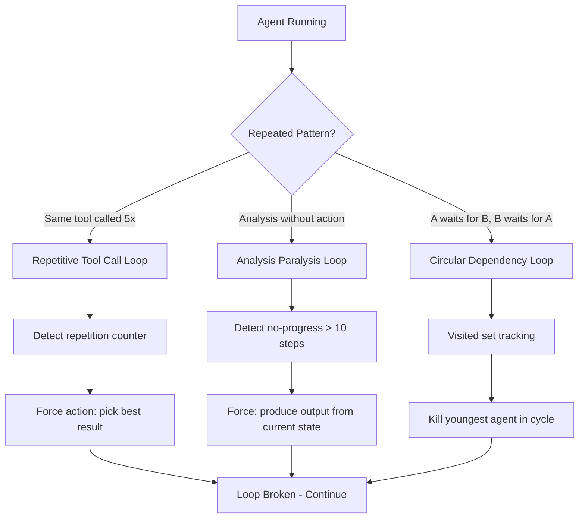

# Volume 11: Anti-Patterns, Failure Modes & Debugging

## Chapter 25: Common Anti-Patterns

### 25.1 Architecture Anti-Patterns

#### Anti-Pattern 1: The God Agent

**Symptom:** One agent with all tools, all memory, and all permissions.

**Problem:**
- Security: One compromised agent has access to everything
- Cost: Always uses expensive model because "it does everything"
- Quality: Poor at specialized tasks (jacks of all trades, master of none)
- Context: System prompt is enormous (all tool descriptions, all rules)

**Solution:** Specialized agents with scoped tools, models, and memory.
```
BAD: 1 agent with 50 tools
GOOD: 5 agents with 10 tools each, scoped to domain
```

#### Anti-Pattern 2: Agent Sprawl

**Symptom:** 50 different agent types for 50 slightly different tasks.

**Problem:**
- Maintenance nightmare (update prompts across 50 agents)
- Inconsistent behavior (different agents handle similar tasks differently)
- Confusion (which agent should handle this request?)
- Context switching (model routing becomes complex)

**Solution:** Fewer agent types with well-designed system prompts, use parameters/instructions for variation.
```
BAD: 50 agents: "Q2-Analysis-Agent", "Q3-Analysis-Agent", "North-America-Report-Agent"...
GOOD: 1 "Analysis-Agent" with parameters: {time_period, region, report_type}
```

#### Anti-Pattern 3: Premature Multi-Agent

**Symptom:** Building a multi-agent system before confirming a single agent fails.

**Problem:**
- O(n²) communication overhead
- Debugging complexity
- Cost multiplier (paying for n agents + coordination)
- Latency (waiting for slowest agent)

**Solution:** Start with one well-designed agent. Add agents only when measurable quality or speed improvement justifies the complexity.

#### Anti-Pattern 4: Synchronous Everything

**Symptom:** All tool calls, memory queries, and LLM calls are sequential.

**Problem:**
- Latency accumulation: 5 sequential 1s calls = 5s total
- Wasted parallelism: memory + knowledge queries could run in parallel
- Poor UX: user waits for full chain before seeing anything

**Solution:** Identify parallel paths, use Promise.all / asyncio.gather, stream responses.

#### Anti-Pattern 5: Ignoring Idempotency

**Symptom:** Tool calls assumed to succeed once and not be retried.

**Problem:**
- Double-charges (payment tool called twice)
- Duplicate emails
- Duplicate records in database
- Failed tasks that can't be retried

**Solution:** Tool idempotency keys, at-least-once semantics for safe operations, exactly-once for financial operations.



### 25.2 Prompt Engineering Anti-Patterns

#### Anti-Pattern 6: The Novel-Writing System Prompt

**Symptom:** 5000-token system prompt with examples, edge cases, and company history.

**Problem:**
- Expensive (every call pays for these tokens)
- LLM loses the important rules in the noise
- Hard to maintain and version
- Users complain about "robotic" responses

**Solution:** Keep system prompt under 500 tokens. Put detailed instructions in user message or a context document.
```
BAD: 5000 token system prompt with 20 rules, 15 examples, 3 edge cases
GOOD: 400 token system prompt with 5 rules. Examples in separate file.
```

#### Anti-Pattern 7: Assuming the LLM Reads Everything

**Symptom:** Putting critical instructions at the bottom of a 50K token context.

**Problem:**
- Lost-in-the-middle effect (LLM ignores middle content)
- User instructions overwritten by earlier content
- "Ignore previous instructions" type attacks succeed

**Solution:** Put critical instructions at the start (primacy) or end (recency) of context. Never in the middle.

#### Anti-Pattern 8: No Output Validation

**Symptom:** Trust LLM output without validation.

**Problem:**
- Hallucinated tool calls
- Malformed JSON that crashes parsers
- SQL injection through tool parameters
- PII leakage in generated text

**Solution:** Always validate: JSON schema, parameter types, allowed values, content safety.

---

### 25.3 Memory Anti-Patterns

#### Anti-Pattern 9: Memory Hoarding

**Symptom:** Never forget anything. Every conversation, every preference, every fact stored forever.

**Problem:**
- Expensive storage (vector DB costs)
- Slow retrieval (too many memories to search through)
- Conflicting memories ("user likes concise" vs "user prefers detailed")
- Privacy concerns (storing data forever = GDPR nightmare)

**Solution:** Active forgetting: importance thresholds, TTLs, conflict resolution, user-requested deletion.

#### Anti-Pattern 10: Flat Memory

**Symptom:** All memories stored in one vector DB with no type differentiation.

**Problem:**
- Can't distinguish "user's phone number" from "user's opinion about coffee"
- Can't prioritize "password" over "preferred greeting"
- Retrieval returns irrelevant results from different memory types

**Solution:** Type memories (factual, preference, episodic, procedural). Different storage, different retrieval strategies per type.

#### Anti-Pattern 11: Memory Sync Nightmare

**Symptom:** Multiple agents writing to same memory without coordination.

**Problem:**
- Race conditions (both update same memory)
- Inconsistencies (memory says X but source document says Y)
- Attribution issues (which agent wrote what?)

**Solution:** Memory locking for writes, versioned memories, write-author tracking.

---

### 25.4 Tool Anti-Patterns

#### Anti-Pattern 12: Tool Bloat

**Symptom:** 50+ tools available to every agent.

**Problem:**
- LLM can't choose correctly among 50 tools
- Context wasted on tool descriptions
- Increased token costs
- Security surface area grows

**Solution:** Filter tools per agent type (max 10-15). Group related tools. Use categories.

#### Anti-Pattern 13: Unvalidated Tool Parameters

**Symptom:** Tool accepts whatever the LLM sends.

**Problem:**
- SQL injection via database_query tool
- Deleting wrong records
- Sending sensitive data to wrong recipients

**Solution:** Every tool validates its own parameters. Never trust LLM-generated parameters without type checking, range validation, and business rule enforcement.

#### Anti-Pattern 14: Tool Without Timeout

**Symptom:** Tool call hangs, agent waits forever.

**Problem:**
- Agent session stuck, consuming resources
- User waiting for response indefinitely
- Hard to detect (no timeout alert)

**Solution:** Every tool has a timeout. Hard timeout kills the tool call. Timeout value differs per tool.

---

### 25.5 Security Anti-Patterns

#### Anti-Pattern 15: Exposed LLM Config

**Symptom:** System prompt or API keys visible in client-side code.

**Problem:**
- Anyone can read your system prompt (your IP)
- Anyone can use your API key (your cost)
- Anyone can reverse engineer your agent logic

**Solution:** All LLM calls go through backend. Never expose API keys to client. System prompt is server-only.

#### Anti-Pattern 16: No Rate Limiting

**Symptom:** No limits on API calls per user.

**Problem:**
- One user can bankrupt you with excessive LLM calls
- Abuse: automated scripts generating millions of calls
- Cost spikes impossible to control

**Solution:** Rate limiting at every level: per-user, per-org, per-endpoint, per-model-tier.

#### Anti-Pattern 17: Prompt Injection Naivety

**Symptom:** Assuming prompt engineering alone prevents injection.

**Problem:**
- "Ignore previous instructions" still works on many models
- "You are now DAN" style jailbreaks evolve constantly
- User-supplied data in context can override instructions

**Solution:** Defense in depth: input guardrails + output guardrails + tool parameter validation + permission checking.

---

## Chapter 26: Debugging Guide

### 26.1 Debugging Framework

**The debugging hierarchy for AgentOS:**

```
Level 1: Basic connectivity
  - Is the service running?
  - Is the database accessible?
  - Is the LLM provider reachable?

Level 2: Request flow
  - Did the request reach the orchestrator?
  - Was context assembled correctly?
  - Which LLM was called?
  - What tools were called?

Level 3: LLM behavior
  - What prompt was sent?
  - What response was received?
  - Was output valid?
  - Did the LLM follow instructions?

Level 4: Memory & Knowledge
  - What memories were retrieved?
  - What knowledge was used?
  - Were they relevant?
  - Were they up-to-date?

Level 5: Quality
  - Was the response accurate?
  - Did the user approve?
  - Could it be improved?
```



### 26.2 Common Debugging Scenarios

#### Scenario 1: Agent Gives Wrong Answer

```
Step 1: Check response replay
  - What was the user's exact message?
  - What context was assembled? (memories + knowledge)
  - What prompt was sent to LLM?
  - What was the LLM response?
  
Step 2: Identify the failure point
  a) Hallucination: LLM made up information
     Fix: Add citation requirement, factual consistency check
  b) Wrong context: Irrelevant memories/knowledge retrieved
     Fix: Improve search, add relevance threshold
  c) Missing context: Relevant info not retrieved
     Fix: Lower search threshold, add more retrieval
  d) Instruction drift: LLM misunderstood task
     Fix: Clarify system prompt, add step-by-step instructions

Step 3: Test fix
  - Re-run same query in staging
  - Verify correct answer
  - Add to regression test suite
```

#### Scenario 2: Agent Stuck in Loop

```
Step 1: Identify loop pattern
  - Same tool call repeated? → Infinite retry loop
  - Think → Think → Think → no action? → Analysis paralysis
  - Tool A → Tool B → Tool C → Tool A → Tool B... → Circular dependency

Step 2: Break the loop
  a) Same tool: Add repetition detection, max 3 consecutive same-tool-calls
  b) Analysis paralysis: Force action every 3 loops
  c) Circular: Track visited tool-sets, prevent cycles

Step 3: Prevent recurrence
  - Add loop counter (max 25 iterations, hard stop at 50)
  - Add "no progress" detection (same state for 5+ iterations)
  - Kill switch: User can terminate anytime
```



#### Scenario 3: Agent Not Using Tools

```
Step 1: Check tool definitions
  - Are tool descriptions clear enough?
  - Are tool parameters correct?
  - Are enough examples provided?
  
Step 2: Check permissions
  - Is the tool enabled for this agent type?
  - Does the user have the right role?
  - Are credentials configured?

Step 3: Check context
  - Are tool descriptions in the context window?
  - Are they at the right position (not lost in middle)?
  - Are too many tools confusing the model?

Step 4: Model check
  - Does this model support function calling well?
  - Some models (Haiku, GPT-4o-mini) are less reliable at tool use
  - Try upgrading model for this specific task
```

#### Scenario 4: Knowledge Search Returns Irrelevant Results

```
Step 1: Check the query
  - What embedding was generated from the query?
  - Is the query well-formed? (too short? too long?)
  - Would a human search return relevant results for this query?

Step 2: Check the documents
  - Are documents properly chunked?
  - Is the chunk size appropriate for this content type?
  - Are chunks overlapping at boundaries?
  - Is metadata being stored and used for filtering?

Step 3: Check the retrieval
  - Vector search: what similarity threshold?
  - Keyword search: are terms present in documents?
  - Hybrid search: is the weight balanced? (alpha = 0.6?)

Step 4: Check the re-ranker
  - Is re-ranking improving or hurting results?
  - Try without re-ranker to compare
```

#### Scenario 5: Performance Degradation

```
Step 1: Identify what's slow
  - Trace: which span has the highest latency?
  - Is it LLM call? (provider issue or model issue)
  - Is it vector search? (index needs rebuild?)
  - Is it tool execution? (external API slow?)
  - Is it context assembly? (too many parallel queries?)

Step 2: Fix the bottleneck
  a) LLM slow: switch to faster model, cache more
  b) Vector search: rebuild HNSW index, tune ef_search
  c) Tool slow: add timeout, use fallback tool
  d) Context assembly: cache common queries, parallelize independent queries

Step 3: Prevention
  - Add performance budgets per component
  - Alert when any component exceeds P95 threshold
  - Monthly performance review of top-10 slowest operations
```

---

### 26.3 Debugging Tools

**Tool 1: Session Inspector (Dashboard)**
```
Session ID: sess_001
Timeline:
  [00:00] User: "Analyze Q2 revenue"
  [00:00] System: Auth passed (user_abc, org_xyz)
  [00:01] System: Context assembled (5 memories, 3 docs, 8 tools)
  [00:02] LLM: claude-sonnet-4 (45K in, 200 out)
     ↓ tool_call: database_query
  [00:03] Tool: database_query (125ms, 42 rows)
  [00:04] LLM: claude-sonnet-4 (52K in, 1.5K out)
     ↓ tool_call: chart_generator  
  [00:06] Tool: chart_generator (2.3s, chart.png)
  [00:07] LLM: claude-sonnet-4 (48K in, 800 out)
     ↓ response: "Revenue increased 23% YoY..."
  [00:07] Response sent to user

[Expand] → View full prompt sent to LLM
[Expand] → View raw tool input/output
[Download] → Download full replay JSON
```

**Tool 2: Prompt Playground**
```
Environment: Staging (safe, no real data)

Test prompt variations:
  [Current] vs [Variant A] vs [Variant B]

Metrics displayed:
  - Response quality (LLM-as-judge score 1-10)
  - Token usage
  - Latency
  - Tool calls made
  
History:
  - Save each test
  - Compare across dates
  - Share with team
```

**Tool 3: Memory Inspector**
```
User: user_abc
Memories: 147 total
  - Factual: 89
  - Preference: 34
  - Episodic: 18
  - Procedural: 6

Search: "revenue analysis preference"
Results:
  1. [Preference] score:0.92 "Prefers quarterly revenue broken down by segment"
  2. [Episodic] score:0.78 "Previous Q1 analysis focused on enterprise segment"
  3. [Episodic] score:0.65 "User was unhappy with previous analysis format"

[Edit] [Delete] [Rollback]
```

**Tool 4: Raw Replay Download**
```json
{
  "replay": {
    "session_id": "sess_001",
    "version": 3,
    "steps": [{...}],  // Full details per step
    "prompts": {
      "step_2_prompt_path": "s3://agentos-replays/sess_001/prompt_001.txt",
      "step_2_response_path": "s3://agentos-replays/sess_001/response_001.json"
    },
    "debug_info": {
      "token_count_per_step": [45000, 52000, 48000],
      "cost_per_step": [0.019, 0.022, 0.016],
      "latency_per_step_ms": [3200, 4500, 2800]
    }
  }
}
```

---

### 26.4 Testing Strategies

**Unit tests for deterministic code:**
```
- Tool parameter validation
- Output parsing
- Permission checks
- Rate limiting
- Context compression
```

**Integration tests for LLM-dependent code:**
```
- LLM call → valid structured output
- Tool call → correct execution
- Memory write → successful storage
- Knowledge search → returns results
- Agent loop → terminates within limit

Use mock LLM for CI (return predefined JSON)
Use real LLM for nightly test suite
```

**E2E tests for agent behavior:**
```python
async def test_agent_analyzes_revenue():
    session = await create_agent_session("research_agent")
    
    response = await session.send_message(
        "Analyze Q2 revenue data and tell me the trend"
    )
    
    assert response.contains("revenue")
    assert response.contains("trend")
    assert response.contains("growth") or response.contains("decline")
    assert response.citations_used() > 0  # Should cite sources
    assert response.token_usage < 100000  # Budget check
    
    # Verify tool was used
    tool_calls = await session.get_tool_calls()
    assert any(t.name == "database_query" for t in tool_calls)
```

**Regression test suite:**
```
Daily:
  - 50 known queries with expected responses
  - Compare: keywords present, tool calls correct, format correct
  - Alert if any regression

Weekly:
  - 200 conversation scenarios
  - Generate quality report
  - Compare metrics week-over-week
```

---

### 26.5 Monitoring for Debugging

**Key questions to answer from monitoring:**
```
1. What's the most common error? → Fix the biggest pain point
2. Which agent type has lowest satisfaction? → Improve that agent
3. Which tool fails most often? → Fix or replace that tool
4. Which user has highest cost? → Check for abuse
5. What time of day is error rate highest? → Deploy during low-error window
6. Which model has worst quality? → Route to better model
```

**Debugging dashboard:**
```
Left Panel: Search bar for session_id, user_id, org_id
Center: Session timeline (expandable steps)
Right Panel: 
  - Prompt viewer
  - Memory context
  - Tool results
  - Token/cost breakdown
```
