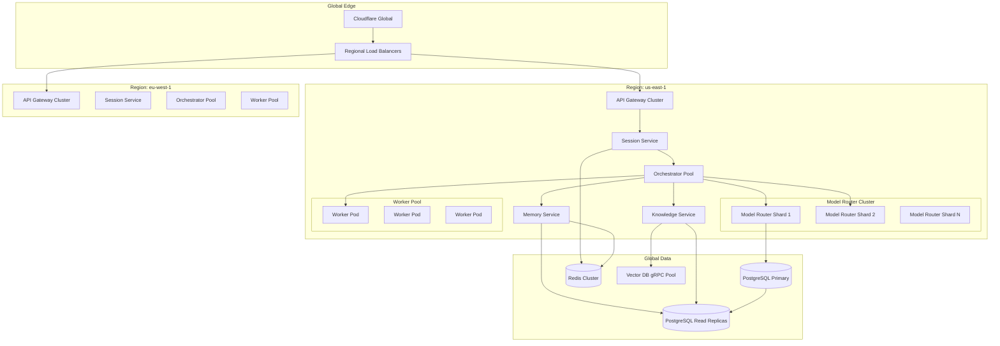
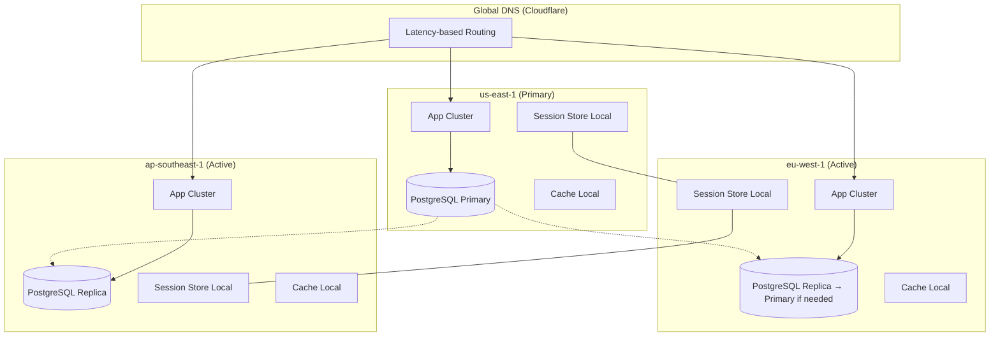

# Volume 12: Scaling to Millions — High-Throughput AgentOS

## Chapter 27: Capacity Planning & Throughput Modeling

### 27.1 Understanding Agent Throughput

**AgentOS throughput is fundamentally different from traditional web apps:**

| Metric | Traditional Web App | AgentOS |
|--------|-------------------|---------|
| Request unit | HTTP request | Agent reasoning loop iteration |
| Duration per unit | 10-200ms | 1-30s |
| Cost per unit | ~$0.00001 | ~$0.001-$0.10 |
| Compute per unit | 10-100ms CPU | 500-5000ms GPU |
| State per unit | Stateless or small session | Large context (up to 200K tokens) |
| External dependencies | 0-1 per request | 1-10 per loop iteration |
| Idempotency | Easy (same output) | Hard (non-deterministic) |

**Modeling throughput:**

```
Given:
  - Average agent session: 15 loop iterations
  - Average LLM call latency: 3s
  - Average tool call latency: 500ms
  - Average context assembly: 200ms
  - Overhead: 300ms (auth, routing, logging)

Total per session: 15 × (3s + 0.5s + 0.2s + 0.3s) = 60s
Sessions per hour per worker: 3600 / 60 = 60 sessions
Workers needed for 1000 concurrent sessions: 1000 / 60 = ~17 workers
```

**Scaling dimensions:**
```
1. Horizontal: More workers (cheap, easy)
2. Vertical: Bigger workers (limited, expensive)
3. Caching: Reduce duplicate LLM calls (free, requires hit rate)
4. Model tiering: Faster models for simpler tasks (cost-latency tradeoff)
5. Batching: Combine non-urgent LLM requests (provider-specific)
```

---

### 27.2 Architecture for Scale



---

### 27.3 Stateless Agent Orchestrator

**The orchestrator MUST be stateless for horizontal scaling:**

```typescript
// Stateless orchestrator — no in-memory state
class StatelessOrchestrator {
    async handleMessage(sessionId: string, message: string, auth: AuthContext) {
        // 1. Load state from Redis (not in-memory)
        const session = await sessionStore.get(sessionId);
        
        // 2. Load context from memory/knowledge services
        const [memories, knowledge, tools] = await Promise.all([
            memoryService.query(session.context),
            knowledgeService.search(message),
            toolRegistry.getForAgent(session.agentType),
        ]);
        
        // 3. Call LLM
        const response = await modelRouter.call(session.model, {
            system: session.systemPrompt,
            messages: session.history,
            userMessage: message,
            context: { memories, knowledge, tools },
        });
        
        // 4. Handle tool calls (loop)
        let finalResponse = response;
        while (finalResponse.action === 'tool_call') {
            const toolResult = await toolExecutor.execute(
                finalResponse.tool, 
                finalResponse.parameters,
                auth
            );
            finalResponse = await modelRouter.call(session.model, {
                ...context,
                toolResult,
            });
        }
        
        // 5. Save state back to Redis
        await sessionStore.update(sessionId, {
            history: [...session.history, { message, response: finalResponse }],
            tokenUsage: session.tokenUsage + response.tokens,
        });
        
        return finalResponse;
    }
}

// Session store (Redis-backed)
class SessionStore {
    async get(sessionId: string): Promise<Session> {
        const data = await redis.get(`session:${sessionId}`);
        return JSON.parse(data);
    }
    
    async update(sessionId: string, updates: Partial<Session>): Promise<void> {
        // Use Redis Lua script for atomic update
        await redis.eval(`
            local key = KEYS[1]
            local updates = cjson.decode(ARGV[1])
            local session = cjson.decode(redis.call('GET', key))
            for k, v in pairs(updates) do
                session[k] = v
            end
            redis.call('SET', key, cjson.encode(session), 'EX', 3600)
        `, [sessionId], [JSON.stringify(updates)]);
    }
}
```

---

### 27.4 Database Scaling Strategy

#### PostgreSQL at Scale

**When you outgrow a single PostgreSQL instance:**
```
Signs:
  - CPU consistently > 60%
  - Query latency P95 > 200ms
  - Connections > 80% of max
  - Storage growing > 10GB/week

Solutions (in order):
  1. Read replicas (offload read queries)
     - Memory queries → replica 1
     - Knowledge queries → replica 2
     - Analytics queries → replica 3

  2. Connection pooling (PgBouncer in transaction mode)
     - 200 app connections → 50 DB connections
     - Critical for serverless / many concurrent workers

  3. Vertical scaling (bigger instance, temporary)
     - r7g.2xlarge → r7g.4xlarge → r7g.8xlarge
     - Expensive, has limits

  4. Table partitioning
     - Partition event_store by month
     - Partition audit_logs by month
     - Partition memories by org_id

  5. Read-write splitting
     - All writes → primary
     - Non-critical reads → replica
     - Use pgbouncer_rr for auto-routing

  6. Sharding (last resort)
     - Shard by org_id range
     - Each shard is independent PostgreSQL instance
     - Requires application-level routing
```

**Example: Partitioning the event_store:**
```sql
-- Create partitioned table
CREATE TABLE event_store (
    id UUID NOT NULL,
    event_type TEXT NOT NULL,
    org_id UUID NOT NULL,
    created_at TIMESTAMP NOT NULL DEFAULT NOW(),
    data JSONB
) PARTITION BY RANGE (created_at);

-- Create monthly partitions
CREATE TABLE event_store_2026_07 
    PARTITION OF event_store
    FOR VALUES FROM ('2026-07-01') TO ('2026-08-01');
    
CREATE TABLE event_store_2026_08 
    PARTITION OF event_store
    FOR VALUES FROM ('2026-08-01') TO ('2026-09-01');

-- Auto-create partitions via pg_cron
SELECT cron.schedule('create-partition', '0 0 1 * *', $$
    DO $$
    DECLARE
        partition_date DATE;
        partition_name TEXT;
    BEGIN
        partition_date := date_trunc('month', NOW()) + INTERVAL '1 month';
        partition_name := 'event_store_' || to_char(partition_date, 'YYYY_MM');
        EXECUTE format(
            'CREATE TABLE %I PARTITION OF event_store FOR VALUES FROM (%L) TO (%L)',
            partition_name,
            partition_date,
            partition_date + INTERVAL '1 month'
        );
    END;
    $$;
$$);
```

#### Redis Cluster Scaling

**When Redis needs sharding:**
```
- Memory > 50 GB
- Operations > 100K / second
- Network bandwidth > 1 Gbps

Solution: Redis Cluster (built-in sharding)
  - 16384 hash slots
  - Automatic sharding across nodes
  - Each node is master + replica
  - No proxy needed (client-side routing)

Key distribution:
  Hash slot = CRC16(key) % 16384

Node layout:
  Node 1: slots 0-5460
  Node 2: slots 5461-10922
  Node 3: slots 10923-16383

Memory per type:
  - Session state: 3 GB / 100K active sessions
  - LLM cache: 10 GB
  - Rate limit counters: 1 GB
  - BullMQ queues: 5 GB
  - Pub/Sub buffers: 1 GB
```

---

### 27.5 LLM Call Optimization at Scale

#### Request Coalescing

```
Problem: 100 users ask "What's Q2 revenue?" → 100 identical LLM calls

Solution: Request coalescing
  - First request for key K → executes LLM call
  - Subsequent requests for key K → wait for first result (dedup)
  - First result returned → shared to all waiters
  - Cache result for TTL (e.g., 60 seconds for factual queries)

Implementation:
  redis.lock('llm:dedup:' + cacheKey, 5000ms)
  if (lock.acquired):
      result = await llmCall(prompt)
      redis.set('llm:cache:' + cacheKey, result, 'EX', 60)
      redis.publish('llm:result:' + cacheKey, result)
  else:
      result = await redis.subscribe('llm:result:' + cacheKey, 10000ms)
```

#### Provider Rate Limit Management at Scale

```typescript
class RateLimitManager {
    private tokenBuckets: Map<string, TokenBucket> = new Map();
    
    async callWithRateLimit(provider: string, request: LLMRequest): Promise<LLMResponse> {
        const bucket = this.getOrCreateBucket(provider);
        
        // Wait for tokens if needed
        while (!bucket.tryConsume()) {
            const waitTime = bucket.timeUntilNextToken();
            await delay(waitTime);
        }
        
        // Distribute across API keys
        const apiKey = this.keyRotator.getNextKey(provider);
        
        return await this.providerClient.call(apiKey, request);
    }
}

class APIKeyRotator {
    private keys: Array<{ key: string, rpmUsed: number, rpmLimit: number }>;
    
    getNextKey(provider: string): string {
        // Round-robin with rate limit awareness
        this.keys.sort((a, b) => a.rpmUsed / a.rpmLimit - b.rpmUsed / b.rpmLimit);
        const selected = this.keys[0];
        selected.rpmUsed++;
        return selected.key;
    }
}
```

#### Batch Processing for Non-Urgent Requests

```
Some providers (OpenAI) offer batch API:
  - Submit batch of up to 50K requests
  - 50% discount vs real-time
  - Results within 1-24 hours

Use cases for batch:
  - Knowledge ingestion (document chunking + embedding)
  - Memory consolidation (summarization batch)
  - Scheduled reports (daily analysis)
  - Background data processing

Architecture:
  Real-time queue (high priority, single requests)
    → BullMQ → Worker → Real-time LLM call
  
  Batch queue (low priority, accumulated requests)
    → Accumulate until 1000 requests or 1 hour
    → Submit to batch API
    → Poll for results
    → Process results
```

---

### 27.6 Global Deployment

#### Multi-Region Active-Active



**Data replication strategy:**
```
User/Org data: 
  - Write to primary region (us-east-1)
  - Async replicate to read replicas (eu, ap)
  - Read from nearest replica
  - Typical latency: 50-500ms replication lag

Session state:
  - Local to region (session doesn't move)
  - If user roams (flight from US to Europe):
    - Session data replicated on read
    - User hits EU region → session loaded from US if not cached
    - Subsequent requests served from EU cache

Memory/knowledge:
  - Written to primary region
  - Async replicated to all regions
  - Read from local replica (eventually consistent)
  - Acceptable: small delay in memory propagation

Cache:
  - Independent per region (no cross-region cache sync)
  - Cache miss → read from local replica
  - Write-through to primary on first request
```

**Session affinity:**
```
Approach: Sticky sessions via cookie
  - User hits us-east-1 → set region cookie
  - Subsequent requests go to same region
  - If region unhealthy → route to next best region
  - Session state replicated on failover
```

---

### 27.7 Cost Optimization at Million-User Scale

**Cost breakdown at 1M monthly active users:**

```
Assuming: 500 sessions/user/month, 15 iterations/session, 3K tokens/iteration

Metric                    Per User      Total (1M users)
─────────────────────────────────────────────────────────
Sessions                    500           500,000,000
LLM calls                  7,500         7,500,000,000
Input tokens               15B           15,000,000,000,000
Output tokens              3.75B         3,750,000,000,000
Total tokens               18.75B        18,750,000,000,000

Cost (at $3/M input, $15/M output):
  Input:                    $45,000       $45,000,000
  Output:                   $56,250       $56,250,000
  Total:                    $101,250      $101,250,000

At this scale, every 10% optimization = $10M annual savings
```

**Optimization strategies at scale:**

```
1. Model distillation: Train small model on large model outputs
   - Use GPT-4 to generate 1M training examples
   - Fine-tune Llama 4 8B on this data
   - Cost: 95% reduction for 80% of quality
   - Savings: ~$50M/year

2. Context caching: Anthropic prompt caching (90% cache hits on system prompts)
   - Cache system prompts → 90% reduction in input token cost for system prompt
   - Savings: ~$5M/year

3. Speculative decoding: Use small model + large model combo
   - Small model drafts tokens, large model verifies
   - 2x throughput for ~same quality
   - Savings: ~$15M/year (fewer servers)

4. Tiered model routing:
   - 70% of requests: Haiku/GPT-4o-mini
   - 20%: Sonnet/GPT-4o
   - 10%: Opus/GPT-4.5
   - Savings: ~$30M/year vs all-Opus

5. Batch processing:
   - Move 30% of requests to batch API (50% discount)
   - Savings: ~$15M/year

6. Cache everything:
   - FAQ responses: 40% hit rate
   - Common queries: 30% hit rate
   - System prompts: 90% hit rate (Anthropic prefix cache)
   - Average: 35% overall LLM call reduction
   - Savings: ~$35M/year
```

---

### 27.8 Observability at Scale

**When standard monitoring breaks at scale:**
```
- Prometheus scrapes 100K targets → timeout
- 10TB of logs per day → can't grep
- 10M traces per minute → storage cost > compute cost
- 100K alerts per day → alert fatigue

Solutions:

Log sampling:
  - Always log: errors, warnings, security events
  - Sample: info logs at 10%
  - Drop: debug logs entirely in production
  - Adaptive sampling: reduce sample rate as volume increases

Trace sampling:
  - Head-based: sample 1% of all traces
  - Tail-based: sample based on criteria (slow traces always, errors always)
  - Store all traces for: enterprise customers
  - Store 1% for: free tier users

Metrics aggregation:
  - Pre-aggregate in application (1-second buckets)
  - Push to Thanos/Cortex (long-term storage)
  - Downsample: 10s → 1m → 1h → 1d resolution
  - Retention: 30 days raw, 1 year aggregated

Alert deduplication:
  - Group alerts by: service + error class
  - Rate limit: max 1 alert per service per 5 minutes
  - Auto-silence: if same alert fired in last hour
```

---

### 27.9 Database at Scale — Sharding Strategy

**When to shard PostgreSQL:**

```
Decision criteria:
  - Data > 5 TB
  - Write throughput > 50K writes/second
  - Single DB can't keep up with connection pool

Sharding approach: Application-level sharding
  
  Shard key: org_id
  
  Shard mapping table:
    org_id_range    shard_id    host
    00000000-3FFF  shard_01    pg-shard-01.agentos.internal
    40000000-7FFF  shard_02    pg-shard-02.agentos.internal
    80000000-BFFF  shard_03    pg-shard-03.agentos.internal
    C00000-FFFF    shard_04    pg-shard-04.agentos.internal

  Application routing:
    shard_id = hash(org_id) % NUM_SHARDS
    query = "SELECT * FROM shard_map WHERE org_id_range @> $1"
    db_host = query.rows[0].host
    // Connect to correct shard and execute
```

**Cross-shard queries (avoid when possible):**
```
If query spans orgs (admin analytics):
  - Fan-out: query all shards in parallel
  - Aggregate results in application
  - Cache results (don't query all shards on every request)

If query needs global uniqueness:
  - Use separate "global" database for cross-org data
  - Or use UUIDs (already globally unique)
```

---

### 27.10 Load Testing Methodology

**Load test targets for AgentOS:**

```
Phase 1: Baseline (single user)
  - Response time: < 3s P50, < 10s P95
  - Token usage: within budget

Phase 2: Ramp up
  - 10 concurrent users → target still met
  - 100 concurrent users → target still met
  - 1000 concurrent users → target still met

Phase 3: Sustained load
  - 1000 concurrent users for 1 hour
  - No memory leaks
  - No queue backlog growth

Phase 4: Stress test
  - Find breaking point: double load every 5 minutes
  - Identify first bottleneck
  - Note: at what load does each component fail?

Phase 5: Soak test  
  - 70% of breaking point for 24 hours
  - Check for: slow leaks, index bloat, queue growth
```

**Load testing tools:**
```
- k6: Agent and API load testing (JavaScript-based)
- Locust: Python-based, good for complex scenarios
- Artillery: Node.js-based, good for WebSocket testing

Custom agent load test:
import http from 'k6/http';
import { check, sleep } from 'k6';

export const options = {
    stages: [
        { duration: '5m', target: 100 },  // Ramp up
        { duration: '30m', target: 100 }, // Sustain
        { duration: '5m', target: 0 },    // Ramp down
    ],
};

export default function() {
    const payload = JSON.stringify({
        message: "What was Q2 revenue?",
        session_id: `sess_${__VU}_${__ITER}`
    });
    
    const res = http.post('https://api.agentos.com/v1/agents/sessions/message', payload, {
        headers: { 'Authorization': 'Bearer token', 'Content-Type': 'application/json' },
        timeout: '60s',
    });
    
    check(res, {
        'status is 200': (r) => r.status === 200,
        'response time < 10s': (r) => r.timings.duration < 10000,
        'response has content': (r) => r.body.length > 0,
    });
    
    sleep(1);
}
```

---

### 27.11 Scaling Checklist

```
□ Session store moved to Redis (not in-memory)
□ Orchestrator is stateless (can kill/replace any pod)
□ Database connection pooling via PgBouncer
□ Read replicas for read-heavy queries
□ LLM response caching (at least 30% hit rate)
□ Rate limiting at API gateway (not just application)
□ Auto-scaling configured for worker pools
□ Health check budgets: < 30s response time P95
□ Queue backlog alert: depth > 10K
□ Cost alerts: hourly cost > 2x normal
□ Cross-region replication configured
□ Load test passed at 10x current user count
□ Sharding strategy documented (even if not yet needed)
□ Incident runbooks for each component failure
```

---

## Chapter 28: Performance Budgets

### 28.1 Component Performance Budgets

```typescript
const PERFORMANCE_BUDGETS = {
    // API Gateway
    api_gateway: {
        p50_latency_ms: 50,
        p95_latency_ms: 150,
        p99_latency_ms: 500,
        error_rate: 0.001,
    },
    
    // Authentication
    auth: {
        p50_latency_ms: 30,
        p95_latency_ms: 100,
        p99_latency_ms: 300,
        error_rate: 0.005,
    },
    
    // Memory retrieval
    memory: {
        p50_latency_ms: 50,
        p95_latency_ms: 200,
        p99_latency_ms: 500,
        error_rate: 0.01,
    },
    
    // Knowledge search (vector + keyword)
    knowledge_search: {
        p50_latency_ms: 100,
        p95_latency_ms: 400,
        p99_latency_ms: 1000,
        error_rate: 0.01,
    },
    
    // LLM call (time to first token)
    llm_ttft: {
        cheap_model_ms: 500,
        balanced_model_ms: 1000,
        premium_model_ms: 3000,
        error_rate: 0.02,
    },
    
    // Tool execution
    tool_execution: {
        fast_tool_ms: 500,
        slow_tool_ms: 5000,
        error_rate: 0.02,
    },
    
    // End-to-end agent response
    e2e_agent: {
        simple_query_p50_ms: 3000,
        simple_query_p95_ms: 8000,
        complex_task_p50_ms: 15000,
        complex_task_p95_ms: 45000,
    },
};

// Budget violation alerting
function checkBudgetViolation(metrics: Metrics): Alert[] {
    const alerts: Alert[] = [];
    
    for (const [component, budget] of Object.entries(PERFORMANCE_BUDGETS)) {
        const actual = metrics.getComponentMetrics(component);
        
        for (const [metric, threshold] of Object.entries(budget)) {
            if (actual[metric] > threshold) {
                alerts.push({
                    severity: actual[metric] > threshold * 3 ? 'critical' : 'warning',
                    component,
                    metric,
                    expected: threshold,
                    actual: actual[metric],
                });
            }
        }
    }
    
    return alerts;
}
```

---

### 28.2 Capacity Estimation Formula

```
Required Workers = 
    (Concurrent Users × Sessions per User × Iterations per Session × Latency per Iteration)
    / (Worker Time per Hour)

Example:
    (10000 × 1 × 15 × 4s) / 3600s = 167 workers

Required LLM capacity:
    LLM calls per second = 
        Concurrent Users × Iterations per Session / Iteration Time
    
    = 10000 × 15 / 60 = 2500 calls/second
    
    At 50 RPM per API key: need 3000 keys (not feasible)
    At 500 RPM per API key: need 300 keys (more feasible)
    At 5000 RPM per API key (enterprise tier): need 30 keys

Required Redis memory:
    Session state: 50KB × Active Sessions
    Cache: 20% of daily unique prompts × 5KB
    Queues: 5MB × Queue Depth
    
    = 50KB × 10000 + 0.2 × 2M × 5KB + 5MB × 5000
    = 500MB + 2GB + 25GB
    = ~28GB
```
