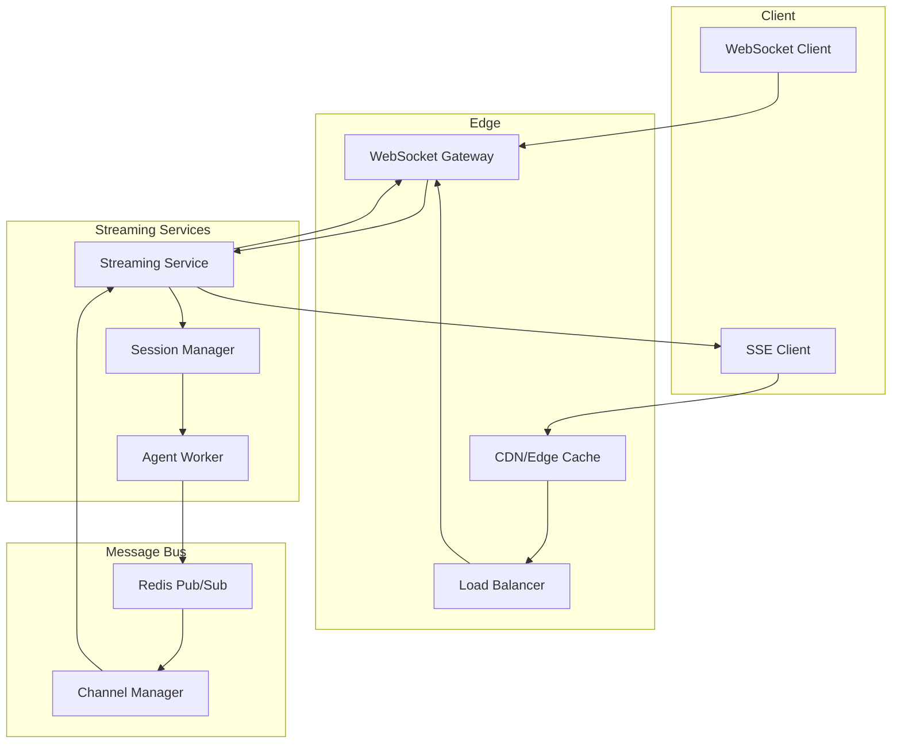
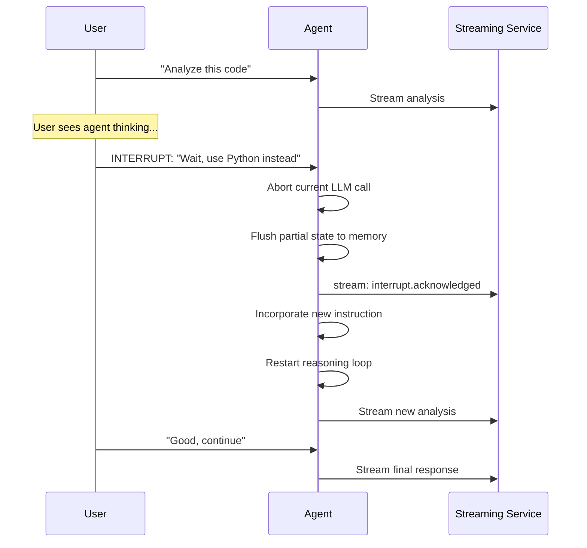

# Volume 13: Real-Time Agent Collaboration & Multiplayer

## Chapter 29: Real-Time Agent Architecture

### 29.1 Why Real-Time Matters for Agents

AgentOS real-time goes beyond traditional "chat" real-time (WebSocket messages). It includes:

- **Token streaming**: User sees agent response as it's generated
- **Live collaboration**: Multiple users watching/participating in same agent session
- **Agent-as-participant**: Agent appears as a live participant in team conversations
- **State synchronization**: All observers see same agent state
- **Human takeover**: User can interrupt agent mid-thought

---

### 29.2 Streaming Architecture



**Event types for agent streaming:**
```typescript
type AgentStreamEvent = 
    | { type: 'session.created', sessionId: string, config: SessionConfig }
    | { type: 'context.assembled', memories: number, knowledge: number, tokens: number }
    | { type: 'llm.calling', model: string, inputTokens: number }
    | { type: 'llm.token', token: string, index: number }
    | { type: 'llm.complete', outputTokens: number }
    | { type: 'tool.calling', tool: string, params: any }
    | { type: 'tool.result', tool: string, summary: string }
    | { type: 'response.token', token: string, index: number }
    | { type: 'response.start' }
    | { type: 'response.done', tokens: number, cost: number }
    | { type: 'error', code: string, message: string }
    | { type: 'user.interrupted', timestamp: number }
    | { type: 'agent.thinking', thoughts: string }  // optional, privacy-sensitive
```

**SSE implementation:**
```typescript
class AgentSSEService {
    async streamResponse(sessionId: string, message: string, res: Response) {
        res.setHeader('Content-Type', 'text/event-stream');
        res.setHeader('Cache-Control', 'no-cache');
        res.setHeader('Connection', 'keep-alive');
        
        const session = await this.getSession(sessionId);
        const events = this.agentExecutor.executeStream(session, message);
        
        for await (const event of events) {
            switch (event.type) {
                case 'llm.token':
                    res.write(`event: token\ndata: ${JSON.stringify({ token: event.token })}\n\n`);
                    break;
                case 'tool.calling':
                    res.write(`event: tool_call\ndata: ${JSON.stringify({ 
                        tool: event.tool, params: event.params 
                    })}\n\n`);
                    break;
                case 'response.done':
                    res.write(`event: done\ndata: ${JSON.stringify({ 
                        tokens: event.tokens, cost: event.cost 
                    })}\n\n`);
                    res.end();
                    break;
                case 'error':
                    res.write(`event: error\ndata: ${JSON.stringify({ 
                        code: event.code, message: event.message 
                    })}\n\n`);
                    res.end();
                    break;
            }
        }
    }
}
```

---

### 29.3 Human-in-the-Loop Interruption

**User interruption design:**



**Interruption implementation:**
```typescript
class InterruptibleAgentExecutor {
    private abortController: AbortController | null = null;
    private lastState: AgentState | null = null;
    
    async executeWithInterrupt(session: Session, message: string): Promise<AsyncGenerator<AgentEvent>> {
        return this.executeLoop(session, message, new AbortController());
    }
    
    async interrupt(reason: string): Promise<void> {
        if (this.abortController) {
            // 1. Abort current LLM call
            this.abortController.abort();
            
            // 2. Save partial state
            await this.saveCheckpoint(this.lastState);
            
            // 3. Emit interrupt event
            return { type: 'interrupted', reason };
        }
    }
    
    private async *executeLoop(session: Session, message: string, signal: AbortSignal) {
        while (!signal.aborted) {
            // Check for interruption at each loop iteration
            if (signal.aborted) {
                yield { type: 'interrupted', reason: 'User interrupted' };
                return;
            }
            
            const response = await this.callLLM(session, message, signal);
            this.lastState = { session, message, partialResponse: response };
            
            if (response.action === 'tool_call') {
                yield { type: 'tool.calling', tool: response.tool, params: response.params };
                const result = await this.executeTool(response.tool, response.params, signal);
                yield { type: 'tool.result', tool: response.tool, summary: result.summary };
                
                // Feed result back to LLM
                message = `Tool result: ${JSON.stringify(result)}`;
                continue;
            }
            
            yield { type: 'response.done', ... };
            return;
        }
    }
}
```

---

### 29.4 Multi-User Session Collaboration

**Use cases:**
```
1. Pair debugging: Two developers watching same agent session
2. Agent-assisted meeting: Agent participates in team chat
3. Training: New user watches experienced user interact with agent
4. Review: Manager reviews agent interactions with team member
5. Demo: Presenting agent capabilities to stakeholders
```

**Architecture for shared sessions:**
```typescript
class SharedSessionService {
    private sessions: Map<string, SharedSession> = new Map();
    
    async joinSession(sessionId: string, userId: string, role: 'owner' | 'spectator' | 'participant') {
        let session = this.sessions.get(sessionId);
        
        if (!session) {
            session = new SharedSession(sessionId);
            this.sessions.set(sessionId, session);
        }
        
        session.addMember({ userId, role, joinedAt: Date.now() });
        
        // Send current state to joining user
        await this.sendCurrentState(sessionId, userId);
        
        // Notify other members
        this.broadcast(sessionId, {
            type: 'member.joined',
            userId,
            role,
            memberCount: session.members.length,
        });
        
        return session.state;
    }
    
    async leaveSession(sessionId: string, userId: string) {
        const session = this.sessions.get(sessionId);
        if (!session) return;
        
        session.removeMember(userId);
        
        this.broadcast(sessionId, {
            type: 'member.left',
            userId,
            memberCount: session.members.length,
        });
        
        // Cleanup if empty
        if (session.members.length === 0) {
            this.sessions.delete(sessionId);
        }
    }
    
    async memberSendMessage(sessionId: string, userId: string, message: string) {
        const session = this.sessions.get(sessionId);
        if (!session) throw new Error('Session not found');
        
        const member = session.getMember(userId);
        if (member.role === 'spectator') throw new Error('Spectators cannot send messages');
        
        // Process through agent executor
        const events = this.agentExecutor.executeStream(session.agentSession, message);
        
        for await (const event of events) {
            this.broadcast(sessionId, {
                ...event,
                sender: userId,
                timestamp: Date.now(),
            });
        }
    }
}
```

---

### 29.5 Conflict Resolution for Shared State

**CRDT approach for agent session state:**
```
Problem: Two users modify agent instructions simultaneously
  User A: "Analyze in Python"
  User B: "Analyze in R"
  → Agent gets conflicting instructions

Solution: Operational Transform / CRDT

Last-Writer-Wins (LWW) Register:
  - Each instruction has a timestamp
  - Agent uses most recent instruction
  - Both users see both changes

Conflict types:
  1. Instruction conflict: Two contradictory instructions
     → LWW, but log the conflict
     → Agent can ask: "I see two approaches, which should I use?"
  
  2. State conflict: Two users modify same memory
     → Versioned memory with merge
     → Auto-merge if compatible, flag if contradictory
  
  3. Permission conflict: One user kicks another, then that user continues
     → Drop messages from removed users after disconnect delay
```

---

### 29.6 Real-Time Agent Presence

**Agent as live participant:**
```
Agent shows typing indicator when thinking
Agent shows "Using database..." when querying
Agent shows tool call indicators (spinning icons)
Agent can be @mentioned in team chat
Agent has online/offline/away status
```

**Presence protocol:**
```typescript
interface AgentPresence {
    agentId: string;
    status: 'online' | 'thinking' | 'executing_tool' | 'idle' | 'offline';
    currentActivity?: string;
    currentSession?: string;
    availableForTasks: boolean;
    lastActiveAt: number;
    capabilities: string[];
}

// Presence events
type PresenceEvent =
    | { type: 'presence.online', agentId: string, capabilities: string[] }
    | { type: 'presence.thinking', agentId: string, startedAt: number }
    | { type: 'presence.executing', agentId: string, tool: string }
    | { type: 'presence.idle', agentId: string, idleSince: number }
    | { type: 'presence.offline', agentId: string };
```

---

### 29.7 WebSocket Connection Management

```typescript
class WebSocketManager {
    private connections: Map<string, Set<WebSocket>> = new Map(); // sessionId → connections
    private heartbeatInterval: number = 30000; // 30s
    
    async handleConnection(ws: WebSocket, sessionId: string, userId: string) {
        // Add to session connections
        if (!this.connections.has(sessionId)) {
            this.connections.set(sessionId, new Set());
        }
        this.connections.get(sessionId)!.add(ws);
        
        // Set up heartbeat
        const heartbeat = setInterval(() => {
            if (ws.readyState === WebSocket.OPEN) {
                ws.ping();
            }
        }, this.heartbeatInterval);
        
        ws.on('pong', () => {
            // Connection alive
        });
        
        ws.on('close', () => {
            clearInterval(heartbeat);
            this.connections.get(sessionId)?.delete(ws);
            
            // Notify others
            this.broadcast(sessionId, {
                type: 'connection.closed',
                userId,
            });
        });
        
        ws.on('message', (data) => {
            this.handleMessage(ws, sessionId, userId, data);
        });
        
        // Send initial state
        ws.send(JSON.stringify({
            type: 'connection.established',
            sessionId,
            userId,
            timestamp: Date.now(),
        }));
    }
    
    private handleMessage(ws: WebSocket, sessionId: string, userId: string, data: Buffer) {
        const message = JSON.parse(data.toString());
        
        switch (message.type) {
            case 'client.message':
                // Forward to agent executor
                this.agentExecutor.handleMessage(sessionId, userId, message.content);
                break;
            case 'client.interrupt':
                // Interrupt current agent execution
                this.agentExecutor.interrupt(sessionId, userId, message.reason);
                break;
            case 'client.ping':
                ws.send(JSON.stringify({ type: 'pong' }));
                break;
        }
    }
    
    private broadcast(sessionId: string, event: object) {
        const connections = this.connections.get(sessionId);
        if (!connections) return;
        
        const data = JSON.stringify(event);
        for (const ws of connections) {
            if (ws.readyState === WebSocket.OPEN) {
                ws.send(data);
            }
        }
    }
}
```

---

### 29.8 Reconnection & State Recovery

```typescript
class ReconnectionManager {
    private messageBuffer: Map<string, AgentEvent[]> = new Map(); // sessionId → recent events
    
    async handleReconnection(ws: WebSocket, sessionId: string, userId: string, lastEventId: string) {
        // Get missed events since lastEventId
        const missedEvents = this.getMissedEvents(sessionId, lastEventId);
        
        // Send missed events
        for (const event of missedEvents) {
            ws.send(JSON.stringify({ type: 'replay', event }));
        }
        
        // Send current state (in case agent finished while disconnected)
        const currentState = await this.getCurrentState(sessionId);
        ws.send(JSON.stringify({ type: 'state.sync', state: currentState }));
        
        // Resume session
        ws.send(JSON.stringify({ type: 'reconnection.complete', sessionId }));
    }
    
    // Buffer events for reconnection (keep last 1000 per session)
    private bufferEvent(sessionId: string, event: AgentEvent) {
        if (!this.messageBuffer.has(sessionId)) {
            this.messageBuffer.set(sessionId, []);
        }
        
        const buffer = this.messageBuffer.get(sessionId)!;
        buffer.push(event);
        
        // Keep only last 1000 events
        if (buffer.length > 1000) {
            buffer.splice(0, buffer.length - 1000);
        }
    }
}
```

---

## Chapter 30: Voice & Multimodal Agents

### 30.1 Voice Integration Architecture

```
User speaks → Speech-to-Text (Whisper/Deepgram) → Text → Agent Processing
  → Text Response → Text-to-Speech (ElevenLabs/OpenAI TTS) → Audio to User

Latency budget for voice:
  STT:               300-500ms
  Agent processing:  1000-3000ms
  TTS generation:    200-500ms (first chunk)
  Total:             1500-4000ms (need < 2000ms for natural conversation)
```

**Optimization:**
```
1. Send audio chunks incrementally (don't wait for full utterance)
2. Use streaming STT (returns partial results as user speaks)
3. Agent starts processing on partial transcript
4. TTS streams chunks, not complete file
5. Predict end-of-utterance (silence detection) to start earlier
```

### 30.2 Voice Agent State Machine

```
IDLE → LISTENING (STT active) → PROCESSING (agent thinking) → SPEAKING (TTS active)
  → LISTENING (next turn) → IDLE (conversation ended)

Each transition must be < 500ms for natural feel.
```

---

### 30.3 Image/Vision Agents

**Agent vision capabilities:**

```
1. Image analysis: "What's in this image?"
2. Document scanning: "Extract text from this PDF screenshot"
3. UI analysis: "Describe this dashboard"
4. Code from screenshot: "Turn this design into HTML"
5. Object detection: "Find all charts in this report"
```

**Vision tool design:**
```typescript
const visionTool = {
    name: 'analyze_image',
    description: 'Analyze an image and answer questions about its content',
    parameters: {
        type: 'object',
        properties: {
            image_url: { type: 'string', description: 'URL or base64 data URL of image' },
            question: { type: 'string', description: 'What to analyze in the image' },
            detail: { 
                type: 'string', 
                enum: ['low', 'high', 'auto'], 
                default: 'auto',
                description: 'Detail level for analysis'
            }
        },
        required: ['image_url', 'question']
    },
    handler: async (params, auth) => {
        // Use GPT-4o or Gemini (both have vision capabilities)
        return await visionLLM.analyze(params.image_url, params.question, params.detail);
    }
};
```

**Multimodal routing:**
```
IF message contains image → route to vision-capable model (GPT-4o, Gemini Pro)
IF message contains audio → route to audio-capable model, or STT + text model
IF message contains video → extract frames, analyze key frames with vision model
```
