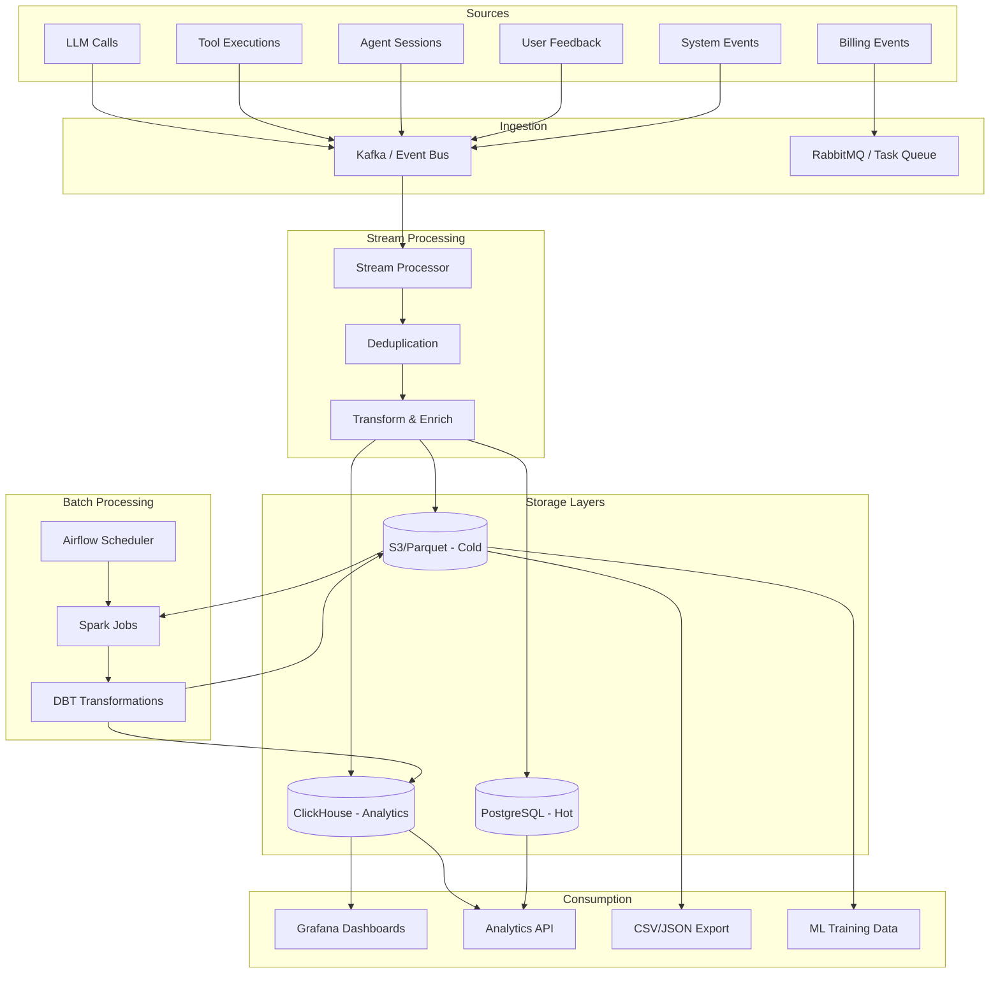

# Volume 16: Data Engineering & Analytics Pipeline

## Chapter 35: AgentOS Data Architecture

### 35.1 Data Classification

**Data types flowing through AgentOS:**

```
Critical Data (must never lose):
  - User accounts, org membership
  - Auth tokens, API keys
  - Billing records, invoices
  - Memory (user's long-term knowledge)
  - Knowledge documents (uploaded by users)

Operational Data (important, can regenerate):
  - LLM call logs (traced from business events)
  - Tool execution logs
  - Agent session history (older than 30 days)
  - Rate limit counters

Analytics Data (aggregated, can lose resolution):
  - User behavior events
  - Performance metrics
  - Cost breakdowns
  - Usage trends

Ephemeral Data (safe to lose):
  - Intermediate LLM responses (until next turn)
  - Temporary sandbox files
  - In-memory caches
```

---

### 35.2 Data Pipeline Architecture



---

### 35.3 Event Schema Design

**Canonical event format:**
```json
{
  "event": {
    "specversion": "1.0",
    "id": "event-2f4a1b7c-8d3e-4f6a-9b0c-1d2e3f4a5b6c",
    "source": "/agentos/orchestrator/v2",
    "type": "com.agentos.agent.session.completed",
    "datacontenttype": "application/json",
    "subject": "session-001",
    "time": "2026-07-13T10:00:00.123Z",
    "data": {
      "session_id": "sess_001",
      "org_id": "org_xyz",
      "user_id": "user_abc",
      "agent_type": "research_agent",
      "duration_ms": 45200,
      "loop_count": 12,
      "tools_used": ["database_query", "chart_generator"],
      "token_usage": {
        "input": 145000,
        "output": 3500,
        "cached": 42000,
        "total_cost": 0.067
      },
      "success": true,
      "feedback_score": null
    }
  }
}
```

---

### 35.4 ClickHouse Schema for Analytics

```sql
-- LLM call analytics
CREATE TABLE llm_calls (
    event_id UUID,
    timestamp DateTime,
    org_id UUID,
    user_id UUID,
    session_id UUID,
    model String,
    provider String,
    input_tokens UInt32,
    output_tokens UInt32,
    cached_tokens UInt32 DEFAULT 0,
    cost Float32,
    latency_ms UInt32,
    time_to_first_token_ms UInt32,
    success UInt8,
    error_type Nullable(String),
    agent_type String,
    context_size UInt32  -- total tokens in prompt
) ENGINE = MergeTree()
PARTITION BY toYYYYMM(timestamp)
ORDER BY (timestamp, org_id, model);

-- Tool call analytics
CREATE TABLE tool_calls (
    event_id UUID,
    timestamp DateTime,
    org_id UUID,
    user_id UUID,
    session_id UUID,
    tool_name String,
    tool_category String,
    latency_ms UInt32,
    success UInt8,
    error_type Nullable(String),
    input_size_bytes UInt32,
    output_size_bytes UInt32,
    plugin_id Nullable(String)
) ENGINE = MergeTree()
PARTITION BY toYYYYMM(timestamp)
ORDER BY (timestamp, org_id, tool_name);

-- Daily aggregated usage
CREATE TABLE daily_usage (
    date Date,
    org_id UUID,
    metric String,  -- 'tokens_input', 'tokens_output', 'calls', 'cost', 'sessions', 'active_users'
    value Float64
) ENGINE = SummingMergeTree()
PARTITION BY toYYYYMM(date)
ORDER BY (date, org_id, metric);

-- Materialized view for org-level rollups
CREATE MATERIALIZED VIEW daily_org_usage
ENGINE = SummingMergeTree()
PARTITION BY toYYYYMM(date)
ORDER BY (date, org_id)
AS SELECT
    toDate(timestamp) as date,
    org_id,
    count(*) as total_calls,
    sum(input_tokens) as total_input_tokens,
    sum(output_tokens) as total_output_tokens,
    sum(cost) as total_cost,
    count(DISTINCT user_id) as active_users
FROM llm_calls
GROUP BY date, org_id;
```

---

### 35.5 Data Retention & Lifecycle

```
PostgreSQL (hot):
  - Active sessions: 24 hours
  - User accounts: permanent
  - Memories: until user/org deletion
  - Current month billing: until invoiced
  - Total: 10-100 GB per 1000 users

ClickHouse (warm):
  - LLM calls raw: 90 days
  - Tool calls raw: 90 days
  - Daily aggregations: 2 years
  - Total: 100 GB - 2 TB depending on usage

S3/Parquet (cold):
  - All raw events: 7 years (compliance)
  - Compressed Parquet: 90% reduction vs JSON
  - Partition by: year/month/day
  - Total: 500 GB - 10 TB for enterprise
```

**Data lifecycle automation:**
```yaml
pipelines:
  hourly:
    - Stream ClickHouse aggregations
    - Update real-time dashboards
    - Check for billing threshold alerts

  daily:
    - DBT transformations (daily_org_usage)
    - Archive raw events to S3 (older than 90 days)
    - Rotate LLM call logs from ClickHouse to S3
    - Export billing reports for invoicing
    - Clean up expired sessions from PostgreSQL

  weekly:
    - Re-cluster ClickHouse tables (optimize merge)
    - Run data quality checks (null rates, outliers)
    - Generate business metrics report
    - Purge intermediate sandbox files

  monthly:
    - Archive to Glacier (events older than 1 year)
    - Data retention audit (GDPR compliance check)
    - Performance review of analytics queries
    - Capacity planning for storage growth
```

---

### 35.6 Real-Time Analytics Queries

**Useful aggregations for live monitoring:**

```sql
-- Current active users (last 5 minutes)
SELECT COUNT(DISTINCT user_id) 
FROM llm_calls 
WHERE timestamp > NOW() - INTERVAL 5 MINUTE;

-- Cost this hour vs same hour yesterday
SELECT 
    toStartOfHour(timestamp) as hour,
    sum(cost) as current_cost
FROM llm_calls
WHERE timestamp > NOW() - INTERVAL 1 HOUR
UNION ALL
SELECT 
    toStartOfHour(timestamp + INTERVAL 1 DAY) as hour,
    sum(cost) as yesterday_cost
FROM llm_calls
WHERE timestamp > NOW() - INTERVAL 25 HOUR 
  AND timestamp < NOW() - INTERVAL 24 HOUR;

-- Top 5 most expensive users today
SELECT 
    user_id,
    sum(cost) as total_cost,
    count() as call_count,
    avg(latency_ms) as avg_latency
FROM llm_calls
WHERE toDate(timestamp) = today()
GROUP BY user_id
ORDER BY total_cost DESC
LIMIT 5;

-- Model usage distribution (last hour)
SELECT 
    model,
    count() as calls,
    sum(input_tokens) as input_tokens,
    sum(output_tokens) as output_tokens,
    sum(cost) as cost
FROM llm_calls
WHERE timestamp > NOW() - INTERVAL 1 HOUR
GROUP BY model
ORDER BY cost DESC;

-- Error rate trend (last 24 hours, 5-minute buckets)
SELECT 
    toStartOfFiveMinutes(timestamp) as bucket,
    countIf(success = 0) as errors,
    count() as total,
    countIf(success = 0) / count() as error_rate
FROM llm_calls
WHERE timestamp > NOW() - INTERVAL 24 HOUR
GROUP BY bucket
ORDER BY bucket;
```

---

### 35.7 Feedback & Quality Data

**Schema for user feedback analytics:**
```sql
CREATE TABLE user_feedback (
    event_id UUID,
    timestamp DateTime,
    org_id UUID,
    user_id UUID,
    session_id UUID,
    message_id UUID,
    feedback_type Enum('thumb', 'rating', 'correction', 'report'),
    score Nullable(Float32),  -- 0-1 for thumbs, 1-5 for rating
    category Nullable(String),
    comment Nullable(String),
    corrected_response Nullable(String),
    agent_type String,
    model String,
    tokens_used UInt32,
    cost Float32,
    latency_ms UInt32
) ENGINE = MergeTree()
PARTITION BY toYYYYMM(timestamp)
ORDER BY (timestamp, org_id, feedback_type);

-- Quality score by agent type (7-day rolling)
SELECT 
    agent_type,
    countIf(score >= 0.8) as positive,
    count() as total,
    countIf(score >= 0.8) / count() as satisfaction_rate
FROM user_feedback
WHERE feedback_type = 'thumb'
  AND timestamp > NOW() - INTERVAL 7 DAY
GROUP BY agent_type
ORDER BY satisfaction_rate DESC;
```

---

### 35.8 Cost Attribution Model

**Tracking cost down to the individual user:**
```sql
-- Cost breakdown by org, by day
SELECT 
    toDate(timestamp) as day,
    org_id,
    sum(cost) as total_cost,
    sum(cost) FILTER (WHERE model LIKE 'claude%') as anthropic_cost,
    sum(cost) FILTER (WHERE model LIKE 'gpt%') as openai_cost,
    sum(cost) FILTER (WHERE model LIKE 'gemini%') as google_cost,
    avg(cost) as avg_cost_per_call,
    count(DISTINCT user_id) as active_users
FROM llm_calls
WHERE toDate(timestamp) BETWEEN '2026-07-01' AND '2026-07-13'
GROUP BY day, org_id
ORDER BY day, total_cost DESC;
```

**Cost attribution to specific features:**
```json
{
  "cost_attribution": {
    "total_monthly": 4523.45,
    "by_feature": {
      "knowledge_search": {
        "embedding_calls": 0.45,
        "llm_rerank_calls": 23.50,
        "total": 23.95,
        "pct": 0.5
      },
      "agent_conversation": {
        "llm_calls": 3850.00,
        "tool_calls": 0.00,
        "total": 3850.00,
        "pct": 85.1
      },
      "memory_operations": {
        "embedding_calls": 12.50,
        "consolidation_calls": 89.00,
        "total": 101.50,
        "pct": 2.2
      },
      "code_execution": {
        "compute_time": 450.00,
        "llm_calls": 98.00,
        "total": 548.00,
        "pct": 12.1
      }
    },
    "by_model": {
      "claude-sonnet-4": { "cost": 2345.00, "pct": 51.8 },
      "gpt-4o-mini": { "cost": 678.00, "pct": 15.0 },
      "gpt-4o": { "cost": 810.45, "pct": 17.9 },
      "claude-haiku-4": { "cost": 456.00, "pct": 10.1 },
      "gemini-2.5-flash": { "cost": 234.00, "pct": 5.2 }
    }
  }
}
```

---

### 35.9 Anomaly Detection Pipeline

```sql
-- Detect unusual cost spikes (hourly, 3x normal)
CREATE MATERIALIZED VIEW cost_anomaly_detection
ENGINE = MergeTree()
ORDER BY (hour, org_id)
AS SELECT
    toStartOfHour(timestamp) as hour,
    org_id,
    sum(cost) as hourly_cost
FROM llm_calls
GROUP BY hour, org_id;

-- Query: alert if current hour > 3x average of last 7 days same hour
SELECT 
    current.hour,
    current.org_id,
    current.hourly_cost as current_cost,
    historical.avg_cost as historical_avg,
    current.hourly_cost / historical.avg_cost as anomaly_ratio
FROM cost_anomaly_detection current
JOIN (
    SELECT 
        toHour(timestamp) as hour_of_day,
        org_id,
        avg(cost) as avg_cost
    FROM llm_calls
    WHERE timestamp > NOW() - INTERVAL 7 DAY
    GROUP BY hour_of_day, org_id
) historical 
    ON toHour(current.hour) = historical.hour_of_day 
    AND current.org_id = historical.org_id
WHERE current.hour = toStartOfHour(NOW())
  AND current.hourly_cost > historical.avg_cost * 3;
```

---

### 35.10 Data Quality Monitoring

```sql
-- Quality checks that run daily
CREATE TABLE data_quality_checks (
    check_date Date,
    check_name String,
    status Enum('pass', 'fail', 'warning'),
    value Float64,
    threshold Float64,
    record_count UInt64,
    details String
) ENGINE = MergeTree()
ORDER BY (check_date, check_name);

-- Sample checks
INSERT INTO data_quality_checks VALUES
    ('2026-07-13', 'llm_calls_completeness', 'pass', 0.998, 0.99, 150000, '99.8% of sessions have LLM call records'),
    ('2026-07-13', 'negative_cost_check', 'fail', 5, 0, 150000, '5 records with negative cost values'),
    ('2026-07-13', 'missing_org_id', 'warning', 0.001, 0.001, 150000, '0.1% of records missing org_id');
```

**Regular quality checks:**
```
Completeness: 
  - Every session.created event has matching session.completed
  - Every tool.call has matching tool.result
  - No orphan events (events referencing deleted entities)

Consistency:
  - org_id in event matches org_id in session context
  - user_id exists in users table
  - Cost values are non-negative

Timeliness:
  - Event timestamp within 5 seconds of ingestion time
  - Session events within reasonable duration (< 1 hour)

Accuracy:
  - Token counts match provider billing (sampled check)
  - Cost calculations verified against provider receipts
```
