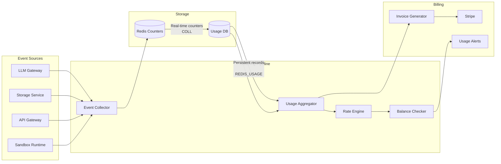

# Volume 17: Billing, Metering & Usage Infrastructure

## Chapter 36: Metering Architecture

### 36.1 What to Meter

**Every billable entity in AgentOS:**

```
Usage-based:
  - LLM tokens consumed (input + output, per model tier)
  - Knowledge storage (per GB per day)
  - Memory storage (per MB per day)
  - API calls (per endpoint)
  - Tool executions (per tool category)
  - Sandbox compute time (per CPU-second)
  - File storage (per GB per day)

Seat-based:
  - Active users (per month)
  - Concurrent sessions (peak)

Tier-based:
  - Feature access (RAG, custom agents, SSO)
  - Support level (community, email, priority, dedicated)
  - SLA level (uptime guarantee, response time)
```

---

### 36.2 Metering Pipeline



**Metering event schema:**
```json
{
  "meter_event": {
    "id": "meter_001",
    "timestamp": "2026-07-13T10:00:00.123Z",
    "org_id": "org_xyz",
    "user_id": "user_abc",
    "meter_type": "llm_tokens",
    
    // Dimensions for rate calculation
    "dimensions": {
      "model": "claude-sonnet-4",
      "tier": "input",
      "cached": false
    },
    
    // Quantity
    "quantity": 45000,
    "unit": "tokens",
    
    // Cost calculation
    "rate_per_unit": 0.000003,  // $3 per 1M tokens
    "cost": 0.135,
    
    // Context
    "session_id": "sess_001",
    "agent_type": "research_agent",
    "source": "agent_orchestrator_v2"
  }
}
```

---

### 36.3 Real-Time Usage Counters

```typescript
class UsageCounter {
    private redis: Redis;
    private readonly WINDOW_SECONDS = 3600; // 1 hour windows
    
    async increment(orgId: string, meterType: string, quantity: number): Promise<void> {
        const pipeline = this.redis.pipeline();
        const now = Date.now();
        const hourBucket = Math.floor(now / (this.WINDOW_SECONDS * 1000));
        
        // Real-time counter (current hour, for instant display)
        const realtimeKey = `usage:${orgId}:${meterType}:${hourBucket}`;
        pipeline.incrByFloat(realtimeKey, quantity);
        pipeline.expire(realtimeKey, 7200); // 2 hour TTL
        
        // Daily counter (for billing)
        const dailyKey = `usage:daily:${orgId}:${meterType}:${formatDate(now)}`;
        pipeline.incrByFloat(dailyKey, quantity);
        pipeline.expire(dailyKey, 86400 * 35); // 35 day TTL
        
        // Monthly counter (for plan limits)
        const monthlyKey = `usage:monthly:${orgId}:${meterType}:${formatMonth(now)}`;
        pipeline.incrByFloat(monthlyKey, quantity);
        pipeline.expire(monthlyKey, 86400 * 365); // 1 year TTL
        
        await pipeline.exec();
    }
    
    async getCurrentUsage(orgId: string): Promise<UsageSummary> {
        const now = Date.now();
        const hourBucket = Math.floor(now / (this.WINDOW_SECONDS * 1000));
        
        const [hourly, daily, monthly] = await Promise.all([
            this.redis.get(`usage:${orgId}:llm_tokens:${hourBucket}`),
            this.redis.get(`usage:daily:${orgId}:llm_tokens:${formatDate(now)}`),
            this.redis.get(`usage:monthly:${orgId}:llm_tokens:${formatMonth(now)}`),
        ]);
        
        return {
            hourly: parseFloat(hourly || '0'),
            daily: parseFloat(daily || '0'),
            monthly: parseFloat(monthly || '0'),
        };
    }
    
    async checkQuota(orgId: string, plan: Plan): Promise<QuotaResult> {
        const usage = await this.getCurrentUsage(orgId);
        const quota = plan.limits;
        
        const results = [];
        
        if (usage.monthly > quota.tokens_monthly) {
            results.push({
                exceeded: true,
                meter: 'llm_tokens',
                usage: usage.monthly,
                limit: quota.tokens_monthly,
                action: 'block',  // Can't make more calls
            });
        }
        
        if (usage.monthly > quota.tokens_monthly * 0.8) {
            results.push({
                exceeded: false,
                meter: 'llm_tokens',
                usage: usage.monthly,
                limit: quota.tokens_monthly,
                action: 'warn',  // Alert user
            });
        }
        
        return { withinQuota: results.every(r => r.action !== 'block'), alerts: results };
    }
}
```

---

### 36.4 Rate Table & Pricing Engine

```typescript
class PricingEngine {
    private rates: Map<string, RateTable> = new Map();
    
    constructor() {
        // LLM rates (per 1M tokens)
        this.rates.set('llm_tokens', {
            base_unit: 'tokens',
            tiers: [
                {
                    model_group: 'premium',
                    input_rate: 15.00,    // $15 per 1M input tokens
                    output_rate: 75.00,   // $75 per 1M output tokens
                    cached_rate: 1.50,    // $1.50 per 1M cached tokens
                    models: ['claude-opus-4', 'gpt-4.5', 'claude-sonnet-4-32k'],
                },
                {
                    model_group: 'standard',
                    input_rate: 3.00,
                    output_rate: 15.00,
                    cached_rate: 0.30,
                    models: ['claude-sonnet-4', 'gpt-4o', 'gemini-2.5-pro'],
                },
                {
                    model_group: 'economy',
                    input_rate: 0.25,
                    output_rate: 1.25,
                    cached_rate: 0.025,
                    models: ['claude-haiku-4', 'gpt-4o-mini', 'gemini-2.5-flash'],
                },
            ],
        });
        
        // Storage rates
        this.rates.set('knowledge_storage', {
            base_unit: 'gb_month',
            tiers: [
                { tier: 'free', rate: 0, limit_gb: 0.01 },
                { tier: 'pro', rate: 0.10, limit_gb: 1 },
                { tier: 'team', rate: 0.08, limit_gb: 10 },
                { tier: 'enterprise', rate: 0.05, limit_gb: 1000 },
            ],
        });
    }
    
    calculateCost(meterType: string, dimensions: any, quantity: number): number {
        const rateTable = this.rates.get(meterType);
        if (!rateTable) return 0;
        
        if (meterType === 'llm_tokens') {
            const tier = rateTable.tiers.find(t => 
                t.models.includes(dimensions.model)
            );
            if (!tier) return 0;
            
            if (dimensions.cached) {
                return (quantity / 1000000) * tier.cached_rate;
            }
            if (dimensions.token_type === 'input') {
                return (quantity / 1000000) * tier.input_rate;
            }
            return (quantity / 1000000) * tier.output_rate;
        }
        
        if (meterType === 'knowledge_storage') {
            const tier = rateTable.tiers.find(t => t.tier === dimensions.plan);
            const billableGb = Math.max(0, quantity - tier.limit_gb);
            return billableGb * tier.rate;
        }
        
        return 0;
    }
}
```

---

### 36.5 Plan & Quota Enforcement

```typescript
interface Plan {
    id: string;
    name: string;
    monthly_base_price: number;
    limits: {
        tokens_monthly: number;  // 1M, 5M, 25M, unlimited
        sessions_concurrent: number;
        knowledge_gb: number;
        users_included: number;
        api_rate_limit: number;  // requests per minute
    };
    features: {
        custom_agents: boolean;
        sso: boolean;
        audit_logs: boolean;
        priority_support: boolean;
        sla_hours: number;  // 0 = none, 8, 24
    };
    overage: {
        tokens_per_1m: number;  // $2 per 1M overage tokens
        storage_per_gb: number;
        user_per_seat: number;
    };
}

const PLANS: Record<string, Plan> = {
    free: {
        id: 'free',
        name: 'Free',
        monthly_base_price: 0,
        limits: {
            tokens_monthly: 100_000,
            sessions_concurrent: 1,
            knowledge_gb: 0.01,
            users_included: 1,
            api_rate_limit: 10,
        },
        features: { custom_agents: false, sso: false, audit_logs: false, priority_support: false, sla_hours: 0 },
        overage: { tokens_per_1m: 0, storage_per_gb: 0, user_per_seat: 0 },  // No overage, hard block
    },
    pro: {
        id: 'pro',
        name: 'Pro',
        monthly_base_price: 29,
        limits: {
            tokens_monthly: 5_000_000,
            sessions_concurrent: 5,
            knowledge_gb: 1,
            users_included: 1,
            api_rate_limit: 100,
        },
        features: { custom_agents: true, sso: false, audit_logs: false, priority_support: false, sla_hours: 0 },
        overage: { tokens_per_1m: 2, storage_per_gb: 0.10, user_per_seat: 0 },
    },
    team: {
        id: 'team',
        name: 'Team',
        monthly_base_price: 99,
        limits: {
            tokens_monthly: 25_000_000,
            sessions_concurrent: 20,
            knowledge_gb: 10,
            users_included: 5,
            api_rate_limit: 500,
        },
        features: { custom_agents: true, sso: false, audit_logs: true, priority_support: true, sla_hours: 8 },
        overage: { tokens_per_1m: 1.50, storage_per_gb: 0.08, user_per_seat: 20 },
    },
    enterprise: {
        id: 'enterprise',
        name: 'Enterprise',
        monthly_base_price: 0,  // Custom pricing
        limits: {
            tokens_monthly: 1_000_000_000,
            sessions_concurrent: 200,
            knowledge_gb: 1000,
            users_included: -1,  // Unlimited
            api_rate_limit: 5000,
        },
        features: { custom_agents: true, sso: true, audit_logs: true, priority_support: true, sla_hours: 24 },
        overage: { tokens_per_1m: 1, storage_per_gb: 0.05, user_per_seat: 15 },
    },
};
```

**Quota enforcement middleware:**
```typescript
async function enforceQuota(req: Request, res: Response, next: NextFunction) {
    const orgId = req.auth.orgId;
    const plan = await getOrgPlan(orgId);
    const usage = await usageCounter.getCurrentUsage(orgId);
    
    // Check if limit exceeded
    if (usage.monthly >= plan.limits.tokens_monthly) {
        if (plan.id === 'free') {
            // Hard block for free tier
            return res.status(429).json({
                error: 'monthly_limit_exceeded',
                message: 'Monthly token limit reached. Upgrade to Pro for unlimited usage.',
                upgrade_url: '/settings/billing',
            });
        }
        
        // Paid tiers: allow overage
        res.setHeader('X-Overage', 'true');
        res.setHeader('X-Overage-Rate', `${plan.overage.tokens_per_1m}/1M tokens`);
    }
    
    // Soft warning at 80%
    if (usage.monthly >= plan.limits.tokens_monthly * 0.8) {
        res.setHeader('X-Usage-Warning', '80%');
        res.setHeader('X-Usage-Limit', String(plan.limits.tokens_monthly));
    }
    
    next();
}
```

---

### 36.6 Invoice Generation

```typescript
class InvoiceGenerator {
    async generateMonthlyInvoice(orgId: string, billingPeriod: DateRange): Promise<Invoice> {
        // 1. Calculate base subscription charges
        const plan = await getOrgPlan(orgId);
        const baseCharge = plan.monthly_base_price;
        
        // 2. Calculate usage-based charges
        const usage = await this.getUsageForPeriod(orgId, billingPeriod);
        
        const lineItems: LineItem[] = [];
        
        // LLM tokens overage
        const tokenUsage = usage.llm_tokens;
        const tokenOverage = Math.max(0, tokenUsage - plan.limits.tokens_monthly);
        if (tokenOverage > 0) {
            const overageCost = (tokenOverage / 1_000_000) * plan.overage.tokens_per_1m;
            lineItems.push({
                description: `LLM tokens overage (${(tokenOverage / 1_000_000).toFixed(2)}M tokens)`,
                quantity: tokenOverage,
                unit: 'tokens',
                rate: plan.overage.tokens_per_1m / 1_000_000,
                amount: overageCost,
            });
        }
        
        // Storage overage
        const storageOverage = Math.max(0, usage.storage_gb - plan.limits.knowledge_gb);
        if (storageOverage > 0) {
            lineItems.push({
                description: `Knowledge storage overage (${storageOverage.toFixed(1)} GB)`,
                quantity: storageOverage,
                unit: 'gb_month',
                rate: plan.overage.storage_per_gb,
                amount: storageOverage * plan.overage.storage_per_gb,
            });
        }
        
        // Additional seats
        const seatOverage = Math.max(0, usage.active_users - plan.limits.users_included);
        if (seatOverage > 0 && plan.limits.users_included > 0) {
            lineItems.push({
                description: `Additional users (${seatOverage} seats)`,
                quantity: seatOverage,
                unit: 'user',
                rate: plan.overage.user_per_seat,
                amount: seatOverage * plan.overage.user_per_seat,
            });
        }
        
        const subtotal = lineItems.reduce((sum, item) => sum + item.amount, 0);
        const total = baseCharge + subtotal;
        
        return {
            invoice_number: `INV-${billingPeriod.year}-${billingPeriod.month}-${orgId.slice(0, 8)}`,
            org_id: orgId,
            billing_period: billingPeriod,
            plan: plan.name,
            base_charge: baseCharge,
            line_items: lineItems,
            subtotal,
            tax: 0,  // Calculate based on org's tax info
            total,
            status: 'pending',
            due_date: addDays(billingPeriod.end, 30),
            created_at: new Date().toISOString(),
        };
    }
}
```

---

### 36.7 Usage Alerts & Notifications

**Alert thresholds:**
```
Plan limit thresholds:
  - 50%: "You've used 50% of your monthly token budget"
  - 80%: "You've used 80% of your monthly token budget. Consider upgrading."  
  - 95%: "You've used 95%. Overage charges will apply."
  - 100%: "Monthly limit reached. Overage charges in effect."

Cost spikes:
  - 2x daily average: "Unusual usage spike detected"
  - 5x daily average: "Significant cost spike — check for runaway agents"

Storage limits:
  - 80%: "Knowledge storage at 80% capacity"
  - 100%: "Knowledge storage full. Uploads blocked until space freed."
```

**Alert delivery:**
```
In-app notification (always)
Email notification (if enabled)
Webhook (if configured, for enterprise)
Slack (if integrated)
```

---

### 36.8 Stripe Integration

```typescript
class StripeBillingService {
    private stripe: Stripe;
    
    async createSubscription(orgId: string, planId: string, paymentMethodId: string) {
        // Create or retrieve Stripe customer
        let customer = await this.getStripeCustomer(orgId);
        if (!customer) {
            customer = await this.stripe.customers.create({
                metadata: { org_id: orgId },
            });
            await this.saveStripeCustomerId(orgId, customer.id);
        }
        
        // Attach payment method
        await this.stripe.paymentMethods.attach(paymentMethodId, {
            customer: customer.id,
        });
        
        // Set as default payment method
        await this.stripe.customers.update(customer.id, {
            invoice_settings: {
                default_payment_method: paymentMethodId,
            },
        });
        
        // Create subscription
        const subscription = await this.stripe.subscriptions.create({
            customer: customer.id,
            items: [
                { price: this.getPriceId(planId), quantity: 1 },
            ],
            metadata: { org_id: orgId },
            trial_period_days: 14,
        });
        
        return subscription.id;
    }
    
    async handleUsageBasedInvoice(orgId: string, lineItems: InvoiceLineItem[]) {
        // Create an invoice with usage line items
        const customerId = await this.getStripeCustomerId(orgId);
        
        // Create invoice items
        for (const item of lineItems) {
            await this.stripe.invoiceItems.create({
                customer: customerId,
                amount: Math.round(item.amount * 100),  // cents
                currency: 'usd',
                description: item.description,
                metadata: { org_id: orgId },
            });
        }
        
        // Finalize and pay
        const invoice = await this.stripe.invoices.create({
            customer: customerId,
            auto_advance: true,  // Auto-finalize
            collection_method: 'charge_automatically',
        });
        
        return invoice.id;
    }
}
```

---

### 36.9 Enterprise Contract Management

```typescript
interface EnterpriseContract {
    orgId: string;
    contractStart: Date;
    contractEnd: Date;
    billingModel: 'monthly_commit' | 'annual_commit' | 'prepaid' | 'usage_only';
    committedAmount: number;  // Monthly or annual committed spend
    committedTokens: number;  // Or committed token volume
    overageRate: number;      // Discounted overage rate
    prepaidBalance: number;   // For prepaid contracts
    autoRenew: boolean;
    renewalTerms: string;
    customPricing: PricingOverride[];
    discount: number;  // Percentage discount off standard pricing
}
```

**Enterprise billing flow:**
```
1. Contract signed → create EnterpriseContract record
2. Monthly/annually: generate invoice based on contract terms
3. Track usage against committed amount
4. If usage exceeds committed: apply overage rate
5. If prepaid: deduct from balance, alert when < 20% remaining
6. Monthly report: usage vs commitment, burn rate, projected annual spend
```

---

### 36.10 Billing Database Schema

```sql
-- Plans
CREATE TABLE billing_plans (
    id TEXT PRIMARY KEY,
    name TEXT NOT NULL,
    description TEXT,
    monthly_price_cents INTEGER NOT NULL DEFAULT 0,
    features JSONB,
    limits JSONB,
    overage JSONB,
    active BOOLEAN DEFAULT true,
    created_at TIMESTAMP DEFAULT NOW()
);

-- Org subscriptions
CREATE TABLE org_subscriptions (
    id UUID PRIMARY KEY,
    org_id UUID NOT NULL REFERENCES orgs(id),
    plan_id TEXT NOT NULL REFERENCES billing_plans(id),
    stripe_subscription_id TEXT,
    stripe_customer_id TEXT,
    status TEXT DEFAULT 'active',  -- active, past_due, canceled, trialing
    current_period_start TIMESTAMP,
    current_period_end TIMESTAMP,
    trial_end TIMESTAMP,
    canceled_at TIMESTAMP,
    created_at TIMESTAMP DEFAULT NOW()
);

-- Usage records
CREATE TABLE usage_records (
    id UUID PRIMARY KEY,
    org_id UUID NOT NULL,
    meter_type TEXT NOT NULL,
    quantity DECIMAL NOT NULL,
    dimensions JSONB,
    cost DECIMAL,
    recorded_at TIMESTAMP DEFAULT NOW(),
    invoice_id UUID  -- Null until invoiced
);

CREATE INDEX idx_usage_org_meter ON usage_records(org_id, meter_type, recorded_at);

-- Invoices
CREATE TABLE invoices (
    id UUID PRIMARY KEY,
    org_id UUID NOT NULL REFERENCES orgs(id),
    invoice_number TEXT UNIQUE,
    stripe_invoice_id TEXT,
    period_start TIMESTAMP,
    period_end TIMESTAMP,
    subtotal_cents INTEGER,
    total_cents INTEGER,
    status TEXT DEFAULT 'pending',  -- pending, paid, overdue, canceled
    paid_at TIMESTAMP,
    due_date TIMESTAMP,
    pdf_url TEXT,
    created_at TIMESTAMP DEFAULT NOW()
);

-- Invoice line items
CREATE TABLE invoice_line_items (
    id UUID PRIMARY KEY,
    invoice_id UUID NOT NULL REFERENCES invoices(id) ON DELETE CASCADE,
    description TEXT NOT NULL,
    quantity DECIMAL,
    unit TEXT,
    unit_price_cents INTEGER,
    amount_cents INTEGER NOT NULL,
    type TEXT  -- base_subscription, overage, seat, storage, credit
);

-- Enterprise contracts
CREATE TABLE enterprise_contracts (
    id UUID PRIMARY KEY,
    org_id UUID NOT NULL REFERENCES orgs(id),
    contract_start DATE NOT NULL,
    contract_end DATE NOT NULL,
    billing_model TEXT NOT NULL,
    committed_amount_cents INTEGER,
    committed_tokens BIGINT,
    overage_rate_multiplier DECIMAL DEFAULT 1.0,
    prepaid_balance_cents INTEGER DEFAULT 0,
    discount_pct DECIMAL DEFAULT 0,
    custom_pricing JSONB,
    auto_renew BOOLEAN DEFAULT true,
    signed_at TIMESTAMP,
    created_at TIMESTAMP DEFAULT NOW()
);
```

---

### 36.11 Common Billing Flows

**Flow 1: Free → Pro upgrade:**
```
1. User clicks "Upgrade" in dashboard
2. Stripe Checkout session created
3. User enters payment details
4. Stripe webhook: checkout.session.completed
5. Update org_subscriptions: free → pro
6. Update plan limits (token budget, concurrent sessions)
7. Send confirmation email
```

**Flow 2: Monthly invoice generation:**
```
1. Daily cron checks: is today end of billing period for any org?
2. For each org ending billing period:
   a. Aggregate usage records for the period
   b. Calculate base charge + overages
   c. Create invoice in database
   d. Create invoice in Stripe
   e. Mark usage records as invoiced
   f. Send invoice notification email
3. Stripe charges payment method
```

**Flow 3: Plan limit reached during session:**
```
1. Agent session active
2. Usage counter hits 95% of monthly limit
3. Agent context receives: "Warning: approaching limit"
4. Agent adapts behavior (shorter responses, cheaper model)
5. Usage hits 100% → switching to overage model (if paid)
6. If free tier: session terminated with upgrade prompt
```
