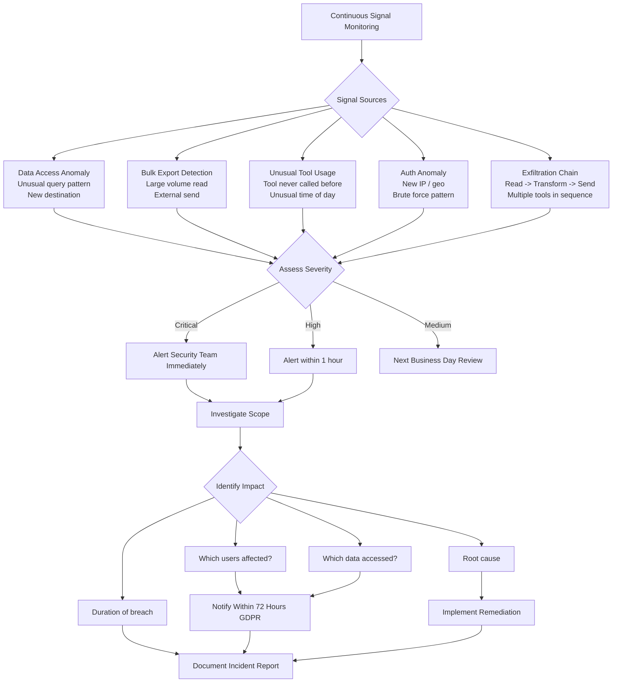

# Volume 18: Compliance Automation (SOC2/GDPR/HIPAA)

## Chapter 37: Compliance Architecture

### 37.1 Compliance Requirements Matrix

| Requirement | SOC 2 | GDPR | HIPAA | Implementation |
|-------------|-------|------|-------|----------------|
| Access control | ✓ | ✓ | ✓ | RBAC + ABAC, MFA |
| Encryption at rest | ✓ | ✓ | ✓ | AES-256, KMS |
| Encryption in transit | ✓ | ✓ | ✓ | TLS 1.3, mTLS |
| Audit logging | ✓ | ✓ | ✓ | Event sourcing + immutable log |
| Data isolation | ✓ | ✓ | ✓ | RLS, tenant separation |
| Breach notification | ✓ | ✓ | ✓ | Automated detection + notification |
| Data retention | | ✓ | ✓ | Policy-based lifecycle |
| Right to delete | | ✓ | ✓ | Cascade delete with verification |
| Data portability | | ✓ | | Export API |
| Consent management | | ✓ | | Preference center |
| DPA (Data Processing Agreement) | ✓ | ✓ | ✓ | Legal document management |
| BAA (Business Associate Agreement) | | | ✓ | Legal document management |
| Vulnerability scanning | ✓ | | ✓ | Automated scanning |
| Penetration testing | ✓ | | ✓ | Annual third-party |
| Employee training | ✓ | ✓ | ✓ | LMS integration |
| Vendor assessment | ✓ | ✓ | ✓ | Automated vendor review |

```mermaid
graph TB
    subgraph "Common Controls - All Frameworks"
        C1[Access Control & Auth]
        C2[Encryption at Rest & Transit]
        C3[Audit Logging]
        C4[Data Isolation / Tenant Separation]
    end

    subgraph "SOC 2 - Security & Availability"
        S1[CC6.1: Logical & Physical Access]
        S2[CC6.7: Data Disposal]
        S3[CC7.2: Anomaly Detection]
        S4[CC7.3: Incident Response]
    end

    subgraph "GDPR - Data Privacy"
        G1[Right to Erasure / Deletion]
        G2[Data Portability]
        G3[Consent Management]
        G4[Breach Notification 72hr]
    end

    subgraph "HIPAA - Healthcare"
        H1[BAA with Vendors]
        H2[PHI Detection & Isolation]
        H3[Minimum Necessary Rule]
        H4[Access Logs for PHI]
    end

    C1 & C2 & C3 & C4 --> ALL[Apply to All]
    S1 & S2 & S3 & S4 --> SOC2[SOC 2 Evidence]
    G1 & G2 & G3 & G4 --> GDPR[GDPR Compliance]
    H1 & H2 & H3 & H4 --> HIPAA[HIPAA Compliance]
```



### 37.2 Automated Compliance Controls

#### 37.2.1 Access Review Automation

```typescript
class AccessReviewAutomation {
    async runQuarterlyReview(): Promise<ReviewReport> {
        // 1. List all users with access
        const allUsers = await this.listAllUsers();
        
        // 2. Check each user's access justification
        const findings = [];
        for (const user of allUsers) {
            const justification = await this.getAccessJustification(user.id);
            
            // Flag if:
            // - No access review in 90 days
            // - Inactive for 30+ days but still active
            // - Has admin role but doesn't need it
            // - Hasn't logged in for 60+ days
            
            if (justification.lastReviewDate < Date.now() - 90 * 86400000) {
                findings.push({
                    type: 'review_overdue',
                    userId: user.id,
                    daysOverdue: Math.floor((Date.now() - justification.lastReviewDate) / 86400000),
                });
            }
            
            if (justification.lastLoginDate < Date.now() - 60 * 86400000) {
                findings.push({
                    type: 'inactive_user',
                    userId: user.id,
                    daysInactive: Math.floor((Date.now() - justification.lastLoginDate) / 86400000),
                    action: 'deactivate',
                });
            }
        }
        
        // 3. Generate review report
        const report: ReviewReport = {
            reviewDate: new Date(),
            totalUsers: allUsers.length,
            findings,
            autoActions: findings
                .filter(f => f.type === 'inactive_user' && f.daysInactive > 90)
                .map(f => ({
                    userId: f.userId,
                    action: 'deactivated_automatically',
                })),
        };
        
        // Auto-deactivate users inactive > 90 days
        for (const action of report.autoActions) {
            await this.deactivateUser(action.userId);
            await this.auditLog.log({
                event: 'compliance.auto_deactivate',
                userId: action.userId,
                reason: `Inactive for 90+ days (auto access review)`,
            });
        }
        
        return report;
    }
}
```

#### 37.2.2 Data Classification Automation

```typescript
class DataClassifier {
    private piiPatterns: RegExp[];
    private phiPatterns: RegExp[];  // HIPAA protected health info
    
    async classifyDocument(document: Document): Promise<DataClassification> {
        const content = document.content;
        const classifications: ClassificationFlag[] = [];
        
        // Check for PII
        for (const pattern of this.piiPatterns) {
            if (pattern.test(content)) {
                classifications.push({
                    type: 'pii',
                    severity: 'high',
                    pattern: pattern.source,
                });
            }
        }
        
        // Check for PHI (HIPAA)
        if (this.isHipaaEnabled()) {
            for (const pattern of this.phiPatterns) {
                if (pattern.test(content)) {
                    classifications.push({
                        type: 'phi',
                        severity: 'critical',
                        pattern: pattern.source,
                    });
                }
            }
        }
        
        // Check for credentials/secrets
        if (containsAPIKey(content)) {
            classifications.push({
                type: 'secret',
                severity: 'critical',
            });
        }
        
        // Auto-label based on highest severity
        const highestSeverity = this.getHighestSeverity(classifications);
        const label = this.getLabel(highestSeverity);
        
        // Apply label to document
        await this.applyLabel(document.id, label);
        
        // If PHI detected, enable enhanced controls
        if (label === 'phi') {
            await this.enableHIPAAControls(document);
        }
        
        return {
            documentId: document.id,
            label,
            classifications,
            autoRedacted: classifications.some(c => c.severity === 'critical'),
            appliedAt: new Date(),
        };
    }
    
    private async enableHIPAAControls(document: Document) {
        // 1. Mark for encryption at rest
        await this.markForEncryption(document.id);
        
        // 2. Restrict access to authorized personnel only
        await this.restrictAccess(document.id, ['admin', 'hipaa_authorized']);
        
        // 3. Enable access logging for every read
        await this.enableAccessAudit(document.id);
        
        // 4. Enable breach detection (monitor for unusual access patterns)
        await this.enableBreachDetection(document.id);
        
        // 5. Apply minimum 7 year retention
        await this.setRetention(document.id, '7 years');
    }
}
```

---

### 37.3 GDPR Data Subject Rights API

```typescript
class GDPRService {
    async handleDataSubjectRequest(request: DataSubjectRequest): Promise<void> {
        switch (request.type) {
            case 'access':
                return this.exportUserData(request.userId);
            case 'erasure':
                return this.deleteUserData(request.userId);
            case 'rectification':
                return this.correctUserData(request.userId, request.corrections);
            case 'portability':
                return this.exportUserDataPortable(request.userId);
            case 'restrict':
                return this.restrictProcessing(request.userId);
        }
    }
    
    async exportUserData(userId: string): Promise<DataExport> {
        // Gather all data for this user across all services
        const [profile, memories, sessions, documents, feedback, billing] = await Promise.all([
            this.getUserProfile(userId),
            this.getUserMemories(userId),
            this.getUserSessions(userId),
            this.getUserDocuments(userId),
            this.getUserFeedback(userId),
            this.getUserBilling(userId),
        ]);
        
        const exportData: DataExport = {
            exported_at: new Date().toISOString(),
            user_id: userId,
            data: {
                profile,
                memories: memories.map(m => ({
                    content: m.content,
                    created_at: m.created_at,
                    importance: m.importance,
                })),
                sessions: sessions.map(s => ({
                    agent_type: s.agent_type,
                    message_count: s.message_count,
                    tokens_used: s.tokens_used,
                    created_at: s.created_at,
                })),
                documents: documents.map(d => ({
                    filename: d.filename,
                    size: d.size,
                    uploaded_at: d.uploaded_at,
                    download_url: d.download_url,
                })),
                feedback,
                billing,
            },
            format: 'json',
        };
        
        // Store export for download (expires in 30 days)
        const exportId = await this.storeExport(exportData);
        
        // Notify user
        await this.notificationService.send(userId, {
            type: 'data_export_ready',
            message: 'Your data export is ready for download',
            downloadUrl: `/api/v1/gdpr/exports/${exportId}`,
            expiresIn: '30 days',
        });
        
        return exportData;
    }
    
    async deleteUserData(userId: string): Promise<DeletionReport> {
        const report: DeletionReport = { deleted: [], errors: [] };
        
        // 1. Anonymize or delete user profile
        try {
            if (this.isRequiredForBilling(userId)) {
                // Can't delete billing records (legal requirement)
                await this.anonymizeProfile(userId);  // Keep but anonymize
                report.deleted.push('profile_anonymized');
            } else {
                await this.deleteProfile(userId);
                report.deleted.push('profile_deleted');
            }
        } catch (e) {
            report.errors.push({ resource: 'profile', error: e.message });
        }
        
        // 2. Delete memories
        try {
            const count = await this.memoryService.deleteAllForUser(userId);
            report.deleted.push(`memories_${count}`);
        } catch (e) {
            report.errors.push({ resource: 'memories', error: e.message });
        }
        
        // 3. Delete sessions (anonymize sessions in audit log)
        try {
            await this.sessionService.anonymizeSessions(userId);
            report.deleted.push('sessions_anonymized');
        } catch (e) {
            report.errors.push({ resource: 'sessions', error: e.message });
        }
        
        // 4. Delete documents
        try {
            const documents = await this.documentService.getUserDocuments(userId);
            for (const doc of documents) {
                await this.storageService.delete(doc.storage_key);
                await this.documentService.delete(doc.id);
            }
            report.deleted.push(`documents_${documents.length}`);
        } catch (e) {
            report.errors.push({ resource: 'documents', error: e.message });
        }
        
        // 5. Delete feedback
        try {
            await this.feedbackService.deleteForUser(userId);
            report.deleted.push('feedback_deleted');
        } catch (e) {
            report.errors.push({ resource: 'feedback', error: e.message });
        }
        
        // 6. Log the deletion
        await this.auditLog.log({
            event: 'gdpr.erasure_completed',
            userId,
            report,
            timestamp: new Date(),
        });
        
        return report;
    }
}
```

---

### 37.4 SOC 2 Evidence Collection

**Automated evidence collection:**
```typescript
class SOC2EvidenceCollector {
    async collectEvidence(controlId: string): Promise<Evidence[]> {
        switch (controlId) {
            case 'CC6.1': // Logical and physical access controls
                return this.collectAccessControlEvidence();
            case 'CC6.7': // Data disposal
                return this.collectDataDisposalEvidence();
            case 'CC7.2': // Monitoring
                return this.collectMonitoringEvidence();
            case 'CC7.3': // Incident response
                return this.collectIncidentResponseEvidence();
            default:
                return [];
        }
    }
    
    async collectAccessControlEvidence(): Promise<Evidence[]> {
        return [
            // Evidence 1: MFA enforcement
            {
                control: 'CC6.1',
                date: new Date(),
                type: 'configuration_snapshot',
                data: JSON.stringify({
                    mfa_enabled: true,
                    mfa_required_for: ['admin', 'owner'],
                    mfa_methods: ['totp', 'webauthn'],
                    last_audit: await this.getLastAuditDate('mfa'),
                }),
                passed: true,
            },
            // Evidence 2: Access review completion
            {
                control: 'CC6.1',
                date: new Date(),
                type: 'access_review',
                data: JSON.stringify({
                    last_review_date: await this.getLastAccessReviewDate(),
                    users_reviewed: await this.getUsersReviewedCount(),
                    auto_remediated: await this.getAutoRemediatedCount(),
                    overdue_reviews: await this.getOverdueReviews(),
                }),
                passed: (await this.getOverdueReviews()) === 0,
            },
            // Evidence 3: Offboarding timeliness
            {
                control: 'CC6.1',
                date: new Date(),
                type: 'offboarding_metrics',
                data: JSON.stringify({
                    avg_deactivation_time_hours: await this.getAvgOffboardingTime(),
                    max_deactivation_time_hours: await this.getMaxOffboardingTime(),
                    within_sla: await this.getOffboardingSLAPercent(),
                }),
                passed: (await this.getAvgOffboardingTime()) < 4,
            },
        ];
    }
}
```

**SOC 2 evidence types:**

| Evidence Type | Description | Collection Method |
|---------------|-------------|-------------------|
| Configuration snapshot | System config at a point in time | Automated daily |
| Access log sample | Random sample of access logs | Weekly |
| Change approval record | Code review + deployment approval | Continuous (CI/CD) |
| Vulnerability scan | Automated scan results | Weekly |
| Penetration test | Third-party test report | Annually |
| Training record | Employee training completion | Quarterly |
| Incident report | Documented incidents | On occurrence |
| Vendor assessment | Vendor security review | Annually |

---

### 37.5 HIPAA-Specific Controls

```typescript
class HIPAAController {
    async handlePHIDetection(content: string, context: ExecutionContext): Promise<PHIAction> {
        // Step 1: Detect PHI
        const phiMatches = this.detectPHI(content);
        
        if (phiMatches.length === 0) return { action: 'allow' };
        
        // Step 2: Check authorization
        const authorized = await this.checkPHIAuthorization(
            context.userId, context.orgId
        );
        
        if (!authorized) {
            // Block PHI access for unauthorized users
            await this.auditLog.log({
                event: 'hipaa.unauthorized_phi_access',
                userId: context.userId,
                phiTypes: phiMatches.map(m => m.type),
                blocked: true,
            });
            
            return { action: 'block', reason: 'Unauthorized PHI access' };
        }
        
        // Step 3: Log access (HIPAA requires access log)
        await this.phiAccessLog.log({
            userId: context.userId,
            orgId: context.orgId,
            sessionId: context.sessionId,
            phiTypes: phiMatches.map(m => m.type),
            purpose: context.taskDescription,
            timestamp: new Date(),
        });
        
        // Step 4: Apply minimum necessary standard
        const minimized = this.applyMinimumNecessary(content, phiMatches, context.purpose);
        
        return { action: 'allow', content: minimized };
    }
    
    private detectPHI(content: string): PHIMatch[] {
        const matches: PHIMatch[] = [];
        
        // 18 HIPAA identifiers
        const patterns = [
            { type: 'name', pattern: /\b[A-Z][a-z]+ [A-Z][a-z]+\b/g },
            { type: 'ssn', pattern: /\b\d{3}-\d{2}-\d{4}\b/g },
            { type: 'mrn', pattern: /(?:MRN|Medical Record)[:\s]*\d{6,10}/gi },
            { type: 'phone', pattern: /\b\d{3}[-.]?\d{3}[-.]?\d{4}\b/g },
            { type: 'email', pattern: /\b[\w.-]+@[\w.-]+\.\w+\b/g },
            { type: 'address', pattern: /\d{1,5}\s+[A-Z][a-z]+(?:\s+[A-Z][a-z]+)*/g },
            { type: 'dob', pattern: /\b\d{1,2}[/-]\d{1,2}[/-]\d{2,4}\b/g },
            { type: 'zip', pattern: /\b\d{5}(?:-\d{4})?\b/g },
        ];
        
        for (const { type, pattern } of patterns) {
            const found = content.match(pattern);
            if (found) {
                matches.push({ type, count: found.length, examples: found.slice(0, 3) });
            }
        }
        
        return matches;
    }
    
    // BAAs (Business Associate Agreements)
    async validateBAACompliance(vendorId: string): Promise<BAAStatus> {
        const baa = await this.getBAA(vendorId);
        
        if (!baa) {
            return { compliant: false, issue: 'No BAA on file', severity: 'critical' };
        }
        
        if (baa.expiresAt < new Date()) {
            return { compliant: false, issue: 'BAA expired', severity: 'critical' };
        }
        
        // Verify BAA covers:
        // - Permitted uses and disclosures
        // - Safeguards (administrative, physical, technical)
        // - Breach notification
        // - Agent/Subcontractor requirements
        // - Termination provisions
        // - Return/destruction of PHI
        
        return { compliant: true, expiresAt: baa.expiresAt };
    }
}
```

---

### 37.6 Data Retention & Disposal

```yaml
retention_policies:
  user_sessions:
    hot_storage: 30 days         # PostgreSQL
    warm_storage: 90 days        # ClickHouse
    cold_storage: null           # Don't archive (privacy)
    deletion: true               # Anonymize after 90 days
  
  llm_call_logs:
    hot_storage: 90 days         # ClickHouse
    cold_storage: 7 years        # S3 Parquet (compliance)
    deletion: false              # Retained for compliance
    anonymization: after_2_years # Remove user_id mapping
  
  user_memories:
    hot_storage: until_delete    # PostgreSQL
    deletion: on_user_request    # GDPR right to erasure
    exportable: true             # GDPR right to access
  
  audit_logs:
    hot_storage: 1 year
    cold_storage: 7 years        # S3 Glacier (SOC 2 requirement)
    immutable: true              # Write-once, append-only
  
  billing_records:
    hot_storage: 7 years         # Legal requirement
    deletion: after_7_years
    exportable: true

  support_tickets:
    hot_storage: 1 year
    cold_storage: 3 years
    deletion: after_3_years
```

**Automated disposal:**
```typescript
class DataDisposalService {
    async runDisposalCycle(): Promise<DisposalReport> {
        const report: DisposalReport = { disposed: [], errors: [] };
        
        // 1. Anonymize sessions older than 90 days
        const oldSessions = await this.sessionService.findSessions({
            olderThan: daysAgo(90),
            status: 'completed',
        });
        
        for (const session of oldSessions) {
            try {
                await this.sessionService.anonymize(session.id);
                report.disposed.push({
                    type: 'session',
                    id: session.id,
                    action: 'anonymized',
                });
            } catch (e) {
                report.errors.push({ type: 'session', id: session.id, error: e.message });
            }
        }
        
        // 2. Archive LLM logs older than 90 days to cold storage
        const cutoverDate = daysAgo(90);
        await this.moveToColdStorage('llm_logs', cutoverDate);
        report.disposed.push({
            type: 'llm_logs',
            date: cutoverDate,
            action: 'archived_to_s3',
        });
        
        // 3. Handle GDPR deletion requests
        const pendingDeletions = await this.getPendingGDPRDeletions();
        for (const request of pendingDeletions) {
            try {
                await this.gdprService.deleteUserData(request.userId);
                await this.markGDPRComplete(request.id);
                report.disposed.push({
                    type: 'gdpr_erasure',
                    userId: request.userId,
                    action: 'completed',
                });
            } catch (e) {
                report.errors.push({ type: 'gdpr_erasure', userId: request.userId, error: e.message });
            }
        }
        
        // 4. Expire billing records older than 7 years
        const oldInvoices = await this.billingService.findInvoices({
            olderThan: daysAgo(365 * 7),
        });
        
        for (const invoice of oldInvoices) {
            try {
                // Anonymize but keep aggregated data for accounting
                await this.billingService.anonymizeInvoice(invoice.id);
                report.disposed.push({
                    type: 'billing_record',
                    id: invoice.id,
                    action: 'anonymized',
                });
            } catch (e) {
                report.errors.push({ type: 'billing_record', id: invoice.id, error: e.message });
            }
        }
        
        return report;
    }
}
```

---

### 37.7 Breach Detection & Notification

```typescript
class BreachDetectionService {
    async analyzeForBreach(): Promise<BreachAssessment> {
        const alerts: BreachSignal[] = [];
        
        // Signal 1: Unusual data access pattern
        const dataAccessAnomaly = await this.detectDataAccessAnomaly();
        if (dataAccessAnomaly) {
            alerts.push({
                type: 'unusual_data_access',
                severity: 'critical',
                details: dataAccessAnomaly,
            });
        }
        
        // Signal 2: Bulk data export
        const bulkExport = await this.detectBulkExport();
        if (bulkExport) {
            alerts.push({
                type: 'bulk_data_export',
                severity: 'high',
                details: bulkExport,
            });
        }
        
        // Signal 3: Unusual tool usage
        const unusualTools = await this.detectUnusualToolUsage();
        if (unusualTools) {
            alerts.push({
                type: 'unusual_tool_usage',
                severity: 'medium',
                details: unusualTools,
            });
        }
        
        // Signal 4: Authentication anomaly
        const authAnomaly = await this.detectAuthAnomaly();
        if (authAnomaly) {
            alerts.push({
                type: 'authentication_anomaly',
                severity: 'critical',
                details: authAnomaly,
            });
        }
        
        // Signal 5: Exfiltration via tool chain
        const exfilChain = await this.detectExfiltrationChain();
        if (exfilChain) {
            alerts.push({
                type: 'data_exfiltration',
                severity: 'critical',
                details: exfilChain,
            });
        }
        
        return {
            assessed_at: new Date(),
            total_signals: alerts.length,
            critical_count: alerts.filter(a => a.severity === 'critical').length,
            signals: alerts,
            requires_notification: alerts.some(a => a.severity === 'critical'),
            notification_deadline: Date.now() + 72 * 3600 * 1000,  // 72 hours for GDPR
        };
    }
    
    async handleBreachNotification(assessment: BreachAssessment): Promise<void> {
        if (!assessment.requires_notification) return;
        
        // 1. Notify internal security team immediately
        await this.alertSecurityTeam(assessment);
        
        // 2. Investigate scope
        const scope = await this.investigateBreachScope(assessment);
        
        // 3. Notify affected users
        if (scope.affectedUsers.length > 0) {
            for (const user of scope.affectedUsers) {
                await this.notificationService.send(user.id, {
                    type: 'breach_notification',
                    priority: 'high',
                    subject: 'Security Incident Notification',
                    message: `We detected unusual activity on your account...`,
                    details: {
                        what_happened: scope.summary,
                        data_affected: scope.dataCategories,
                        actions_taken: scope.mitigations,
                        steps_to_take: scope.recommendedActions,
                        support_contact: 'security@agentos.com',
                    },
                });
            }
        }
        
        // 4. Notify regulators (if required)
        if (scope.requiresRegulatoryNotification) {
            await this.regulatoryNotifier.notify(scope);
        }
        
        // 5. Document incident
        await this.incidentReport.create({
            assessment,
            scope,
            notified: new Date(),
            timeline: [],
        });
    }
}
```



### 37.8 Compliance Dashboard

```typescript
interface ComplianceDashboard {
    overall_status: 'compliant' | 'at_risk' | 'non_compliant';
    last_assessment: Date;
    
    // SOC 2
    soc2: {
        status: 'compliant' | 'in_progress' | 'non_compliant';
        controls_total: 45;
        controls_passed: 43;
        controls_failed: 2;
        next_audit: Date;
        evidence_gaps: string[];
    };
    
    // GDPR
    gdpr: {
        status: 'compliant';
        pending_dsr_requests: number;
        avg_response_time_hours: number;
        data_processing_records: number;
        last_dpia: Date;
    };
    
    // HIPAA (if enabled)
    hipaa: {
        status: 'compliant';
        phi_access_logs_today: number;
        unauthorized_access_attempts: number;
        baa_expiring_soon: number;
        risk_assessment_completed: Date;
    };
}
```

---

### 37.9 Compliance Automation Checklist

```
Daily:
  □ Collect automated evidence snapshots
  □ Monitor access logs for anomalies
  □ Check for expired vendor assessments
  □ Validate encryption status

Weekly:
  □ Run vulnerability scanner
  □ Review failed access attempts
  □ Check data retention boundaries
  □ Validate backup integrity

Monthly:
  □ Review user access (inactive accounts)
  □ Audit admin activity logs
  □ Verify data classification labels
  □ Test backup restoration
  □ Review incident response logs

Quarterly:
  □ Full access review (all users)
  □ Penetration test (if in scope)
  □ BAA/Vendor assessment review
  □ Security awareness training
  □ Disaster recovery drill

Annually:
  □ SOC 2 Type II audit
  □ HIPAA risk assessment
  □ Penetration test (third-party)
  □ Business continuity plan review
  □ Compliance program effectiveness review
```
