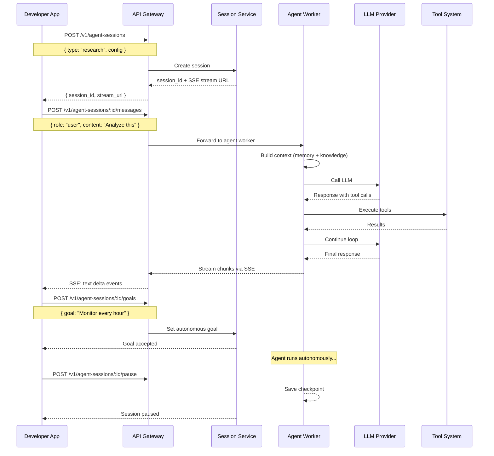
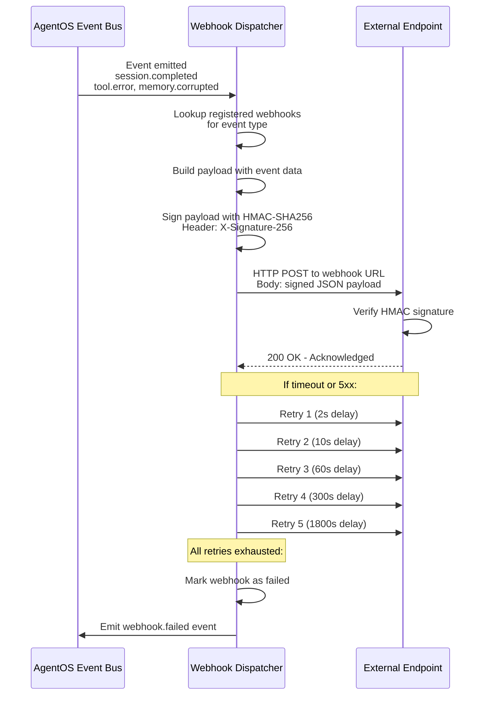

# Volume 19: Full API Reference & Integration Patterns

## Chapter 38: AgentOS REST API Complete Reference

### 38.1 Authentication

```
All API requests require authentication via:
  Header: Authorization: Bearer sk_live_xxx
  Header: X-API-Version: 2026-07-01  (optional)

Rate limiting:
  Per API key: 500 req/min (default), configurable
  Per endpoint: varies (listed per endpoint)
  Response headers: X-RateLimit-*, Retry-After
```

---

### 38.2 Agent Sessions API

#### Create Session

```
POST /v1/agent-sessions

Request:
{
  "agent_type": "research_agent",            // required
  "goal": "Analyze Q2 revenue data",          // optional (sets initial goal)
  "system_prompt_override": "...",            // optional (override default prompt)
  "tools": ["database_query", "email"],       // optional (restrict available tools)
  "model_preference": "claude-sonnet-4",      // optional (override model routing)
  "context": {                                 // optional (initial context)
    "project": "Q2 Analysis",
    "team": "engineering"
  },
  "metadata": {                                // optional (user-defined metadata)
    "source": "salesforce_integration"
  }
}

Response 201:
{
  "id": "sess_001",
  "agent_type": "research_agent",
  "status": "ready",
  "created_at": "2026-07-13T10:00:00Z",
  "allowed_tools": ["database_query", "email"],
  "token_budget": { "session_limit": 100000, "remaining": 100000 },
  "model": "claude-sonnet-4"
}

Rate limit: 100/min
```

#### Send Message

```
POST /v1/agent-sessions/:id/messages

Request:
{
  "content": "Query the Q2 revenue data and tell me the top trends",
  "attachments": [                           // optional
    {
      "type": "file",
      "file_id": "file_001"
    }
  ]
}

Response 200 (synchronous):
{
  "id": "msg_002",
  "session_id": "sess_001",
  "role": "assistant",
  "content": "Based on the Q2 revenue data, the top trends are:\n\n1. Enterprise segment grew 45% YoY\n2. SMB segment remained flat\n3. Customer churn decreased by 12%",
  "tool_calls": [
    {
      "tool": "database_query",
      "parameters": { "query": "..." },
      "result_summary": "42 rows returned",
      "latency_ms": 125
    }
  ],
  "token_usage": { "input": 45000, "output": 1200, "cached": 12000, "cost": 0.019 },
  "citations": [
    { "source": "Q2_Financial_Report.pdf", "page": 12, "excerpt": "..." }
  ],
  "created_at": "2026-07-13T10:00:05Z"
}

Rate limit: 60/min
```

#### Stream Response

```
GET /v1/agent-sessions/:id/messages/stream?content=...

Response (SSE stream):
event: start
data: {"session_id": "sess_001"}

event: context
data: {"memories": 3, "knowledge": 2, "tokens": 25000}

event: tool_call
data: {"tool": "database_query", "params": {"query": "..."}}

event: tool_result
data: {"tool": "database_query", "summary": "42 rows"}

event: token
data: {"token": "Enterprise", "index": 0}

event: token
data: {"token": " segment", "index": 1}

event: done
data: {"tokens_used": 62000, "cost": 0.025, "duration_ms": 4200}

Rate limit: 30/min (streaming)
```

#### Set Goal (Autonomous Mode)

```
POST /v1/agent-sessions/:id/goal

Request:
{
  "goal": "Analyze Q2 revenue data and email the report to team@company.com",
  "constraints": {
    "max_steps": 15,
    "max_tokens": 50000,
    "deadline": "2026-07-14T17:00:00Z"
  },
  "approval_required": ["send_email"]  // tools requiring human approval
}

Response 202:
{
  "session_id": "sess_001",
  "goal_id": "goal_001",
  "status": "planning",
  "estimated_steps": 6,
  "estimated_tokens": 45000,
  "estimated_duration_ms": 60000,
  "created_at": "2026-07-13T10:00:00Z"
}
```

#### Session Management

```
GET    /v1/agent-sessions                          # List sessions
GET    /v1/agent-sessions/:id                       # Get session state
POST   /v1/agent-sessions/:id/cancel                # Cancel/terminate
POST   /v1/agent-sessions/:id/pause                 # Pause (save state)
POST   /v1/agent-sessions/:id/resume                # Resume paused session
DELETE /v1/agent-sessions/:id                       # Delete session + data

List query params:
  ?status=active|paused|completed|cancelled
  &agent_type=research_agent
  &created_after=2026-07-01T00:00:00Z
  &limit=50
  &cursor=abc123
```



### 38.3 Memory API

```
# Read
GET  /v1/memories/:id                                  # Get single memory
GET  /v1/memories?query=revenue&limit=10               # Search memories
GET  /v1/memories/types                                # List all memory types

# Write
POST /v1/memories                                      # Create memory
PUT  /v1/memories/:id                                  # Update memory
POST /v1/memories/:id/importance                       # Update importance rating

# Delete
DELETE /v1/memories/:id                                # Delete memory
POST   /v1/memories/clear                              # Clear all memories (GDPR)

Create memory request:
{
  "content": "User prefers quarterly reports broken down by segment",
  "type": "preference",     // factual | preference | episodic | procedural
  "importance": "medium",   // low | medium | high | critical
  "tags": ["revenue", "reporting", "preferences"],
  "source": "user_statement",  // user_statement | agent_observation | derived
  "expires_at": null         // optional TTL
}

Search request:
{
  "query": "user preferences for reporting",
  "types": ["preference", "factual"],
  "importance_min": "medium",
  "limit": 10,
  "min_score": 0.5
}

Search response:
{
  "results": [
    {
      "id": "mem_001",
      "content": "User prefers quarterly reports broken down by segment",
      "type": "preference",
      "score": 0.89,
      "importance": "medium",
      "created_at": "2026-07-10T14:00:00Z",
      "tags": ["revenue", "reporting"],
      "confidence": 0.85
    }
  ],
  "total_hits": 3,
  "query_tokens": 25
}
```

---

### 38.4 Knowledge API

```
# Document management
POST   /v1/knowledge/documents                     # Upload document
GET    /v1/knowledge/documents                     # List documents
GET    /v1/knowledge/documents/:id                 # Get document details
DELETE /v1/knowledge/documents/:id                 # Delete document
POST   /v1/knowledge/documents/:id/reindex         # Re-index document
POST   /v1/knowledge/documents/:id/refresh         # Check + re-fetch (web sources)

# Search
POST   /v1/knowledge/search                        # Search knowledge base

# Knowledge Graph
POST   /v1/knowledge/entities                      # Create entity
GET    /v1/knowledge/entities                      # List entities
POST   /v1/knowledge/graph/query                   # Graph traversal query
POST   /v1/knowledge/graph/relationships           # Create relationship

Upload document request (multipart/form-data):
  file: quarterly_report.pdf
  metadata: {
    "title": "Q2 2026 Financial Report",
    "source": "upload",
    "tags": ["financial", "quarterly", "2026"],
    "access": "team"  // private | team | org
  }
  
Or (URL fetch):
{
  "url": "https://wiki.company.com/page/123",
  "metadata": {
    "title": "Engineering Wiki - Architecture",
    "source": "web",
    "refresh_frequency_hours": 24
  }
}

Search request:
{
  "query": "What was Q2 revenue growth?",
  "filters": {
    "tags": ["financial"],
    "date_range": { "from": "2026-01-01", "to": "2026-12-31" }
  },
  "hybrid_search": true,
  "alpha": 0.6,           // 0=keyword only, 1=vector only
  "limit": 10,
  "rerank": true,
  "min_score": 0.4,
  "include_citations": true
}

Search response:
{
  "results": [
    {
      "chunk_id": "chunk_042",
      "document_id": "doc_001",
      "document_title": "Q2_Financial_Report.pdf",
      "content": "Enterprise segment revenue reached $8.5M in Q2 2026, representing 45% YoY growth...",
      "score": 0.92,
      "rerank_score": 0.95,
      "metadata": {
        "page": 12,
        "section": "Enterprise Revenue",
        "source": "upload"
      },
      "token_count": 380
    }
  ],
  "total_results": 42,
  "query_tokens": 12,
  "search_time_ms": 145
}
```

---

### 38.5 Tools API

```
# Tool discovery
GET /v1/tools                                          # List available tools
GET /v1/tools/:name                                    # Get tool details
GET /v1/tools/:name/health                             # Get tool health status

# Tool execution
POST /v1/tools/:name/execute                           # Execute tool directly

# Custom tools
POST /v1/tools/custom                                  # Register custom tool
PUT  /v1/tools/custom/:name                            # Update custom tool
DELETE /v1/tools/custom/:name                         # Remove custom tool

# MCP tools
POST /v1/tools/mcp/servers                             # Register MCP server
GET  /v1/tools/mcp/servers                             # List MCP servers
DELETE /v1/tools/mcp/servers/:id                       # Remove MCP server

Tool execution request:
{
  "parameters": {
    "query": "SELECT segment, revenue FROM q2_2026",
    "limit": 1000
  },
  "context": {
    "session_id": "sess_001"
  }
}

Register custom tool request:
{
  "name": "jira_search",
  "description": "Search Jira issues by project and status",
  "auth_type": "oauth2",
  "auth_provider": "jira",
  "functions": [
    {
      "name": "search_issues",
      "description": "Search Jira issues",
      "parameters": {
        "type": "object",
        "properties": {
          "project": { "type": "string", "description": "Project key (e.g., 'PROJ')" },
          "status": { "type": "string", "enum": ["open", "in_progress", "done"] },
          "limit": { "type": "integer", "default": 50 }
        },
        "required": ["project"]
      }
    }
  ]
}
```

---

### 38.6 Admin API

```
# Org management
GET    /v1/admin/org/:id                             # Get org details
PUT    /v1/admin/org/:id                             # Update org
POST   /v1/admin/org/:id/suspend                     # Suspend org
POST   /v1/admin/org/:id/activate                    # Reactivate org

# User management
GET    /v1/admin/org/:id/users                       # List users
POST   /v1/admin/org/:id/users                       # Invite user
PUT    /v1/admin/org/:id/users/:uid                  # Update user role
DELETE /v1/admin/org/:id/users/:uid                  # Remove user

# Usage
GET    /v1/admin/org/:id/usage                       # Get org usage
GET    /v1/admin/usage/summary                       # Global usage summary
GET    /v1/admin/usage/breakdown                     # Detailed cost breakdown

# Billing
GET    /v1/admin/org/:id/billing                     # Get billing info
POST   /v1/admin/org/:id/billing/plan                # Change plan
GET    /v1/admin/org/:id/invoices                    # List invoices

# Audit
GET    /v1/admin/audit-logs                          # Query audit logs
GET    /v1/admin/audit-logs/:id                      # Get audit log detail

# Rate limits
PUT    /v1/admin/org/:id/rate-limits                 # Override rate limits

Audit log query:
GET /v1/admin/audit-logs?org_id=org_xyz
  &user_id=user_abc
  &event_type=auth.login
  &from=2026-07-01T00:00:00Z
  &to=2026-07-13T23:59:59Z
  &severity=warning|critical
  &limit=100
  &cursor=abc123

Response:
{
  "data": [
    {
      "id": "audit_001",
      "timestamp": "2026-07-13T10:00:00.123Z",
      "event_type": "auth.login",
      "actor_id": "user_abc",
      "actor_type": "user",
      "org_id": "org_xyz",
      "resource_type": "session",
      "resource_id": "sess_001",
      "action": "create",
      "details": {
        "ip_address": "203.0.113.42",
        "user_agent": "Chrome/120",
        "mfa_used": true
      },
      "severity": "info"
    }
  ],
  "pagination": { "next_cursor": "def456", "has_more": true }
}
```

---

### 38.7 Webhook Events

```typescript
// All webhooks are POST with HMAC-SHA256 signature
// Header: X-AgentOS-Signature: sha256=<signature>
// Header: X-AgentOS-Event: <event_type>

const WEBHOOK_EVENTS = {
    // Agent events
    'agent.session.created': {
        description: 'New agent session created',
        payload: { session_id: 'string', agent_type: 'string', user_id: 'string' }
    },
    'agent.session.completed': {
        description: 'Agent session completed successfully',
        payload: { session_id: 'string', result_summary: 'string', tokens_used: 'number' }
    },
    'agent.session.failed': {
        description: 'Agent session failed',
        payload: { session_id: 'string', error: 'string', tokens_used: 'number' }
    },
    'agent.session.cancelled': {
        description: 'Agent session cancelled by user',
        payload: { session_id: 'string', reason: 'string', tokens_used: 'number' }
    },
    'agent.tool.called': {
        description: 'Agent called a tool',
        payload: { session_id: 'string', tool: 'string', params: 'object', success: 'boolean' }
    },
    
    // Task events
    'task.completed': {
        description: 'Background task completed',
        payload: { task_id: 'string', task_type: 'string', result: 'object' }
    },
    'task.failed': {
        description: 'Background task failed',
        payload: { task_id: 'string', task_type: 'string', error: 'string' }
    },
    
    // User events
    'user.feedback.received': {
        description: 'User submitted feedback',
        payload: { user_id: 'string', feedback_type: 'string', score: 'number' }
    },
    
    // Usage events
    'usage.threshold.reached': {
        description: 'Usage threshold reached',
        payload: { org_id: 'string', meter: 'string', usage: 'number', threshold: 'number' }
    },
    
    // Compliance events
    'compliance.anomaly.detected': {
        description: 'Security anomaly detected',
        payload: { anomaly_type: 'string', severity: 'string', details: 'object' }
    },
};

// Webhook configuration
POST /v1/webhooks
{
    "url": "https://api.myapp.com/agentos-webhook",
    "events": ["agent.session.completed", "agent.tool.called"],
    "secret": "whsec_xxx",  // Will be used for HMAC signing
    "description": "Production webhook",
    "active": true,
    "retry_on_failure": true,
    "max_retries": 5,
    "filter": {
        "org_ids": ["org_xyz"],  // Only receive events for these orgs
        "min_severity": "info"    // Minimum severity level
    }
}
```



### 38.8 GraphQL API Schema

```graphql
# Queries
type Query {
    # Sessions
    session(id: ID!): AgentSession
    sessions(
        first: Int, 
        after: String, 
        status: SessionStatus,
        agentType: String
    ): SessionConnection!
    
    # Memory
    memories(
        query: String!,
        types: [MemoryType!],
        limit: Int,
        minScore: Float
    ): [Memory!]!
    
    # Knowledge
    knowledgeSearch(
        query: String!,
        filters: KnowledgeFilter,
        limit: Int
    ): KnowledgeResultConnection!
    
    # Tools
    tools(agentType: String): [Tool!]!
    
    # Usage
    usage(orgId: ID!, period: UsagePeriod!): UsageSummary!
}

# Mutations
type Mutation {
    # Sessions
    createSession(input: CreateSessionInput!): AgentSession!
    sendMessage(sessionId: ID!, content: String!, attachments: [AttachmentInput]): Message!
    setGoal(sessionId: ID!, goal: String!, constraints: GoalConstraints): GoalResponse!
    cancelSession(sessionId: ID!): Boolean!
    
    # Memory
    createMemory(input: CreateMemoryInput!): Memory!
    updateMemory(id: ID!, input: UpdateMemoryInput!): Memory!
    deleteMemory(id: ID!): Boolean!
    
    # Knowledge
    uploadDocument(input: UploadDocumentInput!): Document!
    deleteDocument(id: ID!): Boolean!
    
    # Tools
    executeTool(name: String!, params: JSON!): ToolResult!
}

# Subscriptions
type Subscription {
    agentStream(sessionId: ID!): AgentEvent!
    sessionUpdates(orgId: ID!): SessionUpdate!
    usageAlerts(orgId: ID!): UsageAlert!
}

# Types
type AgentSession {
    id: ID!
    agentType: String!
    status: SessionStatus!
    messages: [Message!]!
    goal: Goal
    tokenUsage: TokenUsage!
    createdAt: DateTime!
    lastActiveAt: DateTime!
}

type Message {
    id: ID!
    role: MessageRole!
    content: String!
    toolCalls: [ToolCall!]
    citations: [Citation!]
    tokenUsage: TokenUsage
    createdAt: DateTime!
}
```

---

### 38.9 SDK Integration Patterns

**Pattern 1: Basic Chat Integration**
```typescript
import AgentOS from '@agentos/sdk';

const client = new AgentOS({ apiKey: process.env.AGENTOS_API_KEY });

// Create session
const session = await client.sessions.create({
    agentType: 'research_agent',
});

// Interactive chat
async function chat(io: ServerIO) {
    const stream = session.stream();
    
    stream.on('token', (token) => io.emit('token', token));
    stream.on('tool_call', (call) => io.emit('tool_call', call));
    stream.on('done', (result) => io.emit('done', result));
    
    io.on('message', (msg) => session.sendMessage(msg));
}
```

**Pattern 2: Background Automation**
```typescript
// Scheduled daily report generation
export async function generateDailyReport() {
    const session = await client.sessions.create({
        agentType: 'analysis_agent',
    });
    
    await session.setGoal(
        `Generate daily revenue report for ${formatDate(new Date())}.
         Include: total revenue, top products, anomalies.
         Save report to /reports/daily/ and notify #revenue Slack channel.`,
        {
            approvalRequired: [],  // Fully autonomous
            maxTokens: 100000,
        }
    );
    
    // Monitor progress
    session.on('status_change', async (status) => {
        if (status === 'completed') {
            const report = await session.getOutput('report');
            await slack.postMessage('#revenue', `Daily report ready: ${report.url}`);
        }
        if (status === 'failed') {
            await slack.postMessage('#alerts', `Daily report failed: ${session.error}`);
        }
    });
}
```

**Pattern 3: Custom Agent Integration**
```typescript
import { defineAgent } from '@agentos/sdk';

export const SupportAgent = defineAgent({
    name: 'customer-support-agent',
    version: '2.1.0',
    system: `You are a customer support agent for a SaaS company.
             Be empathetic, provide accurate answers from the knowledge base.
             If you can't resolve, escalate with full context.`,
    tools: [
        'knowledge_search',    // RAG on support docs
        'ticket_lookup',       // Find existing support tickets
        'ticket_create',       // Create new support ticket
        'customer_lookup',     // Get customer account info
    ],
    model: {
        primary: 'claude-sonnet-4',
        fallback: 'claude-haiku-4',
        maxTokens: 4000,
    },
    hooks: {
        beforeResponse: async (response) => {
            // Add sentiment analysis
            response.sentiment = await analyzeSentiment(response.content);
            return response;
        },
        afterToolCall: async (tool, result) => {
            // Log resolution rate
            if (tool === 'ticket_resolved') {
                metrics.increment('support.resolved');
            }
        },
    },
});

// Use in application
const agent = client.agents.use(SupportAgent);
const session = await agent.createSession({
    goal: `Customer Jane is asking about her invoice #INV-2026-0421`,
});
```

**Pattern 4: Webhook Receiver**
```typescript
import express from 'express';
import AgentOS from '@agentos/sdk';

const app = express();
const client = new AgentOS({ apiKey: process.env.AGENTOS_API_KEY });

app.post('/webhooks/agentos', express.json(), async (req, res) => {
    // Verify signature
    const signature = req.headers['x-agentos-signature'];
    const isValid = client.webhooks.verifySignature(
        req.body, 
        signature, 
        process.env.WEBHOOK_SECRET
    );
    
    if (!isValid) return res.status(401).send('Invalid signature');
    
    const event = req.body;
    
    switch (event.type) {
        case 'agent.session.completed':
            // Update our system with session results
            await updateTaskStatus(event.payload.session_id, 'completed');
            break;
        case 'agent.session.failed':
            await updateTaskStatus(event.payload.session_id, 'failed');
            await alertTeam(event.payload.error);
            break;
        case 'usage.threshold.reached':
            await notifyCustomer(event.payload);
            break;
    }
    
    res.sendStatus(200);
});
```



```mermaid
graph TB
    subgraph "Pattern 1: Basic Chat"
        APP1[Your App] --> SDK1[AgentOS SDK]
        SDK1 --> SESS1[Create Session]
        SESS1 --> MSG1[Send Message]
        MSG1 --> STREAM1[SSE Stream]
        STREAM1 --> UI1[Update Chat UI]
    end

    subgraph "Pattern 2: Background Automation"
        CRON[Cron / Webhook] --> SDK2[AgentOS SDK]
        SDK2 --> GOAL[Set Autonomous Goal]
        GOAL --> WAIT2[Wait for Completion]
        WAIT2 --> NOTIFY2[Notify User]
    end

    subgraph "Pattern 3: Custom Agent"
        DEFINE[defineAgent] --> SDK3[AgentOS SDK]
        SDK3 --> DEPLOY[Deploy via CLI]
        DEPLOY --> SERVE[Serve via REST API]
    end
```

### 38.10 Error Codes

```
HTTP 400 - Bad Request
  invalid_parameters: Required parameter missing or invalid
  invalid_schema: Request body fails validation
  invalid_file_type: Uploaded file type not supported
  file_too_large: Upload exceeds size limit (10MB)

HTTP 401 - Unauthorized
  missing_api_key: No Authorization header
  invalid_api_key: API key not found or revoked
  expired_api_key: API key has expired
  invalid_signature: Webhook signature verification failed

HTTP 403 - Forbidden
  insufficient_permissions: API key lacks required scopes
  org_suspended: Organization has been suspended
  plan_limit_exceeded: Current plan doesn't include this feature
  ip_not_allowed: Request IP not in allowlist

HTTP 404 - Not Found
  session_not_found: Session ID doesn't exist
  document_not_found: Document ID doesn't exist
  tool_not_found: Tool name not found
  endpoint_not_found: API endpoint doesn't exist

HTTP 429 - Too Many Requests
  rate_limit_exceeded: Too many requests, see Retry-After header
  monthly_limit_exceeded: Monthly token budget exhausted
  concurrent_limit_exceeded: Too many concurrent sessions

HTTP 500 - Server Error
  internal_error: Unexpected server error (rare)
  provider_error: LLM provider returned error
  tool_error: Tool execution failed
  service_unavailable: Downstream service unavailable

HTTP 502 - Bad Gateway
  llm_provider_error: Provider returned 5xx
  upstream_timeout: Upstream service timed out

HTTP 503 - Service Unavailable
  maintenance: System under maintenance
  overloaded: System under heavy load, retry later
```

---

### 38.11 OpenAPI/Swagger Integration

The full OpenAPI 3.1 specification is available at:
```
https://api.agentos.com/openapi.json
```

Generated client libraries:
```bash
# Install generated client
npm install @agentos/client
pip install agentos-client

# Or generate your own
npx openapi-generator-cli generate \
  -i https://api.agentos.com/openapi.json \
  -g typescript-axios \
  -o ./src/generated/api
```
